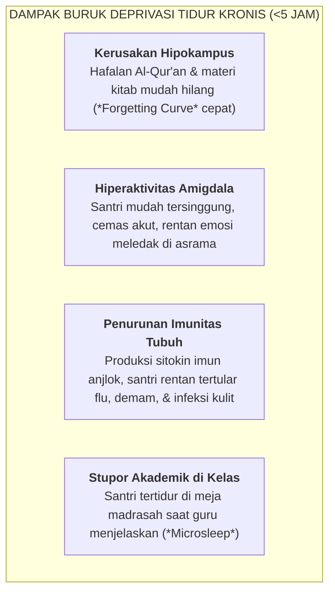

# SUB-BAB 1.2: MENJAGA HAK TIDUR 7 JAM & SUNNAH QAILULAH SIANG

---

## 1. Neurosains Istirahat Remaja: Hak Biologis Penjaga Kestabilan Jiwa

Dalam diskursus pengasuhan pesantren lama, jam tidur santri kerap kali dipangkas secara ekstrem hingga tersisa 3–4 jam per hari, dengan anggapan bahwa semakin sedikit tidur seorang santri, semakin tinggi derajat "mujahadah" dan "tirakat"-nya. 

Pandangan ini secara medis dan pedagogis merupakan sebuah **kekeliruan fatal yang bertentangan dengan fitrah penciptaan manusia dan sunnah Rasulullah SAW**. [^1]

Penelitian neurobiologi perkembangan membuktikan bahwa otak remaja (*Adolescent Brain*) sedang mengalami restrukturisasi sinapsis (*Synaptic Pruning*) dan mielinisasi jalur saraf di *Prefrontal Cortex* (PFC). Proses konsolidasi memori hafalan Al-Qur'an dan pemrosesan emosional sangat bergantung pada fase tidur gelombang lambat (*Slow-Wave Sleep / SWS*) dan fase mimpi aktif (*Rapid Eye Movement / REM Sleep*).



---

## 2. Alokasi Hak Tidur Seimbang: 6 Jam Malam + 45 Menit Qailulah

Ekosistem TUMBUH menetapkan standar kuota istirahat harian santri sebesar **6.5 hingga 7 Jam Total Istirahat Terpadu**: [^2]

```
                  ARSITEKTUR ISTIRAHAT SIRKADIAN EKOSISTEM TUMBUH
                  
  ┌──────────────────────────────────────────────────────────────────────────┐
  │ 1. TIDUR MALAM LELEP (21:45 - 03:30 = 5 JAM 45 MENIT)                   │
  │    • Pematian lampu kamar tepat pukul 21:45 WIB.                         │
  │    • Suasana hening total bebas percakapan (Patroli Musyrif Shift 4).   │
  │    • Memicu sekresi hormon pertumbuhan (HGH) & pemulihan otot fisik.     │
  ├──────────────────────────────────────────────────────────────────────────┤
  │ 2. SUNNAH QAILULAH SIANG (12:30 - 13:15 = 45 MENIT)                      │
  │    • Dilaksanakan setelah sholat Dzuhur & makan siang di kamar asrama.   │
  │    • Tidur siang sejenak (Power Nap) menyegarkan kembali energi otak.    │
  │    • Membersihkan adenosin otak, meningkatkan fokus KBM sesi siang 100%. │
  └──────────────────────────────────────────────────────────────────────────┘
```

---

## 3. Landasan Turats & Sunnah: Menghidupkan Kembali Tradisi *Qailulah*

Rasulullah SAW secara eksplisit memerintahkan umatnya untuk melaksanakan *Qailulah* (tidur siang sejenak) demi membantu kekuatan beribadah dan menjaga kebugaran akal: [^3]

> **قِيلُوا فَإِنَّ الشَّيَاطِينَ لَا تَقِيلُ**
> 
> *"Lakukanlah qailulah (tidur siang sejenak), karena sesungguhnya setan-setan itu tidak pernah tidur siang."* (HR. Ath-Thabarani dalam *Al-Mu'jam al-Ausath* no. 28 dan Abu Nu'aim dalam *Akhbar Ashbahan*, sanad hasan)

Para ulama klasik seperti Imam Ibnu Jama'ah dalam *Tadzkirah as-Sami' wa al-Mutakallim* menganjurkan seorang penuntut ilmu untuk tidak membebani tubuhnya di luar batas kemampuannya:

> **وَلَا يُحَمِّلُ بَدَنَهُ مَا لَا يُطِيقُهُ فَيَمَلُّ وَيَنْقَطِعُ، وَلْيَكُنْ نَوْمُهُ بِمِقْدَارِ مَا تَسْتَرِيحُ بِهِ نَفْسُهُ وَبَدَنُهُ، وَأَحْسَنُهُ نَوْمُ الْقَيْلُولَةِ لِيَسْتَعِينَ بِهِ عَلَى قِيَامِ اللَّيْلِ وَتَحْصِيلِ الْعِلْمِ**
> 
> *"Dan janganlah seorang penuntut ilmu membebani tubuhnya dengan hal yang tidak mampu dipikulnya, sehingga ia merasa bosan dan akhirnya terputus dari menuntut ilmu. Hendaklah tidurnya dalam kadar yang dapat mengistirahatkan jiwa dan badannya, dan sebaik-baik tidur adalah tidur qailulah (siang hari) untuk membantunya bangun qiyamul lail dan mengkaji ilmu."* [^4]

---

## 4. SOP Penegakan Keheningan Malam (*Night Silence Protocol*)

Agar hak tidur malam berjalan optimal tanpa gangguan, diberlakukan SOP Keheningan Malam:
1. **Pemberitahuan 15 Menit Sebelum Padam (21:30)**: Bel kamar berbunyi lembut sebagai tanda santri menghentikan mudzakarah, merapikan meja belajar, dan berwudhu sebelum tidur.
2. **Pemadaman Lampu Utama Tepat Pukul 21:45**: Saklar lampu utama dimatikan; hanya lampu tidur temaram (*amber night-light*) di koridor luar yang menyala.
3. **Larangan Aktivitas Bersuara**: Santri dilarang mengobrol, berjalan-jalan, atau membuat kebisingan. Musyrif Shift 4 berpatroli senyap di koridor memastikan seluruh santri telah berbaring nyaman di kasur masing-masing.

Dengan terjaganya hak tidur, wajah-wajah santri di pagi hari memancarkan kecerahan, kesehatan raga yang prima, dan semangat membara dalam menuntut ilmu.

---

### 📚 Catatan Kaki & Referensi Akademik:

[^1]: Walker, M. (2017). *Why We Sleep: Unlocking the Power of Sleep and Dreams*. New York: Scribner, hlm. 85–124.
[^2]: Tarokh, L., et al. (2016). Sleep in adolescence: Physiology, cognition and mental health. *Neuroscience & Biobehavioral Reviews*, 70, 182–196.
[^3]: Ath-Thabarani, Sulaiman bin Ahmad. (1995). *Al-Mu'jam al-Ausath*. Ditahqiq oleh Thariq bin 'Abdil Mukmin. Kairo: Dar al-Haramain, Jilid I, Hadits no. 28.
[^4]: Ibnu Jama'ah, Badruddin Muhammad bin Ibrahim. (2012). *Tadzkirah as-Sami' wa al-Mutakallim fi Adab al-'Alim wa al-Muta'allim*. Beirut: Dar al-Basyair al-Islamiyyah, hlm. 78–82.
