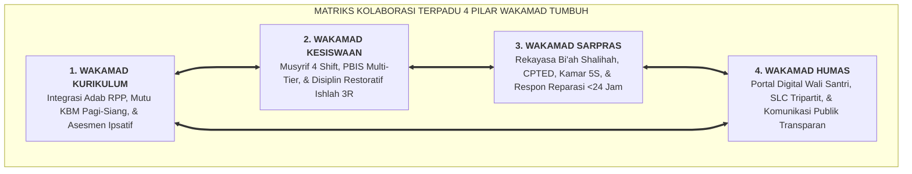

# SUB-BAB 1.4: MATRIKS INTEGRASI KEGIATAN HARIAN 4 PILAR WAKAMAD

---

## 1. Menghilangkan Silo Struktural: Konsep Manajemen Lintas Fungsi (*Cross-Functional Team*)

Salah satu kelemahan paling fundamental dalam tata kelola institusi pendidikan pesantren modern adalah **terjadinya fragmentasi dan silo manajerial (Ego Sektoral)** antara empat bidang kepemimpinan madrasah: [^1]
* Bidang Kurikulum hanya peduli pada nilai ujian dan capaian kurikulum nasional, abai terhadap kesehatan mental santri.
* Bidang Kesiswaan merasa menjadi satu-satunya pihak yang bertugas "menghukum dan menertibkan" santri, tanpa koordinasi dengan guru kelas.
* Bidang Sarpras dianggap sebagai divisi logistik terpisah yang bekerja lambat dan tidak paham kebutuhan pedagogis.
* Bidang Humas hanya berfungsi sebagai resepsionis penerima tamu tanpa koneksi data harian santri.

Ekosistem TUMBUH merombak fragmentasi ini menjadi **Model Organisasi Pembelajar Terintegrasi (*Integrated Learning Organization*)**: seluruh 4 Wakil Kepala Madrasah (Wakamad) bergerak dalam satu komando terpadu 24 jam di bawah kepemimpinan Kepala Madrasah (COO) dan Mudir Pesantren.

---

## 2. Matriks Integrasi Kegiatan Harian 4 Pilar Lintas 24 Jam

Tabel berikut menggambarkan peran operasional spesifik masing-masing bidang Wakamad pada setiap segmen aktivitas harian santri: [^2]

| Blok Jam Harian | 1. Kurikulum | 2. Kesiswaan | 3. Sarpras | 4. Humas |
| :--- | :--- | :--- | :--- | :--- |
| **03:30 - 06:30** *(Fajar & Tahfidz)* | Memantau integrasi tajwid & makharijul huruf pada halaqah tahfidz Subuh. | Musyrif Shift 1 mengawal bangun fajar santun, shaf Subuh, & zikir ma'tsurat. | Memastikan ketersediaan air bersih wudhu, penerangan masjid, & audio adzan jernih. | Mempublikasikan kutipan nasihat fajar / video syiar tahfidz ke media sosial resmi pondok. |
| **06:30 - 07:15** *(Sarapan & Transisi 1)* | Guru piket bersiap di ruang guru; menerima Berita Acara Daily Handover 1. | Musyrif memimpin inspeksi kamar 5S, kawal sarapan, & serahkan logbook malam. | Membuka pintu gerbang madrasah; mengunci seluruh gedung asrama. | Mengunggah buletin menu makan sehat mingguan di portal orang tua. |
| **07:15 - 12:00** *(KBM Madrasah Pagi)* | Mengawal mutu KBM formal, supervisi modul ajar HOTS, & pengamatan adab kelas. | Koordinator BK menangani konseling santri Tier 2 & Tier 3 di Bilik Sakinah. | Melakukan pembersihan menyeluruh area asrama & perawatan preventif AC/kipas. | Melayani tamu dinas, studi banding, & pengaduan orang tua di kantor helpdesk. |
| **12:00 - 13:15** *(Dzuhur & Qailulah)* | Guru kelas menginput nilai asesmen formatif & catatan apresiasi adab kelas. | Musyrif Shift 2 mengawal ketertiban sholat Dzuhur & hening kamar saat Qailulah. | Menjaga stabilitas pasokan air toilet masjid & kebersihan ruang makan siang. | Mengirimkan notifikasi ketercapaian hafalan Qur'an harian via aplikasi wali santri. |
| **13:15 - 15:30** *(KBM Madrasah Siang)* | Mengawal pembelajaran aplikatif, laboratorium komputer/IPA, & kepustakaan. | Musyrif beristirahat / mengikuti sesi mentoring ruhiyyah pengasuh. | Memastikan kesiapan lapangan olahraga & peralatan kebersihan mandi sore. | Menyusun draf materi publikasi majalah dinding digital santri. |
| **15:30 - 16:15** *(Ashar & Transisi 2)* | Guru madrasah menyerahkan kendali santri via Berita Acara Daily Handover 2. | Musyrif Shift 3 menerima kendali santri & mengawal persiapan olahraga sore. | Membuka gerbang asrama; mengunci gedung madrasah; cek lampu lapangan. | Mendokumentasikan foto aktivitas santri untuk laporan berkala. |
| **16:15 - 18:00** *(Olahraga & Mandi)* | Guru madrasah pulang dinas (bebas tugas malam untuk istirahat keluarga). | Musyrif mendampingi klub olahraga (silat, futsal, panahan) & kawal antre mandi. | Memantau kelancaran kran air kamar mandi rasio 1:5 & pengering jemuran. | Menyiapkan materi buletin akhir pekan kemitraan madrasah-keluarga. |
| **18:00 - 20:00** *(Maghrib, Kitab, Isya')* | Evaluasi silabus pengajaran turats & integrasi kitab kuning dengan kurikulum. | Musyrif Shift 4 mendampingi kajian kitab ba'da Maghrib, Isya', & makan malam. | Mengontrol pencahayaan seluruh koridor luar & area gelap (*CPTED*). | Menyiapkan agenda Student-Led Conference (SLC) semesteran. |
| **20:00 - 21:45** *(Mudzakarah & Tidur)* | Menyiapkan lembar tugas terbimbing mudzakarah mandiri santri. | Musyrif memimpin mudzakarah kamar, muhasabah adab, & padam lampu 21:45. | Mengunci gerbang utama pondok; memastikan sistem CCTV & pos jaga aktif. | Menutup tiket layanan pengaduan hari ini (SOP respon pasti <24 jam). |
| **21:45 - 03:30** *(Keheningan Malam)* | Istirahat malam penuh para pendidik. | Musyrif Shift 4 patroli koridor asrama memastikan keheningan total & keamanan. | Tim keamanan berpatroli keliling perimeter pagar pesantren. | Sistem server portal digital melakukan backup data otomatis harian. |

---

## 3. Rapat Pleno Koordinasi Terpadu Mingguan

Setiap hari Kamis pukul 16:30 - 17:45 WIB, diselenggarakan **Rapat Pleno Koordinasi Terpadu 4 Pilar** yang dipimpin oleh Kepala Madrasah:
1. **Pemaparan Data Analitik PBIS**: Koordinator Kesiswaan dan Kurikulum memaparkan grafik tren perilaku positif vs insiden pelanggaran minggu ini.
2. **Evaluasi Tiket Sarpras**: Wakamad Sarpras melaporkan persentase perbaikan sarana yang selesai dalam tempo $<24$ jam.
3. **Ulasan Kepuasan Wali Santri**: Wakamad Humas memaparkan skor indeks kepuasan orang tua dan evaluasi respon komplain.
4. **Perumusan Intervensi Lintas Bidang**: Menyusun rencana aksi terpadu untuk pekan berikutnya, memastikan seluruh keputusan didasarkan pada data faktual riil.

---

### 📚 Catatan Kaki & Referensi Akademik:

[^1]: Lencioni, P. (2006). *Silos, Politics and Turf Wars: A Leadership Fable About Destroying the Barriers That Turn Colleagues Into Competitors*. San Francisco: Jossey-Bass, hlm. 150–190.
[^2]: Senge, P. M. (2006). *The Fifth Discipline: The Art and Practice of the Learning Organization*. New York: Doubleday, hlm. 125–158.
[^3]: Sugai, G., & Horner, R. H. (2006). A promising approach for expanding and sustaining school-wide positive behavior support. *School Psychology Review*, 35(2), 245–259.
