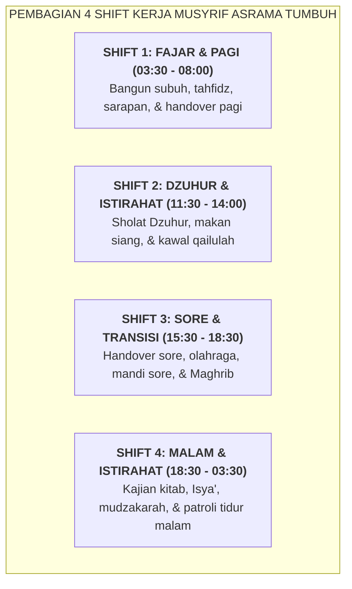

# SUB-BAB 2.1: DESAIN SISTEM 4-SHIFT MUSYRIF: MENGHAPUS KELELAHAN KERJA 24 JAM

---

## 1. Menghapus Beban Kerja 24 Jam Nonstop

Salah satu penyebab utama terjadinya kekerasan pengasuhan di pesantren adalah **pemaksaan kerja 24 jam nonstop tanpa batas shift terhadap musyrif asrama**. Musyrif yang kurang tidur, kelelahan fisik, dan tidak memiliki waktu pribadi akan mengalami penurunan drastis pada fungsi Prefrontal Cortex (PFC), sehingga mereka menjadi sangat reaktif dan mudah meledak amarahnya saat melihat pelanggaran kecil santri.

Ekosistem TUMBUH merombak pola pengasuhan ini melalui **Sistem Kerja 4-Shift Musyrif Terpadu**: [^1]

---

## 2. Jaminan Hak Istirahat & Libur Pasti Musyrif

* **Beban Kerja Terukur**: Setiap musyrif bertugas maksimal **7–8 jam per hari** dalam kombinasi shift yang dirotasi adil.
* **Hak Libur Mingguan Pasti (1 Hari Penuh)**: Setiap musyrif memiliki jadwal libur wajib 1 hari sepekan (*Day-Off*) untuk pemulihan fisik, silaturahmi keluarga, dan pengisian ruhiyyah pribadi.
* **Kompensasi & Apresiasi Layak**: Lembaga menyediakan insentif pembinaan yang bermartabat, asuransi kesehatan, dan makan sehat 3x sehari.

Dengan sistem shift yang manusiawi, musyrif bertugas dalam kondisi bugar, sabar, tersenyum ramah, dan mampu membimbing santri dengan keteladanan penuh cinta (*Firm & Kind*).

---

### 📚 Catatan Kaki & Referensi Akademik:

[^1]: Maslach, C., & Leiter, M. P. (2016). Understanding the burnout experience: Recent research and its implications for psychiatry. *World Psychiatry*, 15(2), 103–111.
[^2]: Folkard, S., & Tucker, P. (2003). Shift work, safety and productivity. *Occupational Medicine*, 53(2), 95–101.
