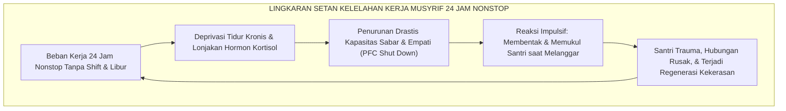

# SUB-BAB 2.1: DESAIN SISTEM 4-SHIFT MUSYRIF: MENGHAPUS KELELAHAN KERJA 24 JAM

---

## 1. Patologi Kelelahan Kerja Kronis: Mengapa Musyrif Menjadi Reaktif?

Dalam tata kelola pondok pesantren tradisional di Indonesia, salah satu krisis manajerial paling tersembunyi namun berdampak paling merusak adalah **penugasan musyrif asrama selama 24 jam sehari, 7 hari seminggu tanpa pembagian shift yang terstandarisasi dan tanpa hak libur yang pasti**. [^1]

Musyrif—yang mayoritas adalah pemuda lulusan baru atau mahasiswa tingkat akhir—sering kali dituntut untuk menjadi sosok serba bisa yang tidak boleh lelah:
* Membangunkan santri pukul 03:30 dini hari.
* Mengawal sholat Subuh dan tahfidz hingga pukul 06:30.
* Berjaga di pos asrama sepanjang siang hari.
* Mengawal kegiatan olahraga sore dan antrean mandi hingga Maghrib.
* Mengajar kajian kitab dan mengawal mudzakarah hingga pukul 22:00 malam.
* Melakukan ronda malam hingga dini hari, lalu kembali bangun pukul 03:30.

Secara neurobiologis dan psikologi okupasi, pola kerja tanpa henti ini memicu **Burnout Akut, Kelelahan Belas Kasih (*Compassion Fatigue*), dan Penurunan Fungsi Eksekutif Otak (*Executive Dysfunction*)**. [^2] 

Tatkala seorang pembina berada dalam kondisi kurang tidur kronis, neurotransmiter serotonin dan dopamin menurun drastis, sementara kadar hormon kortisol melonjak tinggi. Dalam kondisi biologis seperti ini, musyrif kehilangan kapasitas kesabaran emosionalnya; mereka menjadi sangat reaktif, mudah tersinggung, dan secara impulsif melampiaskan kekesalannya kepada santri melalui bentakan keras atau hukuman fisik yang tidak terukur.



---

## 2. Solusi Sistemik: Desain 4 Shift Kerja Musyrif Terpadu

Ekosistem TUMBUH memutus lingkaran setan kekerasan ini dengan merombak struktur kerja pengasuhan melalui **Sistem Kerja 4-Shift Musyrif Terpadu**: [^3]

```
                  DESAIN 4 SHIFT KERJA MUSYRIF EKOSISTEM TUMBUH
  
  ┌─────────────────┬─────────────────┬──────────────────────────────────────────┐
  │ SHIFT KERJA     │ JAM TUGAS       │ FOKUS OPERASIONAL PENGASUHAN             │
  ├─────────────────┼─────────────────┼──────────────────────────────────────────┤
  │ SHIFT 1 (FAJAR) │ 03:30 - 08:00   │ • Membangunkan santri santun fajar.      │
  │                 │ (4.5 Jam Kerja) │ • Kawal shaf Subuh, Ma'tsurat, & Tahfidz.│
  │                 │                 │ • Inspeksi kamar 5S & sarapan bersama.   │
  │                 │                 │ • Daily Handover 1 ke Guru Madrasah.     │
  ├─────────────────┼─────────────────┼──────────────────────────────────────────┤
  │ SHIFT 2 (SIANG) │ 11:30 - 14:00   │ • Sambut santri ba'da KBM sesi pagi.     │
  │                 │ (2.5 Jam Kerja) │ • Kawal sholat Dzuhur & makan siang.     │
  │                 │                 │ • Penegakan Sunnah Qailulah (Tidur Siang)│
  │                 │                 │ • Bangunkan santri masuk KBM sesi siang. │
  ├─────────────────┼─────────────────┼──────────────────────────────────────────┤
  │ SHIFT 3 (SORE)  │ 15:30 - 18:30   │ • Daily Handover 2 dari Guru Madrasah.   │
  │                 │ (3.0 Jam Kerja) │ • Kawal sholat Ashar & olahraga terarah. │
  │                 │                 │ • Kawal antrean tertib mandi sore 5S.    │
  │                 │                 │ • Kesiapan santri masuk masjid Maghrib.  │
  ├─────────────────┼─────────────────┼──────────────────────────────────────────┤
  │ SHIFT 4 (MALAM) │ 18:30 - 03:30   │ • Dampingi kajian kitab Maghrib & Isya'. │
  │                 │ (7.0 Jam Efektif│ • Kawal makan malam & mudzakarah kamar.  │
  │                 │  + Istirahat)   │ • Muhasabah kamar & padam lampu (21:45). │
  │                 │                 │ • Patroli senyap malam di pos asrama.    │
  └─────────────────┴─────────────────┴──────────────────────────────────────────┘
```

---

## 3. Parameter Kesejahteraan & Standar Ketenagakerjaan Musyrif

Ekosistem TUMBUH menetapkan hak-hak ketenagakerjaan mutlak bagi staf pengasuhan asrama: [^4]

1. **Batas Maksimal Jam Kerja Harian**: Setiap musyrif bertugas rata-rata **7 hingga 8 jam per hari** dalam rotasi kombinasi shift (misal: Shift 1 + Shift 3, atau Shift 4 saja).
2. **Hak Libur Mingguan Terjadwal (*Mandatory Weekly Day-Off*)**: Setiap musyrif memiliki jadwal libur wajib **1 hari penuh (24 jam) setiap pekan** untuk memulihkan raga, bersilaturahmi dengan keluarga, dan menyegarkan jiwa.
3. **Penyediaan Tim Musyrif Pengganti (*Relief Musyrif Pool*)**: Lembaga menyediakan tim musyrif pengganti yang bertugas mengisi jadwal musyrif yang sedang libur, cuti sakit, atau mengikuti pelatihan keprofesian.
4. **Tunjangan Kehormatan & Perlindungan Medis**: Musyrif menerima gaji bulanan yang bermartabat (di atas upah minimum regional), jaminan asuransi kesehatan (BPJS Kesehatan & Ketenagakerjaan), serta asupan makan sehat 3 kali sehari yang terjamin mutunya.

Dengan sistem shift yang terukur dan manusiawi ini, musyrif datang bertugas dalam kondisi fisik yang bugar, hati yang tenang, pikiran yang jernih, dan senyuman yang hangat, mampu mendidik santri dengan keteladanan *Qudwah Hasanah* yang memuliakan martabat kemanusiaan.

---

### 📚 Catatan Kaki & Referensi Akademik:

[^1]: Maslach, C., & Leiter, M. P. (2016). Understanding the burnout experience: Recent research and its implications for psychiatry. *World Psychiatry*, 15(2), 103–111.
[^2]: Figley, C. R. (Ed.). (2002). *Treating Compassion Fatigue*. New York: Brunner-Routledge, hlm. 25–48.
[^3]: Folkard, S., & Tucker, P. (2003). Shift work, safety and productivity. *Occupational Medicine*, 53(2), 95–101.
[^4]: International Labour Organization. (2019). *Working Time and Work-Life Balance Around the World*. Geneva: ILO Publications.
