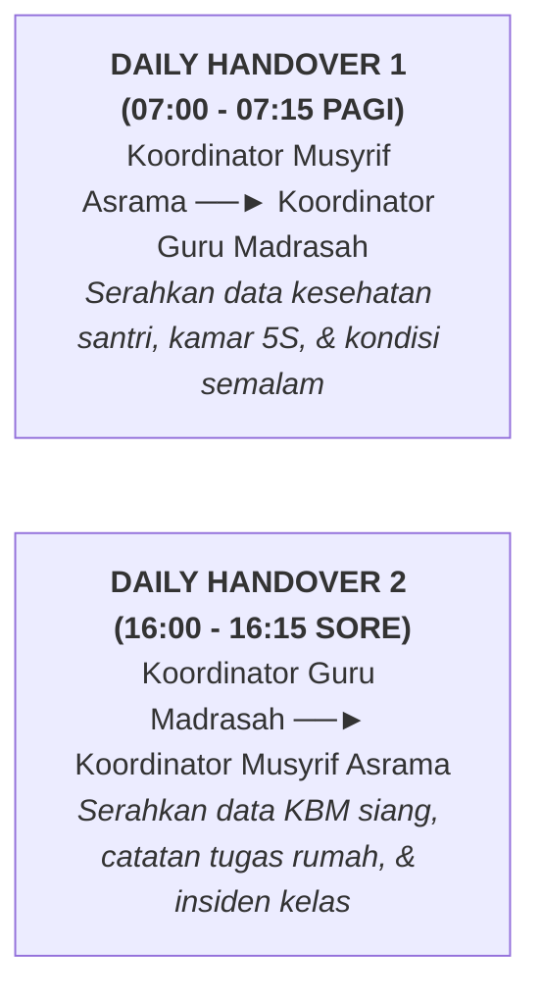

# SUB-BAB 2.3: PROTOKOL DAILY HANDOVER 07:00 & 16:00 (SERAH TERIMA BERBASIS DATA)

---

## 1. Menjembatani Silo: Protokol Serah Terima 15 Menit

Salah satu inovasi manajerial terpenting dalam Ekosistem TUMBUH adalah pelaksanaan **Daily Handover (Pertemuan Serah Terima Harian)** yang mempertemukan pimpinan asrama dan pimpinan madrasah dua kali setiap hari: [^1]

---

## 2. Format 4 Elemen Pelaporan Handover Cepat

Dalam forum 15 menit ini, pelaporan dilakukan secara terstruktur menggunakan aplikasi dashboard:
1. **Status Kesehatan Santri (*Health Status*)**: Daftar santri yang sedang dirawat di Poskestren atau butuh pemantauan minum obat.
2. **Status Perilaku Tier 2 & Tier 3 (*Targeted Students Update*)**: Daftar santri yang sedang menjalani program CICO hari ini.
3. **Catatan Apresiasi Kebaikan Luar Biasa (*Celebrations*)**: Berbagi kabar tentang santri yang menunjukkan kemajuan adab istimewa.
4. **Isu Sarana & Logistik (*Facilities Readiness*)**: Koordinasi cepat dengan Wakamad Sarpras jika ada perbaikan fasilitas darurat.

Dengan protokol Daily Handover ini, informasi tidak pernah terputus, dan santri merasakan bahwa guru di kelas dan musyrif di asrama adalah satu kesatuan keluarga pendidik yang saling terhubung erat.

---

### 📚 Catatan Kaki & Referensi Akademik:

[^1]: Patterson, E. S., et al. (2004). Handoffs: Implications for healthcare from actions taken in other high-stakes domains. *Quality and Safety in Health Care*, 13(2), 125–132.
