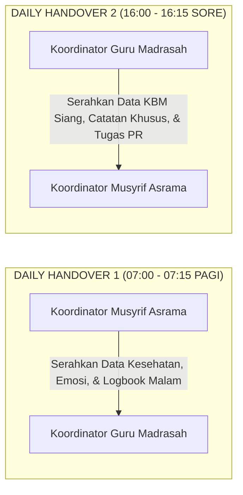

# SUB-BAB 2.3: PROTOKOL DAILY HANDOVER 07:00 & 16:00 (SERAH TERIMA BERBASIS DATA)

---

## 1. Menghubungkan Dua Dunia: Protokol Serah Terima 15 Menit

Dalam ekosistem sekolah berasrama, transfer informasi yang terputus antara pihak asrama dan pihak sekolah formal sering kali menyebabkan santri yang sedang mengalami krisis emosional atau sakit fisik terabaikan. [^1] 

Sebagai contoh: seorang santri yang semalaman menangis karena *homesick* berat atau mengalami demam ringan di asrama, masuk ke kelas madrasah tanpa sepengetahuan guru kelas. Ketika santri tersebut tampak lesu dan tidak fokus, guru membentaknya karena mengira ia malas. Bentakan ini memperparah trauma psikologis anak.

Ekosistem TUMBUH memutus rantai miskomunikasi ini melalui penerapan **Protokol Daily Handover (Serah Terima Harian Berbasis Data)** yang dilaksanakan dua kali setiap hari:



---

## 2. Struktur Standar 4 Elemen Pelaporan Handover Cepat

Pertemuan 15 menit ini berlangsung di Ruang Transisi Terpadu dengan format pelaporan berbasis data digital: [^2]

```
               FORMAT STANDAR PELAPORAN DAILY HANDOVER
  
  1. STATUS KESEHATAN SANTRI (HEALTH ALERTS):
     • Daftar santri yang dirawat di Poskestren (Nama, Diagnosa, Obat).
     • Santri yang dipulangkan ke kamar namun membutuhkan observasi suhu/istirahat.
     
  2. STATUS EMOSI & PERILAKU TIER 2 / TIER 3 (BEHAVIOR TRACKING):
     • Santri yang sedang menjalani pemantauan kartu CICO (Check-In / Check-Out).
     • Santri yang mengalami dinamika emosional (misal: duka keluarga, konflik kamar).
     
  3. APRESIASI & PRESTASI ADAB LUAR BIASA (CELEBRATIONS):
     • Nama-nama santri yang menunjukkan adab mulia istimewa untuk diapresiasi di kelas/halaqah.
     
  4. ISU SARANA & LOGISTIK DARURAT (FACILITIES & READINESS):
     • Catatan fasilitas yang membutuhkan perbaikan cepat dari tim Sarpras.
```

---

## 3. Berita Acara Digital & Akuntabilitas Hukum

Setiap sesi Daily Handover diakhiri dengan **Penandatanganan Berita Acara Serah Terima Digital** pada tablet operasional:
* Kedua pihak (Asrama dan Madrasah) menandatangani berita acara secara elektronik.
* Sistem secara otomatis mengirimkan ringkasan status santri yang butuh perhatian khusus ke dasbor masing-masing Wali Kelas.
* Dengan mekanisme ini, santri merasakan bahwa guru di ruang kelas dan musyrif di kamar asrama adalah satu kesatuan keluarga pendidik yang senantiasa memperhatikan, melindungi, dan menyayangi mereka sepenuh hati.

---

### 📚 Catatan Kaki & Referensi Akademik:

[^1]: Patterson, E. S., et al. (2004). Handoffs: Implications for healthcare from actions taken in other high-stakes domains. *Quality and Safety in Health Care*, 13(2), 125–132.
[^2]: Australian Commission on Safety and Quality in Health Care. (2019). *Implementation Toolkit for Clinical Handover*. Sydney: ACSQHC.
[^3]: Sugai, G., & Horner, R. H. (2006). A promising approach for expanding and sustaining school-wide positive behavior support. *School Psychology Review*, 35(2), 245–259.
