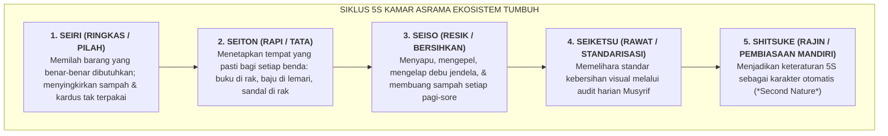

# SUB-BAB 3.1: STANDARISASI 5S KAMAR ASRAMA (RINGKAS, RAPI, RESIK, RAWAT, RAJIN)

---

## 1. Menata Kamar Sebagai Manifestasi Kebersihan Jiwa (*Tazkiyatun Nafs*)

Dalam filosofi Ekosistem TUMBUH, menata kerapian tempat tidur dan kebersihan kamar asrama bukanlah sekadar tugas domestik kasar (*menial labor*), melainkan sebuah sarana **Latihan Ketertiban Batin (*Riyadhatun Nafs fi an-Nazhafah wa at-Tartib*)** yang melatih fokus pikiran, tanggung jawab moral, dan apresiasi terhadap keindahan. [^1]

Kondisi kamar tidur asrama yang berantakan—pakaian kotor berserakan di lantai, tumpukan buku yang tidak teratur, dan kasur yang kusut—secara psikologis menciptakan beban kognitif tersembunyi (*Visual Clutter & Mental Fatigue*). Santri yang hidup dalam lingkungan kamar yang semrawut cenderung memiliki tingkat stres yang lebih tinggi, sulit berkonsentrasi saat menghafal Al-Qur'an, dan rentan terhadap pertengkaran antarteman sekamar.

Ekosistem TUMBUH mengadaptasi metodologi manajemen mutu kelas dunia **5S (Seiri, Seiton, Seiso, Seiketsu, Shitsuke)** ke dalam nilai-nilai peradaban Islam (5R: Ringkas, Rapi, Resik, Rawat, Rajin):

---

## 2. Landasan Turats: Keutamaan Kebersihan & Keindahan dalam Islam

Islam menempatkan kebersihan bukan sekadar pelengkap, melainkan bagian integral dari kesempurnaan iman.

Rasulullah SAW bersabda: [^2]

> **إِنَّ اللَّهَ تَعَالَى طَيِّبٌ يُحِبُّ الطَّيِّبَ، نَظِيفٌ يُحِبُّ النَّظَافَةَ، كَرِيمٌ يُحِبُّ الْكَرَمَ، جَوَادٌ يُحِبُّ الْجُودَ، فَنَظِّفُوا أَفْنِيَتَكُمْ وَلَا تَشَبَّهُوا بِالْيَهُودِ**
> 
> *"Sesungguhnya Allah Ta'ala itu Maha Baik dan mencintai kebaikan, Maha Bersih dan mencintai kebersihan, Maha Mulia dan mencintai kemuliaan, Maha Dermawan dan mencintai kedermawanan; maka bersihkanlah pekarangan-pekarangan kalian dan janganlah kalian menyerupai orang-orang yang gemar membiarkan kekotoran."* (HR. At-Tirmidzi no. 2799, hasan gharib)

Imam Al-Ghazali dalam *Ihya' 'Ulumiddin* (Kitab *Asrar ath-Thaharah*) menjelaskan bahwa kebersihan lahiriah adalah pintu pembuka menuju kebersihan batin:

> **الطَّهَارَةُ لَهَا أَرْبَعُ مَرَاتِبَ: الْمَرْتَبَةُ الْأُولَى: تَطْهِيرُ الظَّاهِرِ عَنِ الْأَحْدَاثِ وَالْأَخْبَاثِ وَالْفُضُولِ، وَهِيَ شَرْطٌ لِصِحَّةِ الصَّلَاةِ وَعِمَارَةِ الْبَاطِنِ بِالْأَنْوَارِ**
> 
> *"Thaharah (kebersihan/kesucian) memiliki empat tingkatan: Tingkatan pertama adalah membersihkan lahiriah (jasad, pakaian, dan tempat tinggal) dari hadats, najis, kekotoran, dan tumpukan barang yang tidak berguna; dan tingkatan ini merupakan syarat bagi keabsahan sholat serta pemakmuran batin dengan cahaya ilahi."* [^3]

---

## 3. Jadwal Operasional 5S Harian Kamar Santri

Penerapan 5S di kamar asrama tidak memakan waktu lama karena dilakukan secara rutin melalui jadwal mikro:
* **06:30 - 06:45 Pagi (Piket Resik Pagi 15 Menit)**:
  - Anggota kamar dibagi menjadi regu piket: 1 santri menyapu lantai, 1 santri mengepel, 1 santri mengelap kaca/meja, dan sisanya merapikan kasur masing-masing (*Hospital Corner*).
* **21:30 - 21:40 Malam (Audit Cepat 10 Menit Sebelum Tidur)**:
  - Ketua Kamar memimpin pemeriksaan cepat: memastikan tidak ada pakaian tergantung di luar lemari, tidak ada buku berserakan di lantai, dan seluruh sandal tersusun rapi di rak luar kamar menghadap ke depan.

Dengan pembiasaan 5S yang konsisten, kamar asrama bertransformasi menjadi ruang hunian yang sejuk, wangi, bercahaya, dan memancarkan wibawa kemuliaan akhlak santri.

---

### 📚 Catatan Kaki & Referensi Akademik:

[^1]: Imai, M. (1997). *Gemba Kaizen: A Commonsense, Low-Cost Approach to Management*. New York: McGraw-Hill, hlm. 65–92.
[^2]: At-Tirmidzi, Muhammad bin 'Isa. (1998). *Sunan at-Tirmidzi*. Ditahqiq oleh Ahmad Muhammad Syakir. Beirut: Dar Ihya' at-Turats al-'Arabi, Kitab *al-Adab*, Hadits no. 2799.
[^3]: Al-Ghazali, Abu Hamid Muhammad bin Muhammad. (2004). *Ihya' 'Ulumiddin*. Beirut: Dar al-Kutub al-'Ilmiyyah, Jilid I, Kitab *Asrar ath-Thaharah*, hlm. 155–160.
[^4]: Saxbe, D. E., & Repetti, R. (2010). 'No place like home': Home tours correlate with daily patterns of mood and cortisol. *Personality and Social Psychology Bulletin*, 36(1), 71–81.
