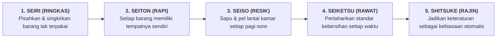

# SUB-BAB 3.1: STANDARISASI 5S KAMAR ASRAMA (RINGKAS, RAPI, RESIK, RAWAT, RAJIN)

---

## 1. Menata Kamar Sebagai Cermin Penataan Jiwa

Dalam tradisi pesantren TUMBUH, menata kamar tidur bukanlah sekadar pekerjaan fisik kasar, melainkan sebuah bentuk **latihan ketertiban batin (*Riyadhatun Nafs fi an-Nazhafah*)**. [^1]

Rasulullah SAW telah bersabda:

> **إِنَّ اللَّهَ طَيِّبٌ يُحِبُّ الطَّيِّبَ، نَظِيفٌ يُحِبُّ النَّظَافَةَ، كَرِيمٌ يُحِبُّ الْكَرَمَ، جَوَادٌ يُحِبُّ الْجُودَ، فَنَظِّفُوا أَفْنِيَتَكُمْ**
> 
> *"Sesungguhnya Allah itu Maha Baik dan mencintai kebaikan, Maha Bersih dan mencintai kebersihan, Maha Mulia dan mencintai kemuliaan, Maha Dermawan dan mencintai kedermawanan; maka bersihkanlah halaman-halaman rumah (dan pekarangan) kalian."* (HR. At-Tirmidzi no. 2799, hasan gharib) [^2]

Ekosistem TUMBUH mengadaptasi metodologi industri kelas dunia **5S (Seiri, Seiton, Seiso, Seiketsu, Shitsuke)** ke dalam bahasa operasional pesantren (5R):

---

## 2. Praktik Harian 5S Kamar Santri

1. **Seiri (Ringkas)**: Santri hanya menyimpan perlengkapan belajar dan pakaian yang diperlukan; barang-barang rusak atau sampah kardus langsung dibuang.
2. **Seiton (Rapi)**: Buku berada di rak buku, alat mandi di keranjang mandi, pakaian seragam di hanger lemari, sandal di rak alas kaki.
3. **Seiso (Resik)**: Piket harian 10 menit setiap pagi (06:30 - 06:40) untuk menyapu dan mengepel lantai kamar.
4. **Seiketsu (Rawat)**: Audit visual kebersihan harian oleh musyrif pendamping kamar.
5. **Shitsuke (Rajin)**: Menerapkan budaya 5S atas kesadaran mandiri tanpa perlu disuruh-suruh lagi.

---

### 📚 Catatan Kaki & Referensi Akademik:

[^1]: Al-Ghazali, Abu Hamid Muhammad bin Muhammad. (2004). *Ihya' 'Ulumiddin*. Beirut: Dar al-Kutub al-'Ilmiyyah, Jilid I, Kitab *Asrar ath-Thaharah*, hlm. 155–170.
[^2]: At-Tirmidzi, Muhammad bin 'Isa. (1998). *Sunan at-Tirmidzi*, Kitab *al-Adab*, Hadits no. 2799.
[^3]: Imai, M. (1997). *Gemba Kaizen*. New York: McGraw-Hill, hlm. 65–88.
