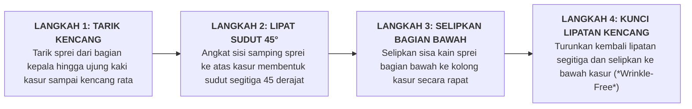

# SUB-BAB 3.2: PANDUAN TATA LETAK KASUR (*HOSPITAL CORNER*), LEMARI, & RAK SEPATU

---

## 1. Presisi Penataan Tempat Tidur: Standar Lipatan *Hospital Corner*

Salah satu indikator visual paling nyata dari keteraturan adab di kamar asrama adalah **kondisi tempat tidur santri**. Kasur yang tertata kencang dan rapi mencerminkan kesiapan mental santri untuk memulai hari dengan disiplin tinggi. [^1]

Ekosistem TUMBUH menetapkan metode penataan kasur standar **Hospital Corner (Sudut Lipat Segitiga 45 Derajat)**:



---

## 2. Standardisasi Zonasi Lemari Pakaian 3 Rak (*Wardrobe Standard*)

Setiap santri diberikan satu unit lemari pakaian pribadi dengan 3 zona penyimpanan terstandarisasi untuk memastikan pakaian tidak menumpuk sembarangan: [^2]

```
                 STANDARISASI ZONASI 3 RAK LEMARI PAKAIAN SANTRI
  
  ┌──────────────────────────────────────────────────────────────────────────┐
  │ ZONA 1 (ATAS): GANTUNGAN SERAGAM RESMI & BUSANA MUSLIM                   │
  │ • Menggunakan hanger seragam plastik hitam menghadap ke dalam lemari.    │
  │ • Urutan dari kiri ke kanan: Jas Almamater -> Seragam Madrasah -> Baju   │
  │   Koko/Gamis -> Jubah Sholat.                                            │
  ├──────────────────────────────────────────────────────────────────────────┤
  │ ZONA 2 (TENGAH): PAKAIAN HARIAN DILIPAT METODE VERTIKAL                  │
  │ • Pakaian dilipat simetris & disusun berdiri/vertikal (metode KonMari).  │
  │ • Baris 1: Kaos dalam & celana dalam (disimpan dalam pouch kain).        │
  │ • Baris 2: Sarung harian & celana sirwal.                                │
  │ • Baris 3: Sajadah cadangan & peci/kopiah putih.                         │
  ├──────────────────────────────────────────────────────────────────────────┤
  │ ZONA 3 (BAWAH): KOTAK PERLENGKAPAN PRIBADI & KITAB                       │
  │ • Keranjang perlengkapan mandi berpori (sabun, sampo, sikat gigi).       │
  │ • Tempat sabun cuci & deterjen tertutup rapat.                           │
  │ • Kitab kuning penunjang & buku tulis cadangan.                          │
  └──────────────────────────────────────────────────────────────────────────┘
```

---

## 3. Disiplin Rak Sepatu & Sandal (*Footwear Alignment Discipline*)

Penataan alas kaki di depan pintu kamar asrama mengikuti protokol kesiapsiagaan:
1. **Posisi Menghadap ke Luar (*Facing Outward*)**: Seluruh sandal dan sepatu diletakkan di rak alas kaki dengan bagian ujung depan sandal menghadap ke arah luar koridor.
2. **Filosofi Kesiapan Langkah (*Readiness Mindset*)**: Saat santri hendak keluar kamar menuju masjid atau madrasah, santri dapat langsung memasukkan kedua kakinya ke dalam sandal secara cepat tanpa perlu memutar badan atau berdesak-desakan.
3. **Kapasitas Maksimal Rak**: Setiap santri maksimal meletakkan 2 pasang alas kaki di rak (1 pasang sepatu madrasah dan 1 pasang sandal wudhu). Sepatu olahraga cadangan disimpan rapi di dalam loker sepatu khusus.

---

### 📚 Catatan Kaki & Referensi Akademik:

[^1]: US Navy. (2018). *Recruit Training Command: Bed Making and Inspection Standards*. Great Lakes, IL: Department of the Navy, hlm. 12–25.
[^2]: Kondo, M. (2014). *The Life-Changing Magic of Tidying Up: The Japanese Art of Decluttering and Organizing*. Berkeley: Ten Speed Press.
[^3]: Imai, M. (1997). *Gemba Kaizen: A Commonsense, Low-Cost Approach to Management*. New York: McGraw-Hill.
