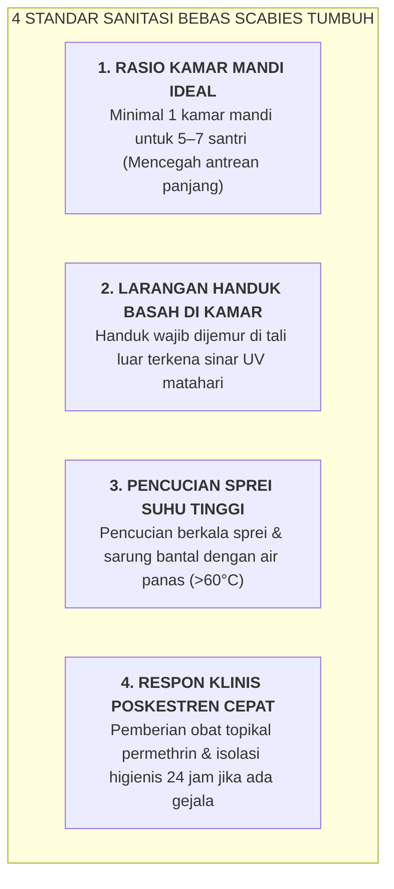

# SUB-BAB 3.3: PROTOKOL SANITASI KAMAR MANDI RASIO 1:5 & PENCEGAHAN SCABIES

---

## 1. Menghapus Stigma Penyakit Asrama: Menolak Anggapan Wajar Scabies

Di banyak pesantren lama, timbulnya penyakit kulit kudis/gudik (*Scabies*) sering kali dianggap keliru sebagai "tanda berkah mondok" atau "tanda sah menjadi santri". 

Secara medis dan fiqih Islam, membiarkan santri menderita infeksi parasit kulit adalah sebuah **kelalaian fatal terhadap mandat Hifzh an-Nafs dan Asrar ath-Thaharah**. Scabies bukan tanda berkah, melainkan tanda dari **kegagalan sistem sanitasi, kelembapan kamar berlebih, dan keterbatasan rasio fasilitas mandi**. [^1]

Ekosistem TUMBUH menetapkan **Dekrit Sanitasi Sehat & Zero-Scabies Sanctuary**:

---

## 2. SOP Sanitasi Kamar Mandi Harian

1. **Pembersihan Rutin 2x Sehari**: Petugas kebersihan Sarpras menyikat lantai toilet dan menguras bak mandi setiap pagi dan sore.
2. **Ventilasi Silang & Sirkulasi Udara Sehat**: Setiap kamar mandi dan kamar tidur memiliki ventilasi udara alami yang cukup, memastikan kelembapan udara tetap berada pada batas sehat ($40\% - 60\%$).
3. **Penyuluhan Higienitas Pribadi**: Santri dilarang saling bertukar pakaian dalam, handuk, atau selimut (*no sharing personal unhygienic items*).

Dengan penegakan protokol sanitasi ini, pesantren menjadi lingkungan yang bersih, wangi, higienis, dan sehat bugar bagi seluruh santri.

---

### 📚 Catatan Kaki & Referensi Akademik:

[^1]: Engelman, D., et al. (2019). The global control of scabies: A public health priority. *The Lancet Infectious Diseases*, 19(4), e130–e138.
[^2]: World Health Organization. (2020). *Scabies: Key Facts*. Geneva: WHO.
