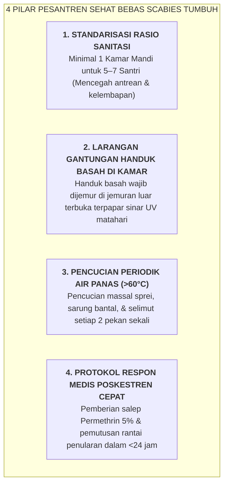

# SUB-BAB 3.3: PROTOKOL SANITASI KAMAR MANDI RASIO 1:5 & PENCEGAHAN SCABIES

---

## 1. Menolak Mitos Menyesatkan: Mengapa Scabies Bukan Tanda Berkah?

Di sebagian pesantren tradisional di Nusantara, masih berkembang sebuah mitos berbahaya bahwa menderita penyakit kudis/gudik (*Scabies*) adalah "tanda sah menjadi santri", "tanda keikhlasan mondok", atau bahkan "penghapus dosa yang membawa berkah ilmu". [^1]

Secara tinjauan medis modern dan kaidah syariat Islam (*Hifzh an-Nafs & Hifzh al-Jasad*), mitos ini adalah sebuah **kejahatan pembiaran kesehatan dan pelanggaran amanah pengasuhan**. 

*Scabies* disebabkan oleh infestasi parasit tungau *Sarcoptes scabiei var. hominis* yang bersarang di bawah lapisan kulit, menyebabkan rasa gatal luar biasa yang memuncak pada malam hari. Santri yang menderita scabies:
* Kehilangan waktu tidur lelap malam karena terus menggaruk kulit hingga berdarah.
* Mengalami infeksi bakteri sekunder (*Impetigo, Selulitis, hingga Glomerulonefritis Akut* pada ginjal).
* Mengalami penurunan konsentrasi belajar dan rasa minder/malu dalam pergaulan sosial.

Ekosistem TUMBUH mendeklarasikan **Gerakan Pesantren Bersih Sehat & Zero-Scabies Sanctuary**:



---

## 2. Standardisasi Rasio Fasilitas Sanitasi & Desain Sirkulasi Udara

Wakamad Sarpras bertanggung jawab memastikan kelaikan fisik fasilitas kamar mandi dan sanitasi: [^2]

1. **Rasio Ideal 1 : 5 (Satu Toilet untuk Lima Santri)**:
   * Menghilangkan antrean panjang di pagi dan sore hari yang kerap memicu santri mandi tergesa-gesa tanpa membersihkan tubuh secara sempurna.
2. **Ventilasi Silang & Pencahayaan Alami (*Cross Ventilation & Daylight*)**:
   * Kamar mandi dirancang memiliki ventilasi udara langsung ke luar gedung dan mendapatkan sinar matahari alami untuk mencegah pertumbuhan jamur dan kelembapan tinggi ($>70\%$).
3. **Kualitas Air Bersih Standar Permenkes**:
   * Air wudhu dan mandi menggunakan sistem penyaringan (*sand-filter & carbon-filter*) dan klorinasi aman, diuji laboratorium secara berkala.

---

## 3. SOP Penanganan Kasus Scabies Cepat di Poskestren

```
               SOP PENANGANAN KLINIS KASUS SCABIES POSKESTREN
  
  ┌───────────────────────┬────────────────────────────────────────────────────────┐
  │ TAHAPAN PENANGANAN    │ PROTOKOL TINDAKAN KLINIS POSKESTREN & ASRAMA           │
  ├───────────────────────┼────────────────────────────────────────────────────────┤
  │ 1. Skrining & Deteksi │ Perawat Poskestren melakukan pemeriksaan lesi kulit    │
  │    Dini (< 12 Jam)    │ khas (terowongan/papul merah di sela jari, pergelangan │
  │                       │ tangan, dan lipatan paha).                            │
  ├───────────────────────┼────────────────────────────────────────────────────────┤
  │ 2. Terapi Topikal     │ Pengolesan Krim Permethrin 5% ke seluruh tubuh santri  │
  │    Massal Sekamar     │ dari leher hingga ujung kaki; didiamkan selama 8-12   │
  │                       │ jam sebelum dibilas bersih.                            │
  │                       │ *Seluruh teman sekamar wajib diobati serentak*.        │
  ├───────────────────────┼────────────────────────────────────────────────────────┤
  │ 3. Dekontaminasi Kain │ Seluruh pakaian, sprei, sarung bantal, & selimut kamar │
  │    Suhu Panas (>60°C) │ direndam dalam air mendidih atau dimasukkan ke dalam   │
  │                       │ mesin pengering suhu panas (>60°C) selama 30 menit.    │
  ├───────────────────────┼────────────────────────────────────────────────────────┤
  │ 4. Isolasi Higienis   │ Santri beristirahat di ruang isolasi Poskestren selama │
  │    24 Jam             │ 24 jam pertama hingga terapi topikal tuntas.           │
  └───────────────────────┴────────────────────────────────────────────────────────┘
```

Dengan penegakan protokol sanitasi yang ketat dan ilmiah, pesantren membuktikan diri sebagai rumah pendidikan yang suci, higienis, bugar, dan memuliakan kesehatan setiap santri.

---

### 📚 Catatan Kaki & Referensi Akademik:

[^1]: Engelman, D., et al. (2019). The global control of scabies: A public health priority. *The Lancet Infectious Diseases*, 19(4), e130–e138.
[^2]: World Health Organization. (2020). *Scabies: Key Facts and Global Epidemiology*. Geneva: WHO Guidelines.
[^3]: Kementerian Kesehatan Republik Indonesia. (2019). *Pedoman Pengendalian Penyakit Kulit Scabies di Lingkungan Pesantren dan Asrama*. Jakarta: Ditjen P2P Kemenkes RI.
