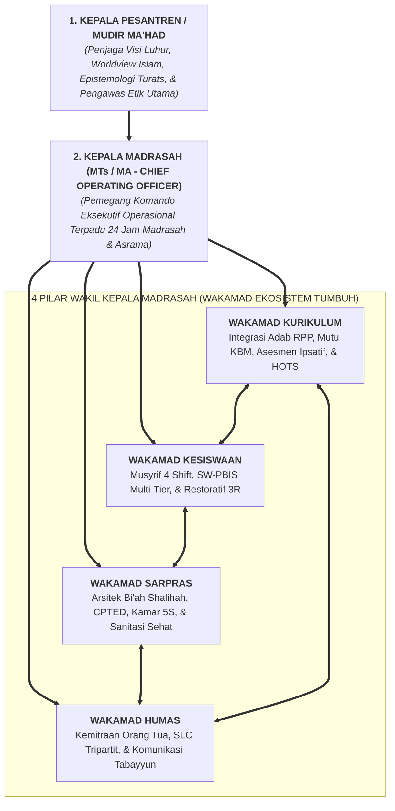

# SUB-BAB 4.1: STRUKTUR ORGANISASI BARU: KEPALA PESANTREN $\rightarrow$ KEPALA MA/MTs $\rightarrow$ 4 WAKAMAD

---

## 1. Menghapus Dualisme Kelembagaan yang Membelah Pondok

Dalam sejarah tata kelola pesantren di Indonesia, salah satu krisis struktural yang paling sering memicu inefisiensi dan perselisihan internal adalah **adanya dualisme komando (*Dual-Authority Paradox*)** antara "Pengurus Yayasan/Pondok Pengasuhan" dengan "Pihak Pengelola Sekolah Formal (Madrasah Tsanawiyah / Aliyah)". [^1]

Dalam sistem dualisme yang terpecah ini:
* Kepala Madrasah merasa hanya bertanggung jawab atas kurikulum formal dari jam 07:00 hingga 14:00, tidak peduli dengan apa yang terjadi di asrama.
* Direktur Pengasuhan Asrama merasa menjadi otoritas tunggal atas santri di luar jam madrasah, membuat aturan sendiri yang sering kali bertabrakan dengan jadwal ujian atau tugas madrasah.
* Santri bingung mematuhi siapa, sementara staf pengajar dan musyrif saling bersaing memperebutkan pengaruh dan anggaran (*Resource & Authority Turf Wars*).

Ekosistem TUMBUH merombak struktur dualisme ini dan menegakkan **Struktur Organisasi Komando Terpadu Pendidikan 24 Jam**:

---

## 2. Garis Komando & Delegasi Otoritas

Struktur organisasi baru ini menetapkan garis instruksi dan pertanggungjawaban yang sangat tegas: [^2]

1. **Kepala Pesantren / Mudir Ma'had (*The Visionary Custodian*)**:
   * Bertanggung jawab menjaga kemurnian visi tauhid, arah kebijakan strategis, keberkahan sanad keilmuan turats, dan integritas moral seluruh lembaga.
2. **Kepala Madrasah (*Chief Operating Officer / COO 24 Jam*)**:
   * Memegang otoritas penuh eksekutif atas seluruh kegiatan belajar di madrasah dan kehidupan santri di asrama selama 24 jam.
   * Menjadi satu-satunya atasan langsung bagi keempat Wakil Kepala Madrasah (Kurikulum, Kesiswaan, Sarpras, Humas), sehingga tidak ada lagi tumpang tindih instruksi.
3. **Empat Wakil Kepala Madrasah (Wakamad)**:
   * Memimpin bidang masing-masing dengan mekanisme *Cross-Functional Collaboration* (kolaborasi lintas fungsi).
   * Bertanggung jawab melaporkan kinerja bidangnya setiap hari melalui logbook terpadu dan rapat koordinasi mingguan.

---

## 3. Matriks Alur Pengambilan Keputusan Strategis & Operasional

| Kategori Keputusan | Pelaksana Pemrakarsa | Tim Verifikasi & Telaah | Pemutus Keputusan Akhir |
| :--- | :--- | :--- | :--- |
| **Kasus Disiplin Berat Tier 3** | Musyrif Kamar & Konselor BK | Wakamad Kesiswaan & Tim Restoratif | **Kepala Madrasah & Mudir** (Persetujuan Bersama) |
| **Perubahan Modul Ajar / RPP Adab** | Tim Guru Mata Pelajaran (MGMP) | Tim Kurikulum & Ahli Turats | **Wakamad Kurikulum** |
| **Pengadaan & Renovasi Sarpras Besar** | Tim Sarpras Lapangan | Wakamad Sarpras & Bagian Keuangan | **Kepala Madrasah & Yayasan** |
| **Penyelesaian Komplain Wali Santri** | Petugas Helpdesk Humas | Wakamad Humas & Bidang Terkait | **Wakamad Humas / Kamad** |

Dengan struktur komando terpadu ini, seluruh energi institusi terfokus pada satu tujuan agung: melayani, menumbuhkan, dan memuliakan fitrah seluruh santri secara adil dan terukur.

---

### 📚 Catatan Kaki & Referensi Akademik:

[^1]: Lencioni, P. (2006). *Silos, Politics and Turf Wars: A Leadership Fable About Destroying the Barriers That Turn Colleagues Into Competitors*. San Francisco: Jossey-Bass, hlm. 150–190.
[^2]: Al-Mawardi, Abu al-Hasan 'Ali bin Muhammad. (1987). *Al-Ahkam as-Sulthaniyyah wa al-Wilayat ad-Diniyyah*. Beirut: Dar al-Kutub al-'Ilmiyyah, hlm. 25–48.
[^3]: Senge, P. M. (2006). *The Fifth Discipline: The Art and Practice of the Learning Organization*. New York: Doubleday.
