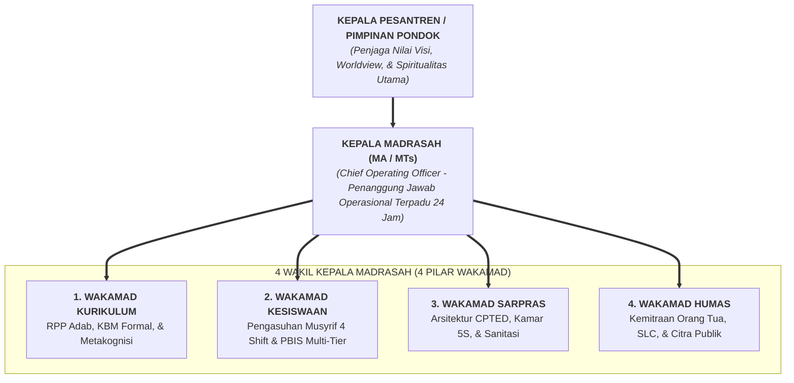

# SUB-BAB 4.1: STRUKTUR ORGANISASI BARU: KEPALA PESANTREN $\rightarrow$ KEPALA MA/MTs $\rightarrow$ 4 WAKAMAD

---

## 1. Bagan Komando Terpadu 24 Jam

Ekosistem TUMBUH merombak struktur dualisme yang memisahkan antara yayasan pondok dengan madrasah formal menjadi **Struktur Komando Pendidikan Terpadu 24 Jam**: [^1]

---

## 2. Mengakhiri Ego Sektoral: Forum Koordinasi Mingguan Terpadu

Tidak ada lagi pilar yang merasa "lebih penting" dari pilar lain:
* Wakamad Kurikulum menyadari bahwa guru tidak akan sukses mengajar jika santri mengantuk karena kegagalan manajemen asrama (Kesiswaan) atau kamar yang pengap (Sarpras).
* Wakamad Kesiswaan menyadari bahwa musyrif tidak akan mampu mendisiplinkan santri jika materi di kelas membosankan dan memicu stres anak.

Setiap hari Kamis sore, diselenggarakan **Rapat Pleno 4 Wakamad** yang dipimpin langsung oleh Kepala Madrasah untuk mengevaluasi data analitik logbook mingguan dan merumuskan langkah perbaikan bersama.

---

### 📚 Catatan Kaki & Referensi Akademik:

[^1]: Lencioni, P. (2006). *Silos, Politics and Turf Wars: A Leadership Fable About Destroying the Barriers That Turn Colleagues Into Competitors*. San Francisco: Jossey-Bass, hlm. 145–182.
[^2]: Al-Mawardi, Abu al-Hasan 'Ali bin Muhammad. (1987). *Al-Ahkam as-Sulthaniyyah*. Beirut: Dar al-Kutub al-'Ilmiyyah, hlm. 25–48.
