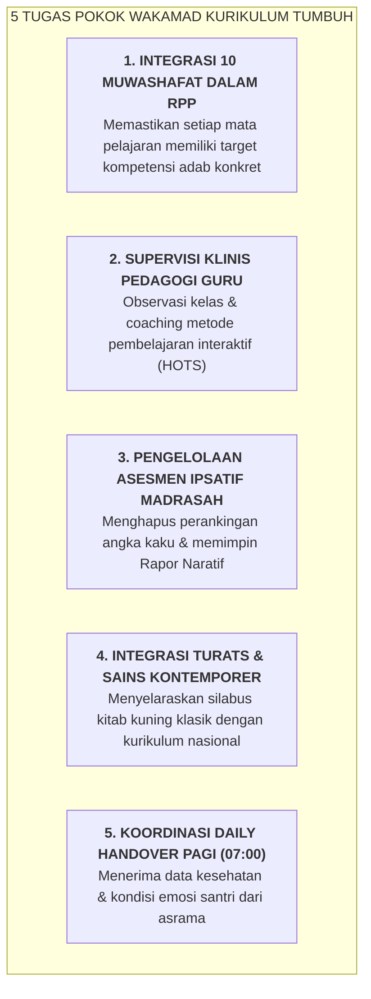

# SUB-BAB 4.2: TUPOKSI & MANDAT WAKAMAD KURIKULUM (INTEGRASI ADAB RPP & HOTS)

---

## 1. Mandat Strategis Wakamad Kurikulum

**Wakil Kepala Madrasah Bidang Kurikulum** bertanggung jawab memastikan bahwa proses transfer ilmu (*Ta'lim*) di ruang-ruang kelas madrasah terintegrasi secara organik dengan pembinaan adab (*Ta'dib*) dan pengembangan nalar kritis (*Mutsaqqaful Fikr*). [^1]

---

## 2. Standar Mutu Pembelajaran Kelas Bebas Stres Toksik

Wakamad Kurikulum mengawal standar proses belajar mengajar:
* **Larangan Mempermalukan Siswa**: Guru dilarang membentak atau mempermalukan santri yang lambat memahami materi di depan kelas.
* **Metode Active Learning**: Guru memfasilitasi diskusi halaqah, eksperimen sains, dan presentasi mandiri santri (*Student-Centered Learning*).

---

### 📚 Catatan Kaki & Referensi Akademik:

[^1]: Tomlinson, C. A. (2014). *The Differentiated Classroom*. Alexandria, VA: ASCD, hlm. 25–50.
