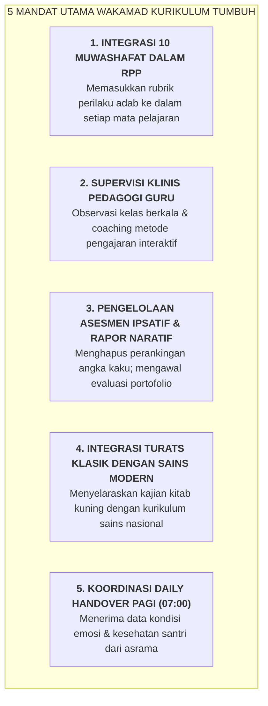

# SUB-BAB 4.2: TUPOKSI & MANDAT WAKAMAD KURIKULUM (INTEGRASI ADAB RPP & HOTS)

---

## 1. Menolak Sekularisasi Terselubung di Ruang Kelas Madrasah

Dalam praktik pendidikan Islam formal saat ini, sering kali terjadi sekularisasi metodologis: pelajaran sains, matematika, dan ilmu sosial diajarkan secara terpisah tanpa kaitan nilai-nilai tauhid dan adab Islam (*Disintegrated Secular Pedagogy*), sementara pelajaran agama (Fiqih, Aqidah, Akhlak) diajarkan secara hafalan kognitif hafalan teks tanpa aplikasi moral di kehidupan nyata. [^1]

Ekosistem TUMBUH memposisikan **Wakil Kepala Madrasah Bidang Kurikulum (Wakamad Kurikulum)** sebagai **Arsitek Integrasi Ilmu & Adab (*Architect of Integrated Curriculum & Higher-Order Thinking Skills*)**. 

Wakamad Kurikulum bertanggung jawab memastikan bahwa setiap Rencana Pelaksanaan Pembelajaran (RPP) dan Modul Ajar di ruang kelas madrasah secara eksplisit memuat indikator kompetensi **10 Muwashafat Karakter Santri**, penalaran tingkat tinggi (*Higher-Order Thinking Skills - HOTS*), dan pembiasaan adab menuntut ilmu (*Adab al-Muta'allim*).

---

## 2. Rincian Tupoksi Baku Wakamad Kurikulum

1. **Perumusan Modul Ajar Terintegrasi Adab**:
   * Membimbing Musyawarah Guru Mata Pelajaran (MGMP) dalam menyisipkan nilai-nilai karakter (misal: integritas ilmiah dalam eksperimen kimia, ketelitian amanah dalam matematika, dan empati sosial dalam geografi).
2. **Supervisi Pengajaran Humanis Bebas *Public Shaming***:
   * Mengaudit metode pengajaran guru di kelas; memastikan tidak ada guru yang menggunakan kekerasan verbal, bentakan kasar, atau mempermalukan santri yang lambat memahami pelajaran (*Dignity-First Classroom*). [^2]
3. **Penyelarasan Kalender Akademik dengan Ritme Asrama**:
   * Mengatur jadwal ujian, tugas proyek, dan praktikum agar tidak berbenturan dengan agenda ibadah malam atau kegiatan tahfidz Al-Qur'an asrama.
4. **Penyelenggaraan Asesmen Ipsatif Semesteran**:
   * Mengoordinasikan penyusunan Rapor Naratif Deskriptif berbasis portofolio bukti otentik dan memfasilitasi pelaksanaan *Student-Led Conference (SLC)* bersama orang tua.

---

### 📚 Catatan Kaki & Referensi Akademik:

[^1]: Al-Attas, Syed Muhammad Naquib. (1980). *The Concept of Education in Islam*. Kuala Lumpur: ABIM, hlm. 35–62.
[^2]: Tomlinson, C. A. (2014). *The Differentiated Classroom: Responding to the Needs of All Learners* (2nd ed.). Alexandria, VA: ASCD.
[^3]: Marzano, R. J. (2007). *The Art and Science of Teaching*. Alexandria, VA: ASCD.
