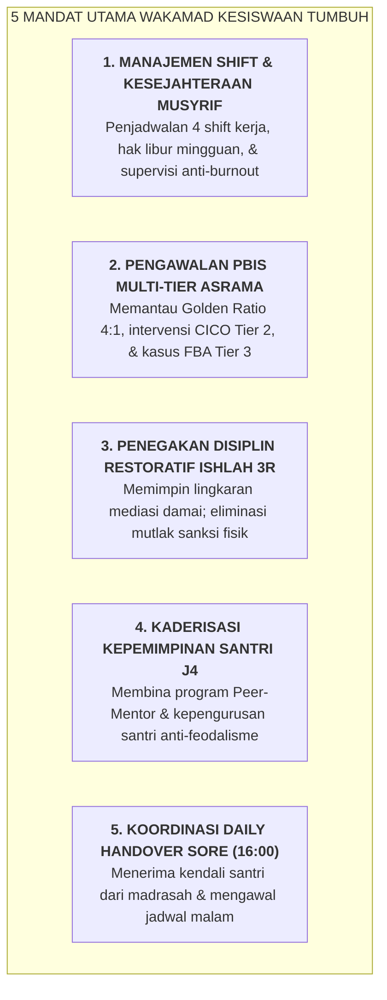

# SUB-BAB 4.3: TUPOKSI & MANDAT WAKAMAD KESISWAAN (MANAJEMEN MUSYRIF & PBIS MULTI-TIER)

---

## 1. Menegakkan Otoritas Pengasuhan 24 Jam yang Berkeadilan

**Wakil Kepala Madrasah Bidang Kesiswaan (Wakamad Kesiswaan)** adalah panglima operasional pembinaan karakter dan disiplin 24 jam santri. Di bawah payung Ekosistem TUMBUH, Wakamad Kesiswaan bukan lagi seorang "algojo penegak hukuman", melainkan **Direktur Ekosistem Pengasuhan & Perlindungan Santri (*Director of Residential Life & Student Safeguarding*)**. [^1]

Wakamad Kesiswaan bertanggung jawab mengomandoi seluruh korps Musyrif Asrama dalam sistem 4 shift kerja, mengawal implementasi School-Wide PBIS Multi-Tier, memfasilitasi penegakan Keadilan Restoratif (*Ishlah al-Bain 3R*), dan memimpin pembinaan kepemimpinan santri (*Peer-Mentorship J4*).

---

## 2. Rincian Tupoksi Baku Wakamad Kesiswaan

1. **Pengelolaan Korps Musyrif Asrama 4 Shift**:
   * Menyusun jadwal rotasi kerja 4 shift musyrif, memastikan rasio ideal musyrif-santri ($1:15$ hingga $1:20$), dan menjamin terlaksananya hak libur 1 hari per pekan.
   * Menyelenggarakan majelis *Liqa' Ruhi* dwi-mingguan untuk supervisi klinis dan katarsis emosional para musyrif.
2. **Pengawasan Implementasi PBIS Multi-Tier**:
   * Memantau logbook digital musyrif untuk memastikan rasio apresiasi verbal mencapai Golden Ratio minimal $4:1$ dibanding teguran.
   * Memimpin pertemuan evaluasi dwi-mingguan bagi santri yang sedang menjalani intervensi Tier 2 (CICO) dan Tier 3 (BIP).
3. **Pemberantasan Budaya Perundungan & Feodalisme Senior**:
   * Melakukan patroli titik rawan (*Hotspots Patrol*), menghapus segala bentuk sidang malam atau perpeloncoan santri junior, dan menerapkan protokol perlindungan anak (*Child Safeguarding*). [^2]
4. **Pembinaan Organisasi Santri Berbasis Khidmah (*Sayyidul Qaum Khadimuhum*)**:
   * Membimbing pengurus organisasi santri jenjang J4 untuk memimpin dengan teladan kasih sayang dan pelayanan, bukan dengan intimidasi kekuasaan.

---

### 📚 Catatan Kaki & Referensi Akademik:

[^1]: Sugai, G., & Horner, R. H. (2006). A promising approach for expanding and sustaining school-wide positive behavior support. *School Psychology Review*, 35(2), 245–259.
[^2]: Olweus, D. (1993). *Bullying at School: What We Know and What We Can Do*. Oxford: Blackwell.
[^3]: Lewis, T. J., & Sugai, G. (1999). Effective behavior support: A systems approach to proactive schoolwide management. *Focus on Exceptional Children*, 31(6), 1–24.
