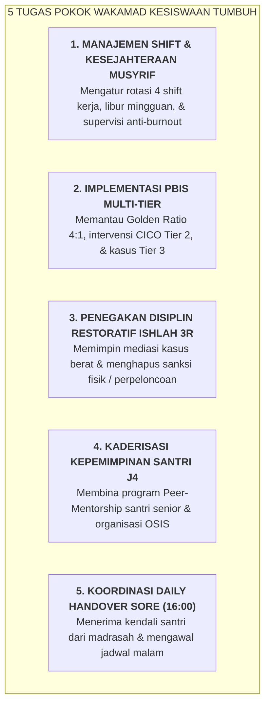

# SUB-BAB 4.3: TUPOKSI & MANDAT WAKAMAD KESISWAAN (MANAJEMEN MUSYRIF & PBIS MULTI-TIER)

---

## 1. Mandat Strategis Wakamad Kesiswaan

**Wakil Kepala Madrasah Bidang Kesiswaan** bertanggung jawab mengomandoi seluruh ekosistem pembinaan asrama 24 jam, mengelola staf musyrif dalam 4 shift kerja, serta mengawal implementasi School-Wide PBIS Multi-Tier dan Keadilan Restoratif. [^1]

---

## 2. Standar Perlindungan Santri & Eliminasi Kekerasan

Wakamad Kesiswaan bertindak sebagai **Kepala Perlindungan Santri (*Chief Safeguarding Officer*)**:
* Menjamin berjalannya kebijakan *Zero Corporal Punishment*.
* Menindak tegas setiap oknum pengurus atau musyrif yang melakukan kekerasan verbal atau fisik terhadap santri.

---

### 📚 Catatan Kaki & Referensi Akademik:

[^1]: Sugai, G., & Horner, R. H. (2006). School-wide positive behavior support. *School Psychology Review*, 35(2), 245–259.
