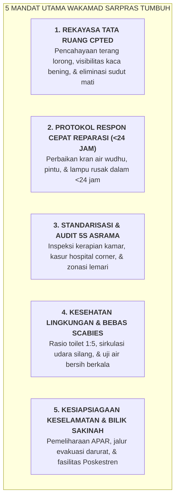

# SUB-BAB 4.4: TUPOKSI & MANDAT WAKAMAD SARPRAS (ARSITEK BI'AH SHALIHAH, CPTED, & 5S)

---

## 1. Sarana Prasarana Sebagai Instrumen Tarbiyah yang Hidup

Dalam paradigma konvensional, bagian sarana dan prasarana sering kali diposisikan sebagai unit pelengkap logistik yang bertugas pasif menunggu laporan kerusakan barang. 

Ekosistem TUMBUH merombak total paradigma ini dengan menetapkan **Wakil Kepala Madrasah Bidang Sarana & Prasarana (Wakamad Sarpras)** sebagai **Arsitek Rekayasa Lingkungan Bi'ah Shalihah (*Environmental Engineer of Sacred Space*)**. [^1]

Wakamad Sarpras bertanggung jawab merekayasa seluruh ruang fisik pesantren—mulai dari pencahayaan lorong, ventilasi kamar, akustik ruang tahfidz, sanitasi toilet, hingga eliminasi sudut buta (*Blind Spots*)—agar secara otomatis mendukung kenyamanan ibadah, keselamatan santri, dan pembentukan kebiasaan hidup teratur.

---

## 2. Rincian Tupoksi Baku Wakamad Sarpras

1. **Pencegahan Kriminalitas Melalui Tata Ruang (CPTED)**:
   * Mengaudit seluruh area pesantren untuk memastikan tidak ada lorong gelap atau sudut tersembunyi yang berpotensi menjadi lokasi perundungan; memasang lampu penerangan LED di seluruh perimeter asrama. [^2]
2. **Penegakan Standar Waktu Perbaikan (<24 Jam Respon Pasti)**:
   * Memimpin tim teknisi pemeliharaan gerak cepat (*Quick Response Maintenance Team*); setiap keluhan kran bocor, lampu mati, atau engsel pintu rusak wajib diperbaiki tuntas dalam tempo maksimal $1 \times 24$ jam demi mencegah *Broken Windows Effect*.
3. **Audit Kelaikan Fasilitas Sanitasi & Poskestren**:
   * Memastikan ketersediaan pasokan air bersih melimpah di tempat wudhu dan toilet (rasio $1:5$ santri per kamar mandi) serta pemeliharaan kebersihan bak mandi.
4. **Penyediaan & Perawatan Bilik Sakinah**:
   * Menjaga kenyamanan fasilitas sensoris di Bilik Sakinah (karpet peredam suara lembut, diffuser aromaterapi, dispenser air, dan pencahayaan temaram hangat).

---

### 📚 Catatan Kaki & Referensi Akademik:

[^1]: Crowe, T. D. (2000). *Crime Prevention Through Environmental Design: Applications of Architectural Design and Space Management Concepts* (2nd ed.). Oxford: Butterworth-Heinemann, hlm. 35–70.
[^2]: Wilson, J. Q., & Kelling, G. L. (1982). Broken windows: The police and neighborhood safety. *The Atlantic Monthly*, 249(3), 29–38.
[^3]: Castaldi, B. (1994). *Educational Facilities: Planning, Modernization, and Management*. Boston: Allyn & Bacon.
