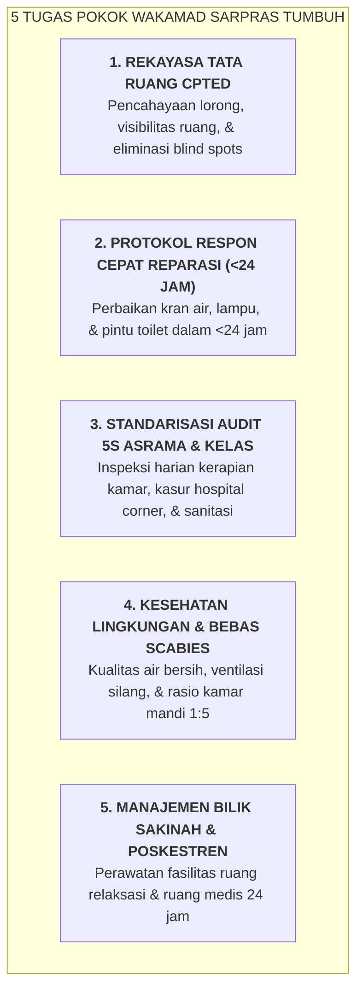

# SUB-BAB 4.4: TUPOKSI & MANDAT WAKAMAD SARPRAS (ARSITEK BI'AH SHALIHAH, CPTED, & 5S)

---

## 1. Mandat Strategis Wakamad Sarpras

**Wakil Kepala Madrasah Bidang Sarana & Prasarana** bukan sekadar "penjaga gudang dan logistik", melainkan **Arsitek Lingkungan Bi'ah Shalihah** yang bertanggung jawab merekayasa ruang fisik pesantren agar aman, sehat, terang, dan mendukung pembentukan karakter adab. [^1]

---

## 2. Standar Pemeliharaan Preventif (*Preventive Maintenance*)

Wakamad Sarpras menerapkan jadwal inspeksi preventif mingguan untuk memastikan seluruh infrastruktur vital (listrik, pompa air, sanitasi, dan perlengkapan pemadam kebakaran) berada dalam status siap pakai 100%.

---

### 📚 Catatan Kaki & Referensi Akademik:

[^1]: Crowe, T. D. (2000). *Crime Prevention Through Environmental Design*. Oxford: Butterworth-Heinemann, hlm. 35–68.
