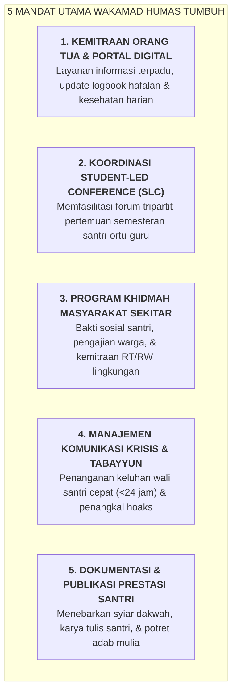

# SUB-BAB 4.5: TUPOKSI & MANDAT WAKAMAD HUMAS (KEMITRAAN ORANG TUA & KOMUNIKASI POSITIF)

---

## 1. Menghubungkan Lembaga dengan Rumah & Masyarakat

Keberhasilan pendidikan karakter di pesantren tidak akan pernah sempurna tanpa adanya **kemitraan simbiotik yang kokoh antara pihak pondok dengan keluarga di rumah (*Home-School Partnership*)** serta penerimaan yang hangat dari masyarakat lingkungan sekitar. [^1]

Dalam Ekosistem TUMBUH, **Wakil Kepala Madrasah Bidang Hubungan Masyarakat (Wakamad Humas)** bukan sekadar juru bicara seremonial, melainkan **Direktur Kemitraan Strategis & Komunikasi Transparan (*Director of Family Engagement & Institutional Communications*)**. 

Wakamad Humas bertanggung jawab menjembatani aliran informasi timbal balik, mengelola forum pertemuan semesteran *Student-Led Conference (SLC)*, memfasilitasi program pengabdian masyarakat santri (*Khidmah al-Mujtama'*), dan menegakkan keterbukaan komunikasi berlandaskan adab *Tabayyun*.

---

## 2. Rincian Tupoksi Baku Wakamad Humas

1. **Pengelolaan Portal Komunikasi Digital Terpadu**:
   * Memastikan sistem portal digital wali santri berjalan lancar; orang tua dapat memantau capaian hafalan Qur'an, kehadiran halaqah, catatan kesehatan Poskestren, dan menu makan santri secara transparan (*No-Surprise Policy*). [^2]
2. **Penyelenggaraan Hari Kunjungan & Parenting Adab**:
   * Mengatur SOP Hari Kunjungan Bulanan (*Visiting Day*), memastikan ketertiban area temu keluarga, dan menyelenggarakan seminar parenting berkala bagi orang tua.
3. **Layanan Pengaduan Satu Pintu (*Helpdesk Careline*)**:
   * Mengoperasikan kanal layanan pengaduan resmi wali santri; menjamin setiap aduan atau pertanyaan dijawab secara santun, cepat, dan berbasis data faktual riil dalam tempo maksimal $1 \times 24$ jam.
4. **Membangun Hubungan Harmonis dengan Masyarakat Sekitar**:
   * Mengoordinasikan program santri berkhidmah ke masjid-masjid warga sekitar (menjadi muadzin, imam tarawih, mengajar TPA), membagikan paket sembako berkala, dan menjaga keharmonisan lingkungan pesantren dengan tetangga.

---

### 📚 Catatan Kaki & Referensi Akademik:

[^1]: Epstein, J. L. (2018). *School, Family, and Community Partnerships: Preparing Educators and Improving Schools* (2nd ed.). New York: Routledge, hlm. 45–95.
[^2]: Henderson, A. T., & Mapp, K. L. (2002). *A New Wave of Evidence: The Impact of School, Family, and Community Connections on Student Achievement*. Austin, TX: SEDL.
[^3]: Al-Qurthubi, Abu 'Abdillah. (2006). *Al-Jami' li Ahkam al-Qur'an*. Kairo: Dar al-Kutub al-Mishriyyah, Jilid XVI, hlm. 312.
