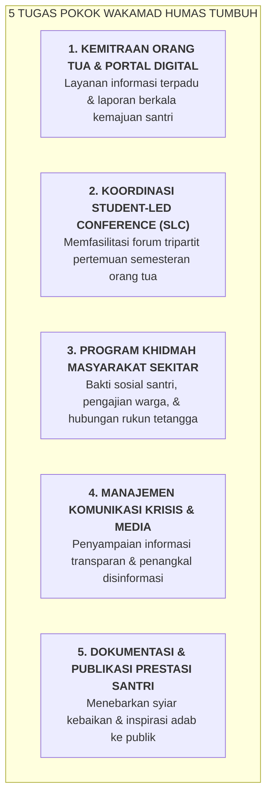

# SUB-BAB 4.5: TUPOKSI & MANDAT WAKAMAD HUMAS (KEMITRAAN ORANG TUA & KOMUNIKASI POSITIF)

---

## 1. Mandat Strategis Wakamad Humas

**Wakil Kepala Madrasah Bidang Hubungan Masyarakat** bertanggung jawab membangun jembatan kemitraan harmonis antara pesantren dengan orang tua santri (*Home-School Partnership*), masyarakat lingkungan sekitar, dan pemangku kepentingan eksternal. [^1]

---

## 2. Standar Transparansi & Keterbukaan Komunikasi

Wakamad Humas memastikan tidak ada tembok pemisah yang kaku antara orang tua dengan pondok:
* Orang tua mendapatkan akses portal digital untuk melihat perkembangan adab, kesehatan, dan prestasi ananda secara transparan.
* Penanganan keluhan orang tua dilayani dengan etika tabayyun yang ramah, cepat, dan solutif.

---

### 📚 Catatan Kaki & Referensi Akademik:

[^1]: Epstein, J. L. (2018). *School, Family, and Community Partnerships: Preparing Educators and Improving Schools* (2nd ed.). New York: Routledge, hlm. 45–80.
