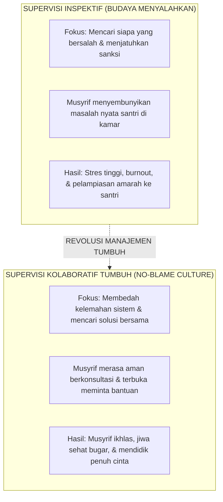

# SUB-BAB 5.1: FILOSOFI SUPERVISI KOLABORATIF: BUDAYA TANPA MENYALAHKAN (*NO-BLAME CULTURE*)

---

## 1. Merawat Jiwa Para Pendidik (*Caring for the Soul of Educators*)

Dalam pilar Triad Pertumbuhan Simbiotik Ekosistem TUMBUH, pertumbuhan dan keselamatan adab santri tidak akan pernah terwujud jika para pendidik dan pengasuhnya (guru dan musyrif) berada dalam kondisi tertekan, kelelahan jiwa, atau hidup dalam ketakutan terhadap pimpinan. [^1]

Di banyak institusi pesantren konvensional, model supervisi yang diterapkan adalah **Supervisi Otoriter-Inspektif (*Punitive-Inspection Model*)**: pimpinan pondok datang hanya untuk mencari-cari kesalahan musyrif, membentak staf di depan umum, dan mengancam pemotongan gaji setiap kali terjadi insiden di kamar asrama.

Budaya suka menyalahkan (*Blame Culture*) ini secara psikologi organisasi memicu dampak yang sangat destruktif:
* Musyrif menjadi defensif, menutupi masalah nyata santri, dan memalsukan laporan kehadiran/kedisiplinan (*Falsified Compliance Reports*).
* Terjadi degradasi keamanan psikologis (*Loss of Psychological Safety*), di mana staf merasa tidak dihargai dan diperlakukan semata-mata sebagai buruh murah.
* Akumulasi frustrasi dan rasa tertekan tersebut pada akhirnya dialihkan dan dilampiaskan oleh musyrif kepada para santri melalui kekerasan pengasuhan di kamar asrama.

Ekosistem TUMBUH merombak model supervisi ini dan menegakkan **Filosofi Supervisi Kolaboratif No-Blame (*Collaborative & Developmental Supervision*)**:

---

## 2. Prinsip Hubungan Pimpinan dengan Korps Musyrif

1. **Musyrif Sebagai Mitra Suci Dakwah (*Shuhbah Tarbawiyyah*)**:
   * Pimpinan memandang musyrif bukan sebagai bawahan upahan, melainkan sebagai saudara seperjuangan dakwah yang memegang amanah peradaban tertinggi (*Hamalat ar-Risalah*).
2. **Fokus pada Audit Sistem, Bukan Mengkambinghitamkan Personal**:
   * Tatkala terjadi masalah di asrama (misal: santri terlambat sholat atau terjadi perkelahian), pertanyaan pertama pimpinan adalah: *"Apakah SOP sudah dipahami dengan baik? Apakah rasio santri per musyrif terlalu berat? Apakah musyrif memerlukan waktu istirahat tambahan?"* [^2]
3. **Penyediaan Ruang Konsultasi Terbuka (*Open-Door Policy*)**:
   * Pimpinan dan konselor senior menyediakan waktu khusus setiap hari bagi para musyrif untuk berdiskusi, mencurahkan beban pikiran, dan meminta saran tanpa rasa takut akan dinilai buruk (*Non-Judgmental Space*).

---

### 📚 Catatan Kaki & Referensi Akademik:

[^1]: Edmondson, A. (1999). Psychological safety and learning behavior in work teams. *Administrative Science Quarterly*, 44(2), 350–383.
[^2]: Deming, W. E. (1986). *Out of the Crisis*. Cambridge, MA: MIT Center for Advanced Educational Services, hlm. 120–145.
[^3]: Hawkins, P., & Shohet, R. (2012). *Supervision in the Helping Professions* (4th ed.). Maidenhead: Open University Press.
