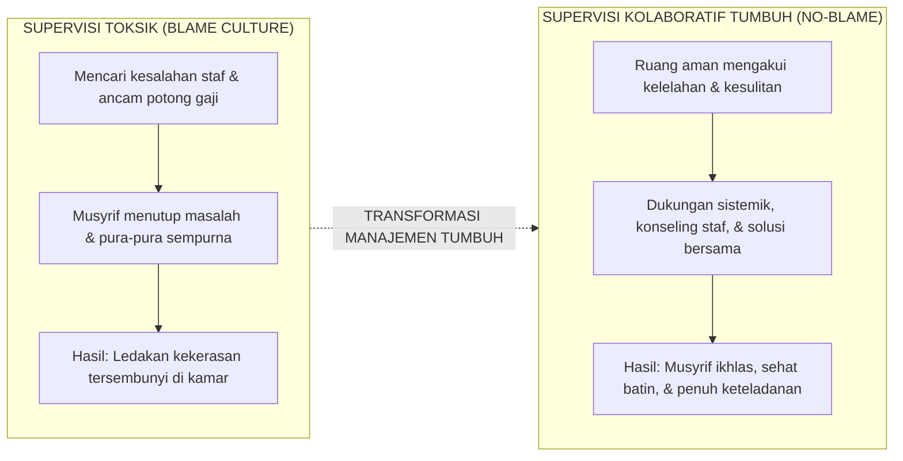

# SUB-BAB 5.1: FILOSOFI SUPERVISI KOLABORATIF: BUDAYA TANPA MENYALAHKAN (*NO-BLAME CULTURE*)

---

## 1. Merawat Sang Perawat (*Caring for the Caregivers*)

Dalam realitas pesantren, para musyrif asrama adalah garda terdepan yang paling rentan mengalami **Kelelahan Belas Kasih (*Compassion Fatigue*)** dan stres traumatik sekunder. Mereka menyerap keluhan, tangisan santri yang *homesick*, dan memediasi perselisihan kamar setiap hari.

Jika manajemen pesantren menerapkan supervisi inspektif yang serba menekan dan suka menyalahkan (*Blame Culture*), musyrif akan menyembunyikan masalah asrama, menutup diri, dan akhirnya melampiaskan rasa frustrasinya kepada santri.

Ekosistem TUMBUH menegakkan **Filosofi Supervisi Kolaboratif No-Blame**: [^1]

---

## 2. Prinsip Hubungan Pimpinan dengan Musyrif

* **Musyrif adalah Aset Suci Tarbiyah**: Pimpinan memandang musyrif sebagai rekan seperjuangan dakwah yang harus dimuliakan dan dijaga kesejahteraannya, bukan sekadar "karyawan bawahan".
* **Fokus pada Sistem, Bukan Kambing Hitam**: Tatkala terjadi masalah di asrama, evaluasi pertama ditujukan pada: *Apakah SOP sudah jelas? Apakah rasio santri terlalu banyak? Apakah musyrif kurang istirahat?*

---

### 📚 Catatan Kaki & Referensi Akademik:

[^1]: Edmondson, A. (1999). Psychological safety and learning behavior in work teams. *Administrative Science Quarterly*, 44(2), 350–383.
[^2]: Figley, C. R. (Ed.). (2002). *Treating Compassion Fatigue*. New York: Brunner-Routledge, hlm. 1–28.
