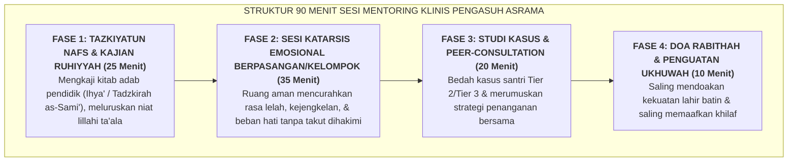

# SUB-BAB 5.2: SESI MENTORING DWI-MINGGUAN PENGASUH & KATARSIS BEBAN EMOSIONAL

---

## 1. Menjaga Kesucian & Kesehatan Mental Pengasuh Asrama

Mengasuh puluhan remaja dengan beragam karakter unik selama 24 jam sehari adalah tugas yang sangat menguras energi batin (*Emotional Labor*). Para musyrif menyerap keluh kesah, tangisan rindu rumah (*homesickness*), kecemasan akademik, hingga amarah santri. Jika beban emosional ini dibiarkan menumpuk tanpa mekanisme pelepasan yang sehat, musyrif akan mengalami trauma sekunder (*Secondary Traumatic Stress*) dan mati rasa empati. [^1]

Ekosistem TUMBUH melembagakan **Majelis Mentoring Ruhiyyah & Sesi Katarsis Emosional Musyrif (Liqa' Ruhi Pengasuh)** yang diselenggarakan secara wajib setiap dua pekan sekali (Jumat malam ba'da Isya' di Bilik Sakinah / Ruang Pertemuan Khusus):

---

## 2. Norma & Etika Pelaksanaan Sesi Katarsis Emosional

Agar sesi katarsis berjalan produktif dan benar-benar memulihkan jiwa para staf, diberlakukan etika forum: [^2]

1. **Kerahasiaan Mutlak (*Confidentiality Circle*)**: Segala curahan hati, kelelahan pribadi, atau kelemahan yang diungkapkan di dalam ruangan tidak boleh dibocorkan ke luar forum atau dijadikan bahan gunjingan.
2. **Tanpa Penghakiman Moral (*No Moral Condemnation*)**: Tatkala seorang musyrif mengakui: *"Saya tadi malam hampir kehilangan kesabaran dan merasa sangat jengkel dengan santri X"*, pembimbing tidak mencelanya sebagai orang yang kurang beriman, melainkan memvalidasi kelelahannya dan mengajarkan teknik regulasi napas dan jeda emosi.
3. **Fasilitasi oleh Konselor Senior Berlisensi**: Forum dipimpin oleh Konselor BK Senior atau Psikolog Lembaga yang terlatih dalam konseling kelompok dan terapi berbasis empati.

Dengan adanya majelis katarsis berkala ini, para musyrif dapat membuang racun stres emosional secara berkala, memperbarui niat ikhlas, dan kembali ke kamar asrama dengan hati yang lapang, sejuk, dan penuh limpahan kasih sayang kepada para santri.

---

### 📚 Catatan Kaki & Referensi Akademik:

[^1]: Figley, C. R. (Ed.). (2002). *Treating Compassion Fatigue*. New York: Brunner-Routledge, hlm. 35–68.
[^2]: Hawkins, P., & Shohet, R. (2012). *Supervision in the Helping Professions* (4th ed.). Maidenhead: Open University Press, hlm. 75–110.
[^3]: Corey, M. S., Corey, G., & Corey, C. (2014). *Groups: Process and Practice* (9th ed.). Belmont, CA: Brooks/Cole.
