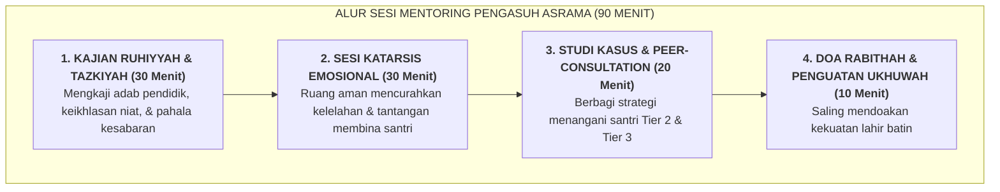

# SUB-BAB 5.2: SESI MENTORING DWI-MINGGUAN PENGASUH & KATARSIS BEBAN EMOSIONAL

---

## 1. Menjaga Kebersihan Hati: Majelis Liqa' Ruhi Musyrif

Setiap dua pekan sekali (Jumat malam ba'da Isya'), seluruh musyrif dan musyrifah asrama berkumpul dalam majelis **Liqa' Ruhi & Mentoring Klinis Pengasuh**: [^1]

---

## 2. Manfaat Sesi Katarsis bagi Kestabilan Musyrif

1. **Katarsis Emosi yang Sehat**: Musyrif dapat melepaskan endapan rasa kesal atau sedih tanpa merasa berdosa, didampingi oleh konselor senior.
2. **Solidaritas Korps Pengasuh**: Menyadari bahwa kesulitan yang dihadapi dialami bersama oleh rekan-rekannya, sehingga menumbuhkan rasa saling menopang (*Peer Support*).
3. **Pengisian Daya Batin (*Spiritual Recharge*)**: Memperbarui niat jihad tarbiyah semata-mata mengharap rida Allah SWT.

---

### 📚 Catatan Kaki & Referensi Akademik:

[^1]: Hawkins, P., & Shohet, R. (2012). *Supervision in the Helping Professions* (4th ed.). Maidenhead: Open University Press, hlm. 65–98.
