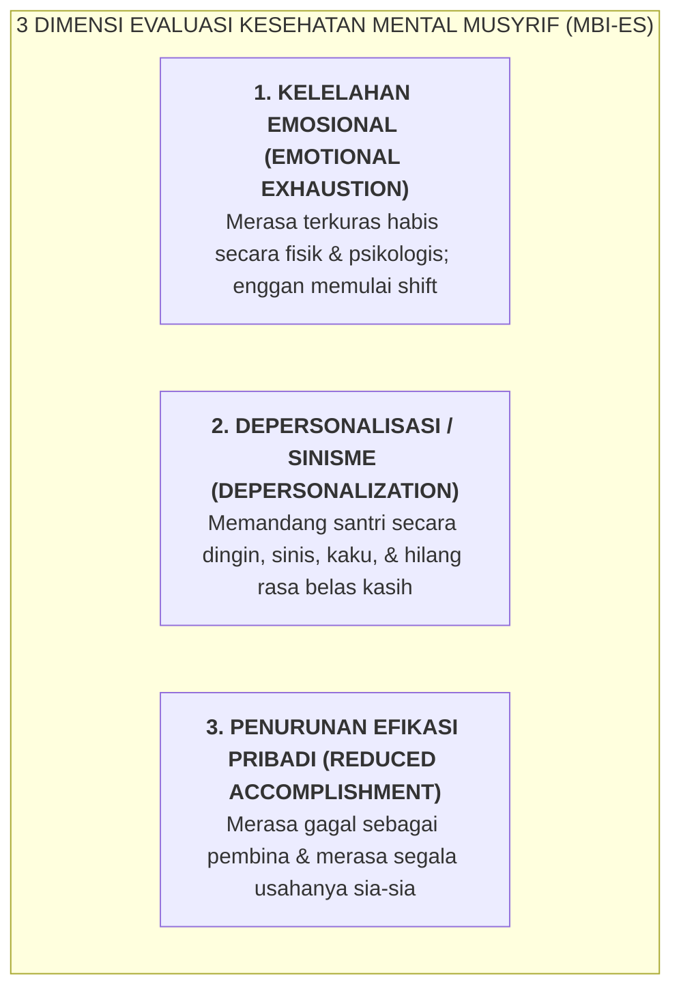

# SUB-BAB 5.3: DETEKSI DINI GEJALA BURNOUT MUSYRIF (SKALA MBI <15%) & CUTI PEMULIHAN

---

## 1. Mencegah Kelelahan Parah Sebelum Meledak Menjadi Krisis

Dalam psikologi industri dan kesehatan kerja, fenomena *Burnout* (Sindrom Kelelahan Kerja Berat) pada pendidik asrama berkembang secara bertahap dan sering kali tidak disadari hingga mencapai titik kritis. Tatkala seorang musyrif sudah mencapai fase burnout berat, mereka rentan melakukan tindakan kekerasan impulsif atau tiba-tiba mengundurkan diri secara mendadak (*abrupt resignation*). [^1]

Ekosistem TUMBUH melakukan skrining proaktif menggunakan instrumen baku internasional **Maslach Burnout Inventory - Educators Survey (MBI-ES)** yang diadaptasi secara khusus untuk konteks kepengasuhan pesantren:

---

## 2. Matriks Tindakan Berbasis Zona Risiko Burnout

Skrining MBI diselenggarakan setiap 3 bulan (Triwulanan) secara digital dan anonim oleh Tim Audit SDM: [^2]

| Skor Burnout (MBI) | Kategori Status | Interpretasi Kondisi Staf | Protokol Tindakan Manajemen TUMBUH |
| :--- | :--- | :--- | :--- |
| **$< 15\%$** | **Zona Hijau (Prima)** | Musyrif berada dalam kondisi psikologis bugar, antusias, dan stabil. | Lanjutkan apresiasi rutin, penugasan normal, dan mentoring dwi-mingguan. |
| **$15\% - 30\%$** | **Zona Kuning (Waspada)** | Mulai menunjukkan tanda kelelahan ringan, sulit tidur, atau mudah kesal. | • Penyesuaian jadwal shift (mengurangi shift malam berturut-turut). • Sesi konseling privat 1-on-1 bersama Psikolog Lembaga. • Pemantauan intensif selama 2 pekan. |
| **$> 30\%$** | **Zona Merah (Risiko Tinggi)** | Mengalami kelelahan akut, sinisme tinggi, berisiko melampiaskan amarah. | • **Aktivasi Mandatori Cuti Pemulihan Berbayar (3–7 Hari Penuh)**. • Pembebasan tugas jaga asrama seketika. • Program restorasi psikologis & spiritual terpandu. |

---

## 3. SOP Cuti Pemulihan Mandatori (*Mandatory Paid Well-Being Leave*)

Bagi staf yang berada di Zona Merah:
1. **Gaji & Hak Penuh Tetap Diberikan**: Cuti pemulihan bukan merupakan hukuman atau skorsing, melainkan tindakan medis-preventif lembaga. Musyrif tetap menerima gaji, tunjangan, dan makan utuh.
2. **Penggantian oleh Tim Musyrif Pengganti (*Relief Pool*)**: Posisi jaga di asrama diambil alih sepenuhnya oleh staf pengganti tanpa menimbulkan kekosongan pengawasan bagi santri.
3. **Detoks Digital Pekerjaan**: Musyrif yang sedang cuti pemulihan dinonaktifkan sementara dari grup percakapan operasional asrama agar sistem sarafnya benar-benar beristirahat secara total.

Dengan sistem deteksi dini dan jaminan hak pemulihan ini, tingkat pergantian musyrif (*Turnover Rate*) di pesantren TUMBUH dapat ditekan hingga di bawah $5\%$ per tahun, memelihara kontinuitas kasih sayang dan stabilitas pembinaan bagi santri.

---

### 📚 Catatan Kaki & Referensi Akademik:

[^1]: Maslach, C., Jackson, S. E., & Leiter, M. P. (1996). *Maslach Burnout Inventory Manual* (3rd ed.). Palo Alto, CA: Consulting Psychologists Press.
[^2]: Schaufeli, W. B., & Enzmann, D. (1998). *The Burnout Companion to Study and Practice: A Critical Analysis*. London: Taylor & Francis, hlm. 85–120.
[^3]: Leiter, M. P., & Maslach, C. (2004). *Areas of Worklife: A Structured Approach to Organizational Predictors of Job Burnout*. Research in Occupational Stress and Well-being, 3, 91–134.
