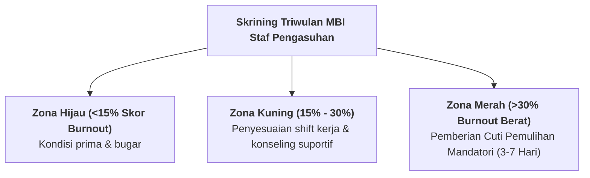

# SUB-BAB 5.3: DETEKSI DINI GEJALA BURNOUT MUSYRIF (SKALA MBI <15%) & CUTI PEMULIHAN

---

## 1. Instrumen Maslach Burnout Inventory (MBI) di Pesantren

Setiap triwulan, tim penjamin mutu SDM melakukan skrining kesehatan mental seluruh staf pengasuhan menggunakan instrumen **Maslach Burnout Inventory (MBI)** yang mengukur 3 dimensi: [^1]
1. **Emotional Exhaustion (Kelelahan Emosional)**: Merasa energinya terkuras habis dan enggan menghadapi santri.
2. **Depersonalization (Sinisme & Hilang Empati)**: Mulai memandang santri sebagai "objek yang menyusahkan" dan bersikap dingin.
3. **Reduced Personal Accomplishment (Merasa Tidak Berdaya)**: Merasa usahanya membina santri sia-sia.

---

## 2. SOP Cuti Pemulihan Mandatori (*Mandatory Recovery Leave*)

Musyrif yang terindikasi berada di zona risiko tinggi:
* Diberikan hak **Cuti Pemulihan selama 3 hingga 7 hari penuh** dengan tetap menerima gaji dan tunjangan utuh (*Paid Well-Being Leave*).
* Tugas jaga digantikan sementara oleh tim musyrif cadangan (*Relief Musyrif Pool*).
* Dilarang membuka grup percakapan kerja asrama selama masa pemulihan agar sistem sarafnya benar-benar beristirahat.

Kebijakan ini menjamin bahwa tidak ada musyrif yang dipaksa mengasuh santri dalam kondisi jiwa yang terluka atau kelelahan akut.

---

### 📚 Catatan Kaki & Referensi Akademik:

[^1]: Maslach, C., Jackson, S. E., & Leiter, M. P. (1996). *Maslach Burnout Inventory Manual*. Palo Alto, CA: Consulting Psychologists Press.
