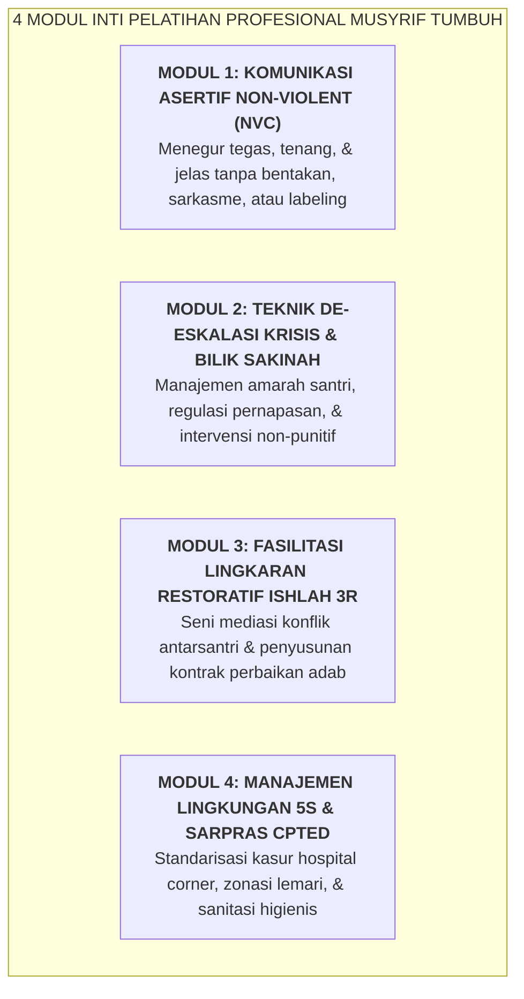

# SUB-BAB 5.4: PENGEMBANGAN KEPROFESIAN BERKELANJUTAN: PELATIHAN PEDAGOGI *FIRM & KIND*

---

## 1. Menolak Amatirisme: Musyrif Sebagai Pendidik Profesional

Di era tantangan disrupsi moral saat ini, tugas membina remaja di asrama 24 jam tidak dapat lagi diserahkan kepada sekadar "niat baik tanpa keterampilan" (*well-intentioned amateurism*). Mengelola dinamika psikologis puluhan santri menuntut keahlian profesional yang teruji dalam ranah pedagogi terapan, manajemen perilaku, komunikasi non-kekerasan, dan de-eskalasi krisis. [^1]

Ekosistem TUMBUH merancang kurikulum **Pengembangan Keprofesian Berkelanjutan (PKB Musyrif & Pendidik)** dengan pilar utama pedagogi **Firm & Kind (Tegas & Penuh Kasih Sayang)**:



---

## 2. Jenjang Karier & Akreditasi Pengasuh Asrama (*Musyrif Career Pathway*)

Untuk menjamin motivasi belajar dan profesionalisme jangka panjang, Ekosistem TUMBUH memberlakukan sistem sertifikasi 3 level: [^2]

```
               JENJANG KARIER & AKREDITASI MUSYRIF EKOSISTEM TUMBUH
  
  ┌────────────────────────┬─────────────────────────────────────────────────┐
  │ LEVEL AKREDITASI       │ KOMPETENSI KUNCI & SYARAT PENGUJIAN             │
  ├────────────────────────┼─────────────────────────────────────────────────┤
  │ LEVEL 1: MUSYRIF PRATAMA│ • Menguasai seluruh SOP 4 Shift & Kamar 5S.     │
  │ (Tahun Pertama)        │ • Mampu input logbook PBIS & Rasio 4:1.         │
  │                        │ • Lulus uji simulasi de-eskalasi dasar.         │
  ├────────────────────────┼─────────────────────────────────────────────────┤
  │ LEVEL 2: MUSYRIF MADYA │ • Menguasai fasilitasi Intervensi CICO Tier 2.  │
  │ (Tahun 2 - 3)          │ • Memimpin Lingkaran Restoratif Ishlah 3R.      │
  │                        │ • Lulus uji studi kasus konflik santri berat.   │
  ├────────────────────────┼─────────────────────────────────────────────────┤
  │ LEVEL 3: MUSYRIF UTAMA │ • Mampu membedah FBA & merancang dokumen BIP.   │
  │ (Senior / Master Coach)│ • Menjadi mentor bagi musyrif baru (Liqa' Ruhi).│
  │                        │ • Memimpin Tim Respon Krisis & Safeguarding.    │
  └────────────────────────┴─────────────────────────────────────────────────┘
```

Peningkatan jenjang akreditasi berkorelasi langsung dengan kenaikan tunjangan kehormatan profesi, fasilitas tempat tinggal keluarga di lingkungan pondok, dan beasiswa studi lanjut pascasarjana. Dengan penghargaan profesi yang tinggi ini, posisi musyrif dipandang sebagai jalur pengabdian dakwah yang sangat prestisius, mulia, dan menjanjikan masa depan yang cerah.

---

### 📚 Catatan Kaki & Referensi Akademik:

[^1]: Nelsen, J. (2006). *Positive Discipline* (4th ed.). New York: Ballantine Books, hlm. 25–60.
[^2]: Danielson, C. (2007). *Enhancing Professional Practice: A Framework for Teaching* (2nd ed.). Alexandria, VA: ASCD.
[^3]: Rosenberg, M. B. (2015). *Nonviolent Communication: A Language of Life* (3rd ed.). Encinitas, CA: PuddleDancer Press.
