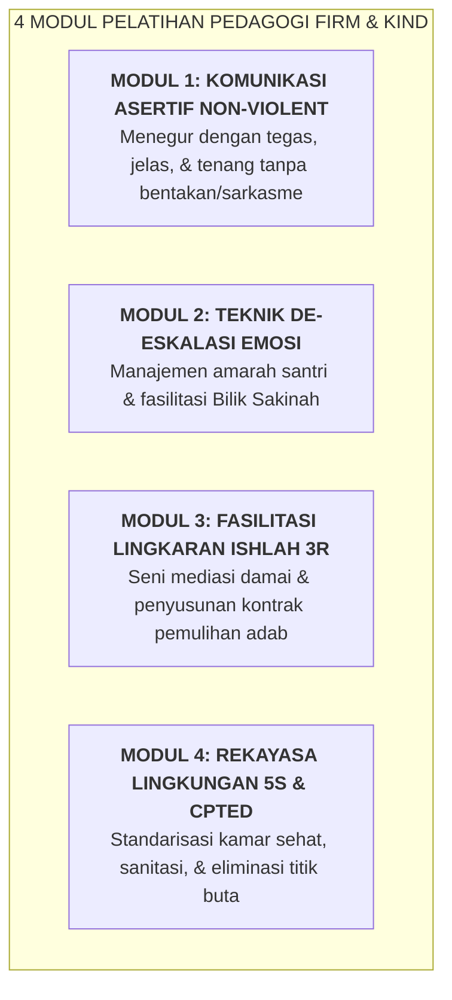

# SUB-BAB 5.4: PENGEMBANGAN KEPROFESIAN BERKELANJUTAN: PELATIHAN PEDAGOGI *FIRM & KIND*

---

## 1. Menolak Pengasuhan Amatir: Profesionalisasi Musyrif

Di era modern saat ini, pengasuhan asrama 24 jam tidak boleh lagi diserahkan kepada lulusan baru tanpa pelatihan yang memadai (*untrained amateurism*). Musyrif adalah seorang **Profesional Pendidikan Pengasuhan (*Residential Educator*)** yang memegang tanggung jawab hukum dan moral tertinggi atas keselamatan anak.

Ekosistem TUMBUH merancang kurikulum **Pengembangan Keprofesian Berkelanjutan (PKB Musyrif)** dengan fokus pada kompetensi pedagogi **Firm & Kind (Tegas & Penuh Kasih)**: [^1]

---

## 2. Sertifikasi Musyrif Terakreditasi TUMBUH

Setiap musyrif yang lolos uji kompetensi teoritis dan studi kasus simulasi lapangan mendapatkan **Sertifikat Pengasuh Terakreditasi Level 1–3**. 

Peningkatan level sertifikasi berkorelasi langsung dengan jenjang karier, peningkatan tunjangan kehormatan, dan peluang beasiswa pendidikan lanjut, memposisikan profesi musyrif sebagai profesi yang mulia, bermartabat, dan sejahtera.

---

### 📚 Catatan Kaki & Referensi Akademik:

[^1]: Nelsen, J. (2006). *Positive Discipline*. New York: Ballantine Books, hlm. 15–40.
