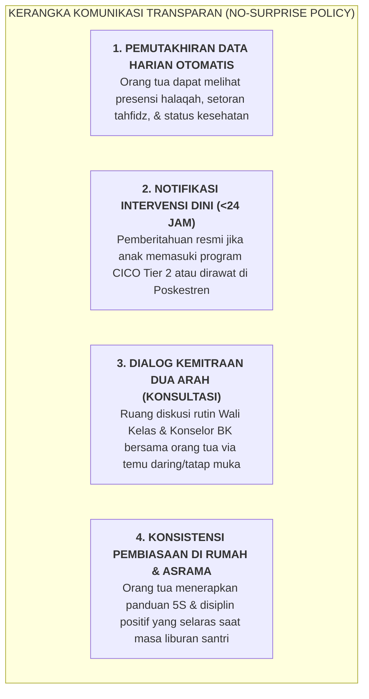

# SUB-BAB 6.1: PROTOKOL KOMUNIKASI TRANSPARAN DENGAN WALI SANTRI (*NO-SURPRISE POLICY*)

---

## 1. Membongkar Tembok Ketertutupan Asrama

Dalam tradisi pesantren konvensional, pola komunikasi antara pihak pengelola pondok dengan para orang tua santri sering kali diwarnai oleh asimetri informasi yang parah (*Severe Information Asymmetry*). Pihak pondok cenderung menerapkan kebijakan tertutup: kabar mengenai santri sakit, konflik antarteman, atau kesulitan belajar ditutup-tutupi rapat-rapat dari keluarga dengan dalih "agar orang tua tidak cemas di rumah". [^1]

Praktik menutup-nutupi masalah ini sering kali berujung pada bencana relasional (*Relational Catastrophe*): orang tua baru dikabari tatkala sang anak sudah menderita sakit parah yang terlambat ditangani, atau saat anak tiba-tiba dikeluarkan dari pondok tanpa ada peringatan awal. Ketika hal ini terjadi, orang tua merasa dikhianati, kepercayaan terhadap institusi runtuh seketika, dan tidak jarang berujung pada perselisihan hukum yang merusak nama baik pesantren.

Ekosistem TUMBUH membuang paradigma ketertutupan ini dan menegakkan **Kebijakan Tanpa Kejutan (*No-Surprise Policy*) Melalui Portal Komunikasi Digital Terpadu**:

---

## 2. Parameter Transparansi Informasi Terbuka vs Kerahasiaan Konseling

Untuk menjaga keseimbangan antara transparansi informasi keluarga dengan etika privasi konseling anak (*Counseling Confidentiality*), diberlakukan pedoman batasan: [^2]

| Jenis Informasi Santri | Akses Informasi Orang Tua | Prosedur Penyampaian |
| :--- | :--- | :--- |
| **Capaian Tahfidz & Akademik** | Terbuka Penuh Harian / Mingguan | Notifikasi otomatis di aplikasi portal digital wali santri. |
| **Status Kesehatan & Rekam Medis** | Terbuka Penuh Seketika ($<15$ Menit jika rujukan RS) | Panggilan telepon darurat dari dokter/perawat Poskestren. |
| **Program Penguatan Karakter (Tier 2 CICO)** | Terbuka Penuh (Kemitraan Perbaikan) | Surat resmi & sesi konsultasi daring bersama Wali Kelas. |
| **Catatan Curhat Privat Konseling BK** | **Rahasia Terjaga (*Confidential*)** | Dirahasiakan demi membangun rasa percaya santri kepada konselor, *kecuali ada ancaman bahaya fisik/nyawa*. |

---

## 3. Menghapus Grup Liar: Sentralisasi Satu Pintu Humas (*One-Gate System*)

Untuk mencegah maraknya hoaks, saling curiga, dan pergunjingan (*Ghibah*) di kalangan wali santri, lembaga melarang pembentukan grup-grup percakapan liar informal yang tidak dimoderasi oleh staf resmi. Seluruh pengumuman resmi, agenda kegiatan, dan konsultasi dipusatkan melalui **Satu Pintu Layanan Humas Terpadu** yang terverifikasi dan profesional.

---

### 📚 Catatan Kaki & Referensi Akademik:

[^1]: Epstein, J. L. (2018). *School, Family, and Community Partnerships: Preparing Educators and Improving Schools* (2nd ed.). New York: Routledge, hlm. 95–130.
[^2]: American School Counselor Association. (2016). *ASCA Ethical Standards for School Counselors*. Alexandria, VA: ASCA.
[^3]: Henderson, A. T., & Mapp, K. L. (2002). *A New Wave of Evidence: The Impact of School, Family, and Community Connections on Student Achievement*. Austin, TX: SEDL.
