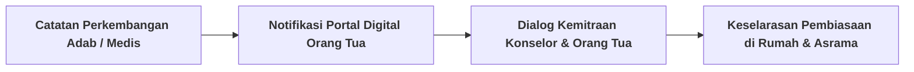

# SUB-BAB 6.1: PROTOKOL KOMUNIKASI TRANSPARAN DENGAN WALI SANTRI (*NO-SURPRISE POLICY*)

---

## 1. Menghilangkan Budaya Menutup-nutupi Masalah

Di banyak pondok konvensional, pihak asrama kerap menyembunyikan kondisi santri yang sedang sakit atau bermasalah adab dari orang tua karena takut disalahkan. Orang tua baru dikabari saat sang anak sudah dilarikan ke rumah sakit dalam kondisi parah atau saat anak tiba-tiba dikeluarkan dari pondok.

Ekosistem TUMBUH menetapkan **Kebijakan Tanpa Kejutan (*No-Surprise Policy*)**: [^1]
* Orang tua adalah mitra sah tarbiyah yang memiliki hak mutlak untuk mengetahui perkembangan fisik dan psikologis anaknya secara berkala.
* Segala intervensi Tier 2 (CICO) atau perawatan medis di Poskestren dilaporkan secara transparan melalui portal digital orang tua dalam tempo $1 \times 24$ jam.

---

## 2. Saluran Informasi Resmi Terpadu (*One-Gate Information*)

Untuk mencegah kesimpangsiuran kabar dan hoaks di kalangan wali santri:
1. Seluruh informasi kedinasan, kalender akademik, dan laporan keuangan santri dipusatkan melalui **Satu Pintu Layanan Humas Terpadu**.
2. Dilarang membuat grup percakapan informal liar yang berpotensi memicu pergunjingan dan keresahan antar-wali santri.

---

### 📚 Catatan Kaki & Referensi Akademik:

[^1]: Epstein, J. L. (2018). *School, Family, and Community Partnerships*. New York: Routledge, hlm. 95–130.
