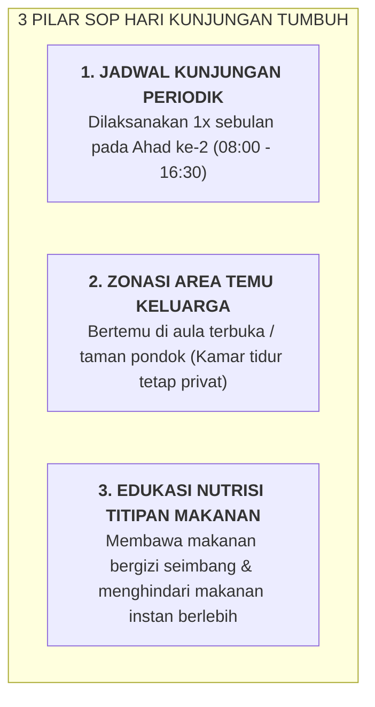

# SUB-BAB 6.2: MANAJEMEN KUNJUNGAN ORANG TUA & ETIKA SILATURAHMI ASRAMA

---

## 1. Menjaga Kestabilan Ritme Pembiasaan Asrama

Hari kunjungan orang tua (*Visiting Day*) adalah momen yang sangat membahagiakan, namun jika tidak dikelola dengan SOP yang rapi, kunjungan dapat memicu gangguan ritme asrama (seperti menumpuknya makanan cepat saji tidak sehat, hilangnya waktu istirahat santri, dan rasa cemburu bagi santri yang orang tuanya tinggal jauh).

Ekosistem TUMBUH merancang **SOP Hari Kunjungan Tertib & Bermakna**:

---

## 2. Forum Parenting & Penguatan Visi Bersama

Pada setiap hari kunjungan, tim pesantren menyelenggarakan **Kajian Parenting Adab (60 Menit)** di masjid pondok sebelum waktu temu santri dimulai. Forum ini menyelaraskan pemahaman orang tua mengenai pentingnya disiplin positif, membiasakan anak hidup mandiri 5S, dan cara mendengarkan curhat anak secara empatik.

---

### 📚 Catatan Kaki & Referensi Akademik:

[^1]: Henderson, A. T., & Mapp, K. L. (2002). *A New Wave of Evidence: The Impact of School, Family, and Community Connections on Student Achievement*. Austin, TX: SEDL.
