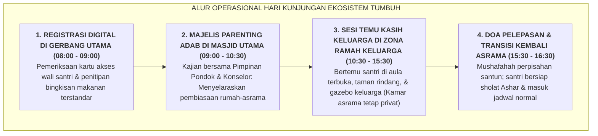

# SUB-BAB 6.2: MANAJEMEN KUNJUNGAN ORANG TUA & ETIKA SILATURAHMI ASRAMA

---

## 1. Menjaga Keseimbangan Antara Kasih Sayang Keluarga & Kemandirian Santri

Hari Kunjungan Orang Tua (*Visiting Day*) adalah momentum yang sangat dirindukan oleh seluruh keluarga santri. Namun, tatkala hari kunjungan tidak dikelola dengan sistem operasional yang matang, momentum ini dapat menimbulkan dampak negatif terhadap ritme kehidupan asrama: [^1]
* Menumpuknya sampah makanan cepat saji instan yang merusak pola makan sehat santri.
* Terganggunya privasi santri lain akibat orang tua lawan jenis masuk ke area kamar tidur santri secara bebas.
* Timbulnya rasa minder atau sedih mendalam bagi santri-santri dhuafa atau santri luar pulau yang orang tuanya tidak dapat hadir berkunjung.

Ekosistem TUMBUH merancang **SOP Manajemen Hari Kunjungan Tertib, Edukatif, & Bermakna**:

---

## 2. Tiga Regulasi Utama Hari Kunjungan

1. **Zonasi Area Pertemuan (*Designated Family Zones*)**:
   * Pertemuan keluarga diselenggarakan di area publik yang asri (Taman Pondok, Gazebo, Aula Utama, dan Kantin Terbuka).
   * **Larangan Mutlak Masuk Kamar Tidur Santri**: Orang tua dilarang keras memasuki kamar tidur santri demi menjaga privasi aurat, keamanan barang, dan ketertiban tata ruang 5S kamar.
2. **Edukasi Nutrisi Makanan Titipan (*Healthy Food Guidelines*)**:
   * Lembaga menyediakan panduan makanan titipan bergizi seimbang (buah-buahan segar, madu, kurma, makanan olahan rumah sehat) dan membatasi makanan instan tinggi MSG/pengawet yang berlebih.
3. **Program "Keluarga Asuh" bagi Santri Luar Pulau**:
   * Bagi santri yang orang tuanya tidak bisa hadir karena kendala jarak, pimpinan pondok dan komite wali santri setempat membentuk program **Orang Tua Asuh Sebaya**: mengajak santri tersebut makan siang bersama di gazebo, sehingga tidak ada satu pun anak yang merasa kesepian atau terabaikan.

---

### 📚 Catatan Kaki & Referensi Akademik:

[^1]: Henderson, A. T., & Mapp, K. L. (2002). *A New Wave of Evidence: The Impact of School, Family, and Community Connections on Student Achievement*. Austin, TX: SEDL.
[^2]: Epstein, J. L. (2018). *School, Family, and Community Partnerships*. New York: Routledge.
