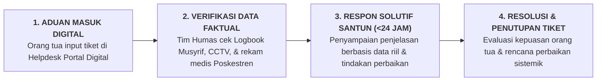

# SUB-BAB 6.3: KANAL PENGADUAN SUARA WALI SANTRI & MEKANISME TABAYYUN TERBUKA

---

## 1. Menegakkan Etika Tabayyun Qur'ani dalam Menangani Keluhan

Dalam dinamika interaksi antara orang tua dengan pondok pesantren, kesalahpahaman informasi (*Misinformation & Cognitive Bias*) sering kali memicu kecemasan akut dan amarah wali santri. Ketika seorang anak menelepon sambil menangis mengeluhkan perlakuan temannya atau kekecewaan terhadap menu makan, orang tua yang panik cenderung langsung menyebarkan keluhan tersebut ke media sosial atau menuduh pihak pondok berbuat zalim. [^1]

Al-Qur'an memberikan landasan etika komunikasi universal dalam menghadapi berita dan keluhan:

> **يَا أَيُّهَا الَّذِينَ آمَنُوا إِن جَاءَكُمْ فَاسِقٌ بِنَبَإٍ فَتَبَيَّنُوا أَن تُصِيبُوا قَوْمًا بِجَهَالَةٍ فَتُصْبِحُوا عَلَىٰ مَا فَعَلْتُمْ نَادِمِينَ**
> 
> *"Wahai orang-orang yang beriman! Jika seseorang yang fasik datang kepadamu membawa suatu berita, maka bertabayyunlah (telitilah kebenarannya), agar kamu tidak mencelakakan suatu kaum karena kebodohan (kecerobohan), yang akhirnya kamu menyesali perbuatanmu itu."* (QS. Al-Hujurat [49]: 6) [^2]

Ekosistem TUMBUH mendirikan **Kanal Layanan Suara Wali Santri (*Helpdesk Careline*) Berbasis Tabayyun Ilmiah**:

---

## 2. Standardisasi Waktu & Kualitas Respon Keluhan

Tim Humas terikat oleh standar layanan prima (*Service Level Agreement - SLA*): [^3]

1. **Konfirmasi Penerimaan Aduan Maksimal 2 Jam**: Memberikan nomor tiket resmi dan kepastian bahwa keluhan sedang diverifikasi ke pihak terkait di asrama/madrasah.
2. **Respon Solutif Lengkap Maksimal 24 Jam**: Menyampaikan hasil investigasi internal secara objektif, santun, dan menyertakan langkah konkret penyelesaian masalah.
3. **Kultur Akui Kekeliruan (*Accountability Culture*)**: Apabila keluhan wali santri terbukti disebabkan oleh kelalaian staf atau kerusakan sarana pondok, pimpinan lembaga secara ksatria menyampaikan permohonan maaf resmi dan melakukan perbaikan seketika tanpa mencari-cari alasan pembenaran diri.

Dengan mekanisme penanganan aduan yang transparan, cepat, dan bermartabat ini, hubungan antara wali santri dengan pimpinan pesantren terjalin di atas fondasi kepercayaan mutlak (*Mutual Trust*), ukhuwah yang tulus, dan saling mendoakan keberkahan.

---

### 📚 Catatan Kaki & Referensi Akademik:

[^1]: Coombs, W. T. (2014). *Ongoing Crisis Communication: Planning, Managing, and Responding* (4th ed.). Thousand Oaks, CA: SAGE Publications, hlm. 75–110.
[^2]: Tafsir Ibnu Katsir. (2000). *Tafsir Al-Qur'an al-'Azhim*. Riyadh: Dar Thayyibah, Jilid VII, hlm. 368–372.
[^3]: Parasuraman, A., Zeithaml, V. A., & Berry, L. L. (1988). SERVQUAL: A multiple-item scale for measuring consumer perceptions of service quality. *Journal of Retailing*, 64(1), 12–40.
