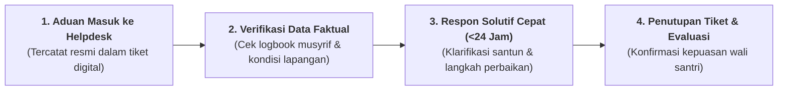

# SUB-BAB 6.3: KANAL PENGADUAN SUARA WALI SANTRI & MEKANISME TABAYYUN TERBUKA

---

## 1. Menegakkan Budaya Tabayyun dalam Menangani Keluhan

Ketika orang tua menerima aduan dari anaknya (misal: *"Umi, sandal saya hilang"* atau *"Ustadz kamar menegur saya"*), respon instingtif orang tua terkadang adalah kecemasan atau kemarahan.

Ekosistem TUMBUH menyediakan **Kanal Pengaduan Resmi Suara Wali Santri (*Helpdesk Careline*)** yang beroperasi di bawah prinsip syariat **Tabayyun (Klarifikasi Faktual yang Santun)**: [^1]

---

## 2. Standar Layanan Pengaduan (<24 Jam Respon Pasti)

* **Respon Awal Maksimal 2 Jam**: Tim Humas memberikan konfirmasi penerimaan pesan dan memulai proses verifikasi internal ke pihak asrama/madrasah.
* **Klarifikasi Faktual Tanpa Emosi**: Tim Humas menyampaikan penjelasan berbasis data riil logbook secara objektif, tenang, dan menghargai kekhawatiran orang tua.
* **Tindakan Korektif Konkret**: Jika keluhan disebabkan oleh kelemahan fasilitas atau kekeliruan staf, pimpinan pesantren menyampaikan permohonan maaf resmi dan langsung melakukan perbaikan sistem.

---

### 📚 Catatan Kaki & Referensi Akademik:

[^1]: Al-Qurthubi, Abu 'Abdillah. (2006). *Al-Jami' li Ahkam al-Qur'an*. Kairo: Dar al-Kutub al-Mishriyyah, Jilid XVI, hlm. 312.
