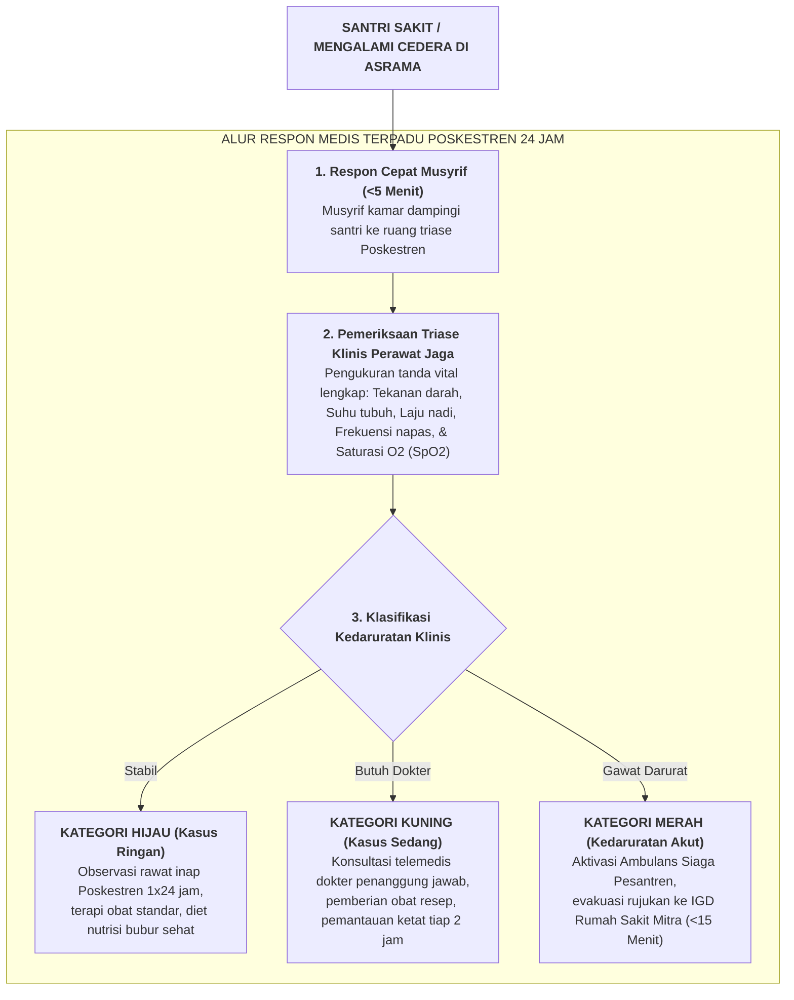

# SUB-BAB 7.1: SOP PENANGANAN KEDARURATAN MEDIS & LAYANAN POSKESTREN 24 JAM

---

## 1. Urgensi Medis & Tanggung Jawab Syar'i Penjagaan Jiwa (*Hifzh an-Nafs*)

Dalam struktur hukum dan etika Islam, keselamatan fisik dan nyawa santri adalah amanah tertinggi yang berada di bawah payung *Maqashid asy-Syari'ah*, khususnya mandat *Hifzh an-Nafs* (Pemeliharaan Jiwa) dan *Hifzh al-Jasad* (Pemeliharaan Raga). [^1] 

Di banyak pondok pesantren konvensional, penanganan santri yang jatuh sakit sering kali diwarnai oleh kelalaian fatal dan keterlambatan diagnosa. Gejala penyakit akut—seperti demam tifoid tinggi, apendisitis (usus buntu akut), asma bronkiale berat, atau cedera fisik akibat olahraga—kerap dianggap remeh sebagai "hanya masuk angin biasa" atau "kurang ikhlas mondok". Santri yang sakit sering dibiarkan terbaring di pojok kamar asrama yang lembap tanpa pemeriksaan medis yang memadai, dan baru dilarikan ke rumah sakit saat kondisinya sudah kritis atau mengalami syok sepsis.

Ekosistem TUMBUH merombak total kelalaian ini dengan mendirikan dan mengoperasikan **Pos Kesehatan Pesantren (Poskestren) Terpadu 24 Jam** yang diawaki oleh tenaga perawat berlisensi (*Registered Nurses*) dan dokter jaga yang terhubung langsung dengan jejaring Rumah Sakit Rujukan Daerah:

---

## 2. Standar Protokol Triase Klinis & Kriteria Rujukan Kedaruratan

Untuk menghilangkan keraguan subjektif staf dalam mengambil keputusan medis, Poskestren TUMBUH memberlakukan **Pedoman Triase Kedaruratan Berbasis Parameter Objektif**: [^2]

| Kategori Triase | Parameter Klinis Terukur | Protokol Tindakan Wajib | Batas Waktu Respon (*Response Time*) |
| :--- | :--- | :--- | :--- |
| **Merah (Gawat Darurat)** | • Penurunan kesadaran (*GCS < 13*) • Sesak napas berat (*SpO2 < 92%* atau laju napas > 30x/menit) • Demam tinggi disertai kejang atau kaku kuduk • Nyeri perut kanan bawah akut mencurigakan apendisitis • Patah tulang terbuka (*Open Fracture*) atau cedera kepala berat | • Pemasangan oksigenasi nasal kanul / masker O2. • Pemasangan infus jalur intravena (IV Line). • Hubungi sopir ambulans siaga. • Rujuk seketika ke IGD Rumah Sakit Rujukan. | **Maksimal 15 Menit** sejak tiba di Poskestren menuju IGD RS. |
| **Kuning (Urgensi Sedang)** | • Demam $38.5^\circ\text{C} - 39.5^\circ\text{C}$ menetap $>24\text{ jam}$ • Diare akut $>5\text{ kali}$ disertai tanda dehidrasi ringan-sedang • Asma serangan ringan-sedang (merespons nebulizer) • Luka robek yang membutuhkan penjahitan (*hecting*) | • Terapi nebulizer / rehidrasi oral (Oralit). • Pemberian antipiretik dan antibiotik resep dokter. • Observasi di ruang isolasi Poskestren. | **Maksimal 30 Menit** pemeriksaan oleh dokter jaga/telemedis. |
| **Hijau (Kasus Ringan)** | • Batuk pilek ringan (*Common Cold*) tanpa sesak • Sakit kepala ringan, dismenorea primer (santri putri) • Luka lecet superfisial atau memar ringan olahraga | • Perawatan luka antiseptik. • Istirahat di ruang rawat inap Poskestren. • Diet makanan bergizi tinggi protein dan vitamin. | Observasi 12–24 jam sebelum kembali ke asrama. |

---

## 3. SOP Komunikasi Darurat Medis Kepada Orang Tua Santri

Komunikasi dalam kondisi krisis medis menuntut transparansi, empati, dan ketenangan profesional dari tim manajemen pondok: [^3]

1. **Prinsip Beban Nol Keterlambatan (*Zero Delay Notification*)**: Tatkala santri diputuskan untuk dirujuk ke rumah sakit, tim Poskestren wajib menghubungi orang tua melalui panggilan telepon resmi (bukan sekadar pesan singkat) dalam waktu maksimal **15 menit** setelah keputusan rujukan diambil.
2. **Struktur Penyampaian Informasi SBAR (*Situation, Background, Assessment, Recommendation*)**:
   * *Situation*: Menyampaikan nama santri, kondisi saat ini, dan bahwa ananda sedang didampingi menuju rumah sakit.
   * *Background*: Menjelaskan riwayat keluhan sejak awal mula dirawat di Poskestren.
   * *Assessment*: Menyampaikan hasil pemeriksaan fisik tanda vital terkini dan arahan dokter.
   * *Recommendation*: Meminta persetujuan tindakan medis rujukan (*informed consent*) dan mengundang orang tua untuk hadir mendampingi di rumah sakit jika memungkinkan.
3. **Pendampingan Fisik Staf Tanpa Putus**: Santri yang dirawat di rumah sakit tidak boleh ditinggalkan sendirian. Musyrif kamar atau perawat Poskestren bertugas menjaga di sisi tempat tidur santri 24 jam bergantian hingga orang tua kandung tiba di rumah sakit.
4. **Penjaminan Pembiayaan Darurat Lembaga**: Pesantren menyediakan dana talangan medis darurat (*Emergency Medical Fund*) agar tindakan medis di IGD tidak pernah tertunda hanya karena kendala administrasi pembayaran.

---

## 4. Rekayasa Preventif & Audit Higienitas Lingkungan

Poskestren tidak hanya bertindak kuratif saat santri sakit, melainkan memimpin program kesehatan preventif bersama Wakamad Sarpras:
* **Pemeriksaan Berkala Kualitas Air Bersih**: Uji mikrobiologi bakteri *E. coli* dan kandungan kimia air sumur/bor pondok setiap 6 bulan sekali.
* **Skrining Massal Kesehatan Santri Baru**: Pemeriksaan kesehatan menyeluruh (antropometri, kesehatan mata, gigi, dan skrining riwayat alergi/asma) pada pekan pertama masuk pondok.
* **Edukasi Sanitasi Asrama**: Pelatihan berkala bagi santri mengenai cara cuci tangan 6 langkah WHO dan etika batuk/bersin yang benar.

---

### 📚 Catatan Kaki & Referensi Akademik:

[^1]: Al-Mawardi, Abu al-Hasan 'Ali bin Muhammad. (1987). *Al-Ahkam as-Sulthaniyyah wa al-Wilayat ad-Diniyyah*. Beirut: Dar al-Kutub al-'Ilmiyyah, hlm. 240–258.
[^2]: American Academy of Pediatrics. (2016). Medical emergencies in school and boarding environments. *Pediatrics*, 138(4), e20162485.
[^3]: Patterson, E. S., et al. (2004). Handoffs: Implications for healthcare from actions taken in other high-stakes domains. *Quality and Safety in Health Care*, 13(2), 125–132.
[^4]: World Health Organization. (2018). *School Health Services: An Expanded Framework*. Geneva: WHO Guidelines Approved by the Guidelines Review Committee.
