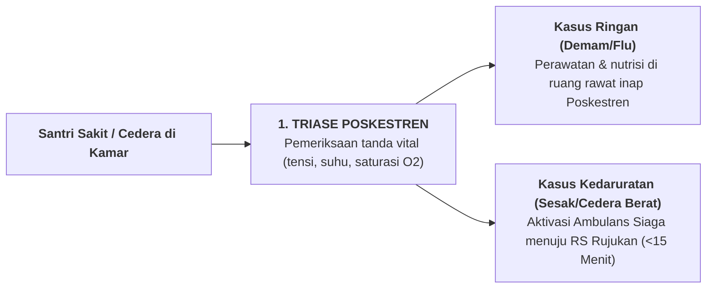

# SUB-BAB 7.1: SOP PENANGANAN KEDARURATAN MEDIS & LAYANAN POSKESTREN 24 JAM

---

## 1. Respons Kedaruratan Medis Cepat (<15 Menit)

Kesehatan fisik dan keselamatan jiwa santri (*Hifzh an-Nafs*) adalah prioritas mutlak yang tidak boleh tertunda satu detik pun. Ekosistem TUMBUH mendirikan **Pos Kesehatan Pesantren (Poskestren) 24 Jam** yang diawaki oleh tenaga perawat dan dokter jaga. [^1]

---

## 2. SOP Komunikasi Darurat Medis ke Orang Tua

1. **Pemberitahuan Segera Tanpa Menunda**: Begitu santri dirujuk ke rumah sakit, tim Poskestren segera menghubungi orang tua via panggilan telepon langsung untuk meminta izin tindakan medis dan memberikan kabar yang tenang dan jelas.
2. **Pendampingan Penuh Staf**: Santri yang dirawat di rumah sakit selalu didampingi oleh musyrif atau petugas medis pondok hingga orang tua tiba di lokasi.

---

### 📚 Catatan Kaki & Referensi Akademik:

[^1]: American Academy of Pediatrics. (2016). Medical emergencies in school and boarding environments. *Pediatrics*, 138(4), e20162485.
