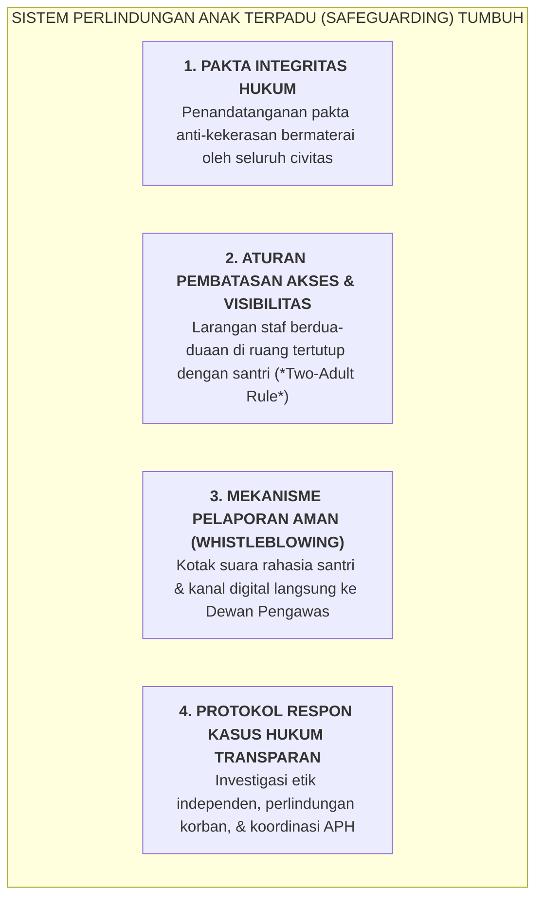

# SUB-BAB 7.2: PROTOKOL PERLINDUNGAN ANAK (*CHILD SAFEGUARDING*): MITIGASI RISIKO KEKERASAN

---

## 1. Pesantren Sebagai Ruang Aman Suci (*Safe Sanctuary for Children*)

Tatkala orang tua menyerahkan buah hatinya ke dalam asuhan pesantren, mereka menitipkan amanah jiwa dan raga anak tercinta. Secara hukum positif (Undang-Undang Perlindungan Anak) maupun hukum syariat Islam (*Maqashid asy-Syari'ah*), lembaga pesantren memegang status **In Loco Parentis (Bertindak Sebagai Pengganti Orang Tua yang Memiliki Tanggung Jawab Hukum Penuh)**. [^1]

Kekerasan terhadap santri—baik berupa kekerasan fisik (tamparan, pukulan, tendangan), kekerasan verbal (ejekan fisik, hinaan orang tua, bentakan kasar), kekerasan seksual, pengabaian gizi/kesehatan, maupun feodalisme perundungan (*bullying*) senior—adalah sebuah **pelanggaran pidana berat dan dosa besar (*Kabirah*)** yang menghancurkan keberkahan dakwah pesantren.

Ekosistem TUMBUH memberlakukan **Kebijakan Perlindungan Anak (*Comprehensive Child Safeguarding Policy*)** yang bersifat mengikat dan tanpa kompromi (*Zero Tolerance Policy*):

---

## 2. Empat Pilar Perlindungan Anak di Lingkungan Asrama

### ⚖️ 1. Pakta Integritas Hukum & Skrining Ketat SDM
Setiap calon musyrif, guru madrasah, tenaga keamanan, dan staf sarpras wajib melalui proses pemeriksaan latar belakang (*Background Check*) dan menandatangani Pakta Integritas Anti-Kekerasan yang memuat sanksi pemecatan tidak hormat serta pelaporan pidana ke pihak kepolisian apabila terbukti melakukan kekerasan.

### 🚪 2. Aturan Visibilitas & Protokol *Two-Adult Rule*
* **Larangan Ruang Tertutup Privat**: Konseling BK, pembinaan santri, atau pertemuan tatap muka antara staf dengan santri wajib dilakukan di ruangan dengan jendela kaca transparan (seperti Bilik Sakinah yang berpintu kaca) atau di hadapan minimal dua orang dewasa (*Two-Adult Rule*).
* **Larangan Masuk Kamar Tidur Santri Tanpa Izin Terbuka**: Staf atau musyrif dilarang memasuki area tempat tidur santri dalam kondisi pintu tertutup rapat atau lampu padam.

### 📢 3. Kanal Pelaporan Aman & Perlindungan Saksi (*Whistleblowing Safeguard*)
Pesantren menyediakan kanal pelaporan rahasia:
* Santri dapat memasukkan surat aduan ke **Kotak Suara Sahabat Santri** yang kuncinya hanya dipegang oleh Tim Independen Perlindungan Anak.
* Identitas pelapor dan korban dijamin kerahasiaannya $100\%$ (*Non-Retaliation Policy*), dilindungi dari ancaman pengucilan atau intimidasi pihak mana pun.

---

## 3. Matriks Klasifikasi Pelanggaran Perlindungan Anak & Respon Kelembagaan

| Tingkat Pelanggaran | Bentuk Perilaku Spesifik | Prosedur Investigasi & Tindakan Lembaga | Sanksi Resmi Lembaga |
| :--- | :--- | :--- | :--- |
| **Kategori 1: Pelanggaran Etik Ringan** | • Berbicara kasar / nada membentak santri. • Memberikan julukan negatif (*labeling*). • Menyuruh santri melakukan tugas pribadi staf. | • Panggilan klarifikasi oleh Wakamad Kesiswaan. • Coaching komunikasi asertif *Firm & Kind*. • Surat Peringatan Pertama (SP-1). | Pembinaan internal & evaluasi intensif 1 bulan. |
| **Kategori 2: Pelanggaran Disiplin Sedang** | • Menjatuhkan sanksi fisik ringan (push-up berlebih, berdiri lama). • Melakukan penggeledahan barang tanpa SOP. • Mengabaikan laporan santri sakit di kamar. | • Investigasi oleh Tim Etik Pesantren. • Dinonaktifkan sementara dari shift kamar. • Surat Peringatan Keras (SP-2). | Penurunan jabatan / penundaan kenaikan tunjangan kehormatan. |
| **Kategori 3: Kejahatan Berat / Tindak Pidana** | • Pemukulan fisik, penendangan, penganiayaan. • Pelecehan seksual fisik maupun verbal. • Pembiaran tradisi perpeloncoan/sidang malam senior. | • **Pembebas-tugasan seketika (<1 Jam)**. • Pendampingan medis & psikologis bagi korban. • Pelaporan resmi ke Kepolisian / KPAI. | **Pemecatan Tidak Hormat & Proses Hukum Pidana**. |

---

## 4. Perlindungan Hak Psikologis Korban & Rekonsiliasi Komunitas

Tatkala terjadi insiden kekerasan di lingkungan asrama, lembaga tidak boleh bersikap menutup-nutupi demi "reputasi pondok". Reputasi pondok yang sejati dibangun di atas kejujuran dan ketegasan membela yang terzalimi (*Nashrul Mazhlum*). [^2]

Lembaga wajib membiayai seluruh pemulihan medis dan terapi trauma psikologis korban (*Trauma Counseling*), serta memberikan jaminan bahwa korban dapat melanjutkan studinya dengan rasa aman tanpa stigma.

---

### 📚 Catatan Kaki & Referensi Akademik:

[^1]: UNICEF. (2018). *Child Safeguarding Standards and Guidance for Educational Settings*. New York: UNICEF, hlm. 14–48.
[^2]: Al-Kasani, 'Ala'uddin Abu Bakr bin Mas'ud. (1986). *Bada'i' ash-Shana'i' fi Tartib asy-Syara'i'*. Beirut: Dar al-Kutub al-'Ilmiyyah, Jilid VII, hlm. 230–245.
[^3]: Council of International Schools. (2020). *International Child Protection Standards*. Leiden: CIS Publications.
