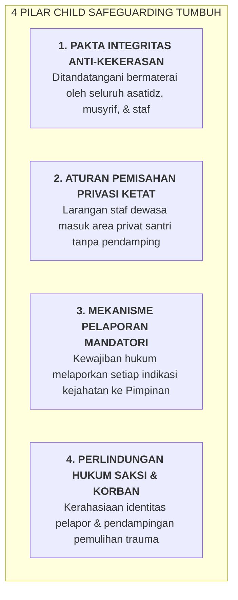

# SUB-BAB 7.2: PROTOKOL PERLINDUNGAN ANAK (*CHILD SAFEGUARDING*): MITIGASI RISIKO

---

## 1. Menjaga Keamanan Suci Pesantren (*Safe Sanctuary*)

Setiap anak yang dititipkan oleh orang tuanya ke pesantren berhak mendapatkan perlindungan mutlak dari segala bentuk kekerasan fisik, kekerasan emosional, penelantaran, perundungan, dan pelecehan.

Ekosistem TUMBUH memberlakukan **Kebijakan Perlindungan Anak (*Child Safeguarding Policy*)** yang mengikat seluruh sivitas akademika: [^1]

---

## 2. Prosedur Investigasi Independen & Transparan

Jika terjadi laporan mengenai dugaan pelanggaran perlindungan anak:
* Terduga pelaku langsung dinonaktifkan sementara dari tugas pengasuhan (*administrative suspension*) demi melindungi santri.
* **Tim Investigasi Etik Independen** melakukan pemeriksaan fakta secara objektif.
* Jika terbukti terjadi pelanggaran berat/tindak pidana, lembaga secara transparan meneruskan kasus tersebut ke pihak berwajib (*Kepolisian & KPAI*) tanpa ada upaya menutupi kesalahan.

---

### 📚 Catatan Kaki & Referensi Akademik:

[^1]: UNICEF. (2018). *Child Safeguarding Standards and Guidance for Educational Settings*. New York: UNICEF.
