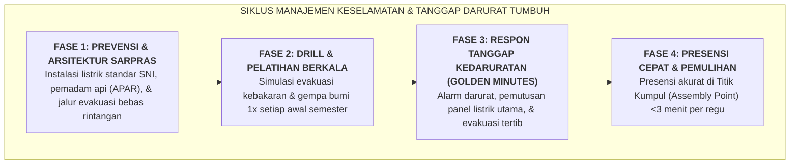

# SUB-BAB 7.3: MANAJEMEN KRISIS KEBAKARAN, BENCANA ALAM, & EVAKUASI ASRAMA

---

## 1. Kesiapsiagaan Tanggap Darurat Bencana di Asrama Bertingkat

Gedung asrama pesantren yang menampung ratusan santri dalam struktur kamar bertingkat menyimpan potensi risiko bencana yang masif apabila tidak dikelola dengan sistem mitigasi terpadu. Bahaya kebakaran korsleting listrik, gempa bumi, banjir bandang, atau kebocoran gas dapur umum dapat berujung pada korban jiwa yang fatal jika jalur penyelamatan tersumbat atau santri panik tanpa komando. [^1]

Dalam syariat Islam, ikhtiar mitigasi keselamatan fisik (*Ittikhadz al-Asbab li as-Salamah*) adalah kewajiban fiqhiyyah yang mendahului tawakkal:



---

## 2. Standardisasi Infrastruktur Keselamatan Fisik Sarpras

Wakamad Sarpras bertanggung jawab memastikan kelaikan seluruh infrastruktur keselamatan: [^2]

1. **Jalur Evakuasi Bebas Hambatan (*Clear Exit Corridors*)**:
   * Seluruh lorong, pintu darurat, dan tangga asrama dilarang keras dihalangi oleh tumpukan barang, jemuran pakaian, rak sepatu liar, atau kasur cadangan.
   * Pintu darurat di lantai 2 ke atas wajib membuka ke arah luar dan menggunakan palang darurat (*Panic Push Bar*) yang mudah ditekan dalam kegelapan.
2. **Pencahayaan Darurat & Peta Fosfor (*Photoluminescent Signage*)**:
   * Peta denah evakuasi berbahan fosfor menyala dalam gelap (*Glow-in-the-Dark*) terpasang di setiap pintu kamar tidur dan persimpangan lorong.
   * Lampu darurat otomatis (*Emergency Lights*) bertenaga baterai terpasang di setiap anak tangga darurat dan aktif seketika saat listrik padam total.
3. **Alat Pemadam Api Ringan (APAR) Terkalibrasi**:
   * Tabung APAR tipe Serbuk Kimia Kering (*Dry Chemical Powder*) dan $CO_2$ terpasang di setiap jarak maksimal 15 meter pada ketinggian 1.2 meter dari lantai.
   * Tekanan manometer APAR diinspeksi setiap awal bulan oleh tim Sarpras dan dicatat dalam kartu kontrol fisik.

---

## 3. SOP Tanggap Darurat Kebakaran & Gempa Bumi (*Golden Minutes Protocol*)

```
               SOP EVAKUASI KEDARURATAN ASRAMA EKOSISTEM TUMBUH
  
  ┌───────────────────────┬────────────────────────────────────────────────────────┐
  │ LANGKAH KERJA         │ TINDAKAN OPERASIONAL SPESIFIK & KOMANDO               │
  ├───────────────────────┼────────────────────────────────────────────────────────┤
  │ 1. Bunyikan Alarm     │ Petugas jaga membunyikan sirene darurat bersuara       │
  │    Darurat Terpusat   │ intermiten tanpa henti & umumkan via pengeras suara.   │
  ├───────────────────────┼────────────────────────────────────────────────────────┤
  │ 2. Pemutusan Arus     │ Teknisi Sarpras / Musyrif shift mematikan saklar utama │
  │    Listrik & Gas      │ listrik gedung (MCB Utama) & menutup valve gas dapur.  │
  ├───────────────────────┼────────────────────────────────────────────────────────┤
  │ 3. Gerakan Evakuasi   │ Santri keluar kamar berbaris 1 banjar, menutup hidung  │
  │    Tertib (No Panic)  │ dengan kain basah jika ada asap, berjalan cepat        │
  │                       │ (DILARANG BERLARI/DORONG-DORONGAN) menuruni tangga.   │
  ├───────────────────────┼────────────────────────────────────────────────────────┤
  │ 4. Menuju Titik       │ Seluruh santri dan staf bergerak menuju Titik Kumpul   │
  │    Kumpul (Assembly)  │ Utama (Lapangan Sepak Bola Pondok yang luas & terbuka).│
  ├───────────────────────┼────────────────────────────────────────────────────────┤
  │ 5. Presensi Kilat     │ Ketua Kamar & Musyrif menghitung jumlah santri kamar;  │
  │    (< 3 Menit)        │ laporkan status 'LENGKAP' atau 'KURANG (sebut nama)'   │
  │                       │ kepada Koordinator Evakuasi di posko lapangan.         │
  └───────────────────────┴────────────────────────────────────────────────────────┘
```

---

## 4. Pelaksanaan *Emergency Drill* Semesteran

Simulasi evakuasi darurat diselenggarakan minimal **satu kali setiap awal semester**:
* Santri dilatih refleks menunduk, berlindung di bawah meja kokoh, dan memegang kaki meja (*Drop, Cover, Hold On*) saat terjadi gempa bumi.
* Setiap musyrif dan santri jenjang J4 dilatih memadamkan api menggunakan tabung APAR dan karung goni basah.
* Waktu total evakuasi dari kamar lantai teratas hingga berkumpul lengkap di lapangan ditargetkan mencapai waktu optimal di bawah **3 menit 30 detik**.

---

### 📚 Catatan Kaki & Referensi Akademik:

[^1]: National Fire Protection Association. (2018). *NFPA 101: Life Safety Code*. Quincy, MA: NFPA, hlm. 85–120.
[^2]: Federal Emergency Management Agency. (2017). *Guide for Developing High-Quality Emergency Operations Plans for Schools*. Washington, DC: FEMA.
[^3]: Alexander, D. (2002). *Principles of Emergency Planning and Management*. Harpenden: Terra Publishing, hlm. 45–78.
