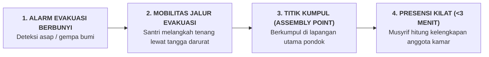

# SUB-BAB 7.3: MANAJEMEN KRISIS KEBAKARAN, BENCANA ALAM, & EVAKUASI ASRAMA

---

## 1. Kesiapsiagaan Tanggap Darurat Bencana

Bangunan asrama pesantren bertingkat yang menampung ratusan santri menuntut standar keselamatan kebakaran dan mitigasi bencana alam yang ketat (*Disaster Risk Reduction*). [^1]

Ekosistem TUMBUH menetapkan **Protokol Tanggap Darurat Bencana Asrama**:

---

## 2. Standar Fasilitas Keselamatan Fisik Sarpras

* **APAR (Alat Pemadam Api Ringan)**: Terpasang di setiap jarak 15 meter di seluruh koridor dan dapur umum, diinspeksi tekanannya setiap bulan.
* **Simulasi Evakuasi Rutin (*Fire & Earthquake Drill*)**: Dilaksanakan sekali setiap semester secara terprogram untuk melatih refleks santri.
* **Peta Jalur Evakuasi Bercahaya (*Glow-in-the-Dark Exit Signs*)**: Terpasang di setiap pintu kamar santri.

---

### 📚 Catatan Kaki & Referensi Akademik:

[^1]: National Fire Protection Association. (2018). *NFPA 101: Life Safety Code*. Quincy, MA: NFPA.
