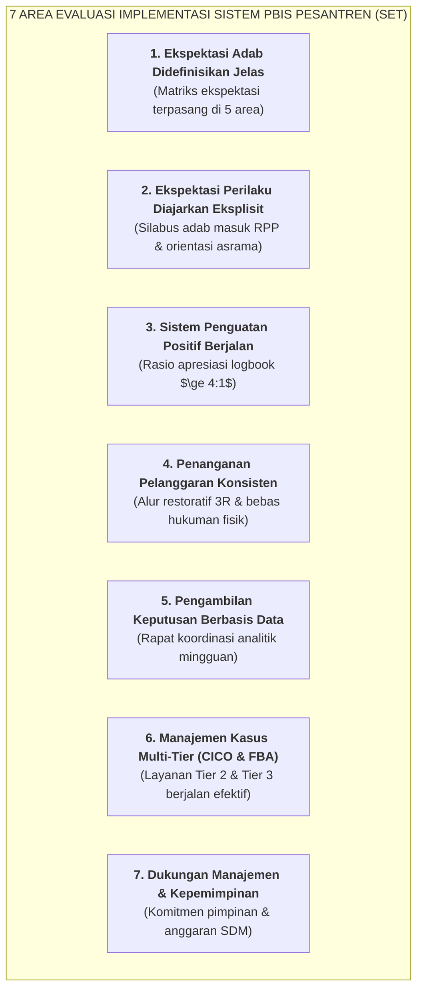

# SUB-BAB 8.1: INSTRUMEN EVALUASI DIRI LEMBAGA: SCHOOL-WIDE EVALUATION TOOL (SET)

---

## 1. Menjamin Implementasi Berkualitas (*Fidelity of Implementation*)

Untuk memastikan bahwa sistem PBIS dan disiplin restoratif tidak sekadar menjadi dokumen di atas kertas, Ekosistem TUMBUH menggunakan instrumen evaluasi internasional **School-Wide Evaluation Tool (SET)** yang diadaptasi secara khusus untuk lingkungan pesantren. [^1]

SET mengukur tingkat kepatuhan implementasi sistem melalui 7 area kunci:

---

## 2. Standar Ambang Batas Kepatuhan Mutu ($\ge 80\%$)

Sebuah pesantren dinyatakan telah menerapkan Ekosistem TUMBUH secara matang (*High Fidelity*) apabila mencapai **skor kepatuhan minimal $80\%$** pada evaluasi SET yang dilakukan oleh tim auditor independen setiap akhir tahun ajaran.

---

### 📚 Catatan Kaki & Referensi Akademik:

[^1]: Horner, R. H., et al. (2004). The School-Wide Evaluation Tool (SET): A research instrument for assessing school-wide positive behavior support. *Journal of Emotional and Behavioral Disorders*, 12(1), 3–12.
