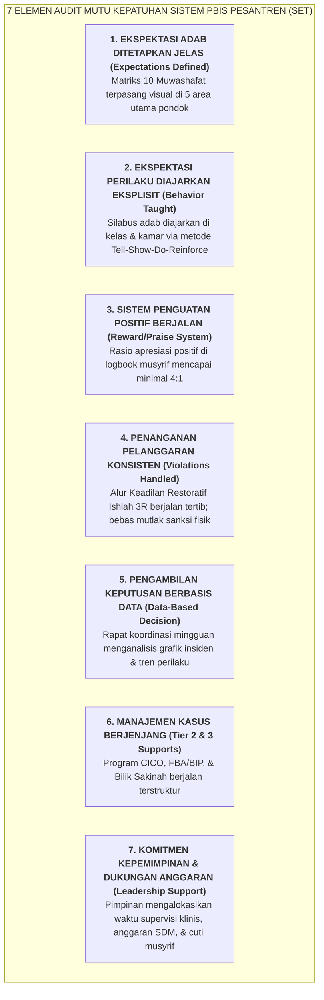

# SUB-BAB 8.1: INSTRUMEN EVALUASI DIRI LEMBAGA: SCHOOL-WIDE EVALUATION TOOL (SET)

---

## 1. Menjamin Integritas Implementasi Sistem (*Implementation Fidelity*)

Salah satu kegagalan terbesar dari berbagai program inovasi pendidikan di Indonesia adalah **fenomena "Hangat-hangat Tahi Ayam" (*Short-Lived Enthusiasm*)**: sebuah sistem baru dirancang dengan sangat indah, namun setelah berjalan beberapa bulan, pelaksanaannya memudar, para staf kembali ke kebiasaan lama yang serba manual dan reaktif, dan dokumen SOP hanya menjadi tumpukan kertas mati di lemari arsip. [^1]

Untuk memastikan bahwa Ekosistem TUMBUH tetap berjalan dengan integritas implementasi (*Fidelity*) yang konsisten dari tahun ke tahun, pesantren menggunakan instrumen evaluasi internasional **School-Wide Evaluation Tool (SET)** yang telah diadaptasi secara komprehensif ke dalam ekosistem pesantren berasrama 24 jam.

---

## 2. Metodologi Pelaksanaan Audit SET di Pesantren

Audit SET dilaksanakan setiap akhir semester oleh **Tim Auditor Mutu Independen** (dikoordinasi oleh Lembaga Penjaminan Mutu Internal / LPMI) melalui 3 teknik triangulasi data: [^2]

1. **Wawancara Acak Santri & Staf (*Random Triangulation Interviews*)**:
   * Auditor mewawancarai secara acak 20 santri dari berbagai jenjang (J1 s/d J4) dan 10 staf/musyrif untuk menguji pemahaman mereka mengenai aturan pondok dan rasa aman mereka di asrama.
2. **Observasi Lapangan Langsung (*Direct Facility Observation*)**:
   * Memeriksa kondisi fisik kamar tidur 5S, keteraturan antrean makan, kebersihan toilet sanitasi, dan pencahayaan lorong CPTED.
3. **Audit Jejak Data Digital (*Digital Logbook Audit*)**:
   * Meninjau konsistensi pencatatan data logbook harian, rasio apresiasi, tindak lanjut kartu CICO, dan kepatuhan penyelesaian tiket helpdesk sarpras dalam tempo $<24$ jam.

---

## 3. Standar Kriteria Kelulusan Mutu ($\ge 80\%$)

Lembaga menetapkan ambang batas kelulusan mutu:
* **Skor SET $\ge 80\%$ di Seluruh 7 Elemen**: Pesantren dinyatakan berstatus *High-Fidelity PBIS Sanctuary* (Sistem Pembinaan Adab Unggul & Berkelanjutan).
* **Skor SET $< 80\%$**: Lembaga menyusun *Action Plan Remedial* intensif selama 30 hari untuk memperbaiki elemen yang masih kurang.

---

### 📚 Catatan Kaki & Referensi Akademik:

[^1]: Fixsen, D. L., et al. (2005). *Implementation Research: A Synthesis of the Literature*. Tampa, FL: University of South Florida.
[^2]: Horner, R. H., et al. (2004). The School-Wide Evaluation Tool (SET): A research instrument for assessing school-wide positive behavior support. *Journal of Emotional and Behavioral Disorders*, 12(1), 3–12.
[^3]: Sugai, G., & Horner, R. H. (2006). A promising approach for expanding and sustaining school-wide positive behavior support. *School Psychology Review*, 35(2), 245–259.
