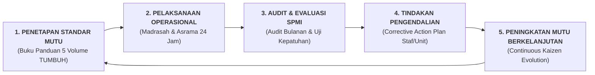

# SUB-BAB 8.2: AUDIT KEPATUHAN SOP PENGASUHAN & PENJAMINAN MUTU INTERNAL (SPMI)

---

## 1. Lembaga Penjaminan Mutu Internal (LPMI) Sebagai Pengawal Standar

Untuk menjaga agar seluruh manual operasional, SOP 24 jam, dan protokol perlindungan anak berjalan secara konsisten, Ekosistem TUMBUH mendirikan unit fungsional independen **Lembaga Penjaminan Mutu Internal (LPMI / SPMI Pesantren)** yang bertanggung jawab langsung kepada Dewan Pembina Yayasan dan Mudir Ma'had. [^1]

LPMI beroperasi di luar struktur hierarki pelaksana harian (terpisah dari 4 Wakamad) untuk menjamin objektivitas audit, independensi evaluasi, dan ketiadaan konflik kepentingan (*Conflict of Interest*).

---

## 2. Matriks Indikator Kinerja Utama (KPI) Audit Bulanan SPMI

Setiap akhir bulan, tim auditor SPMI melakukan audit kepatuhan (*Compliance Audit*) terhadap 6 indikator kinerja utama: [^2]

| Area Audit Mutu | Indikator Kinerja Utama (KPI) | Standar Target Mutu | Bukti Verifikasi Objektif |
| :--- | :--- | :--- | :--- |
| **1. Perlindungan Anak (*Safeguarding*)** | Ketiadaan hukuman fisik & perpeloncoan | **$100\%$ Bebas Kekerasan (Nol Insiden)** | Wawancara rahasia santri & audit kotak suara sahabat. |
| **2. Budaya Apresiasi PBIS** | Rasio apresiasi positif harian di asrama | **$\ge 4 : 1$ (Apresiasi vs Teguran)** | Log data analitik aplikasi logbook digital musyrif. |
| **3. Beban Kerja & Kesehatan Staf** | Jam kerja musyrif & realisasi libur | **Maksimal 8 Jam/Hari & 1 Hari Libur/Pekan** | Rekam presensi sidik jari & jadwal rotasi shift kerja. |
| **4. Standar Kebersihan Kamar 5S** | Kepatuhan kasur hospital corner & sanitasi | **$\ge 95\%$ Kamar Masuk Kategori Bersih** | Lembar inspeksi visual acak mingguan pengasuhan. |
| **5. Respon Reparasi Sarpras** | Kecepatan penanganan fasilitas rusak | **$< 24\text{ Jam}$ untuk Kasus Standar** | Rekapitulasi waktu penutupan tiket helpdesk Sarpras. |
| **6. Kesehatan Lingkungan Sanitasi** | Angka kejadian penyakit kulit (Scabies) | **$0\text{ Kasus}$ Menular Baru (Zero-Scabies)** | Laporan rekam medis triase bulanan Poskestren. |

---

## 3. Siklus Tindakan Korektif (*Corrective Action Protocol*)

Tatkala ditemukan unit kerja atau staf yang belum mencapai target standar mutu:
1. LPMI menerbitkan **Surat Permintaan Tindakan Korektif (SPTK)** kepada penanggung jawab unit terkait.
2. Unit kerja bersama Wakamad terkait menyusun rencana perbaikan konkret dalam tempo maksimal 7 hari kerja.
3. Auditor LPMI melakukan verifikasi ulang (*Re-Audit*) pada bulan berikutnya untuk memastikan kelemahan sistem telah tuntas diperbaiki.

Dengan sistem penjaminan mutu internal yang hidup dan berwibawa ini, pesantren TUMBUH senantiasa mempertahankan standar keunggulan peradaban secara konsisten dan lestari.

---

### 📚 Catatan Kaki & Referensi Akademik:

[^1]: Deming, W. E. (1986). *Out of the Crisis*. Cambridge, MA: MIT Center for Advanced Educational Services, hlm. 120–150.
[^2]: Kementerian Pendidikan dan Kebudayaan RI. (2018). *Pedoman Sistem Penjaminan Mutu Internal (SPMI) Pendidikan Dasar dan Menengah*. Jakarta: Ditjen Dikdasmen Kemendikbud.
[^3]: Juran, J. M., & Godfrey, A. B. (1999). *Juran's Quality Handbook* (5th ed.). New York: McGraw-Hill.
