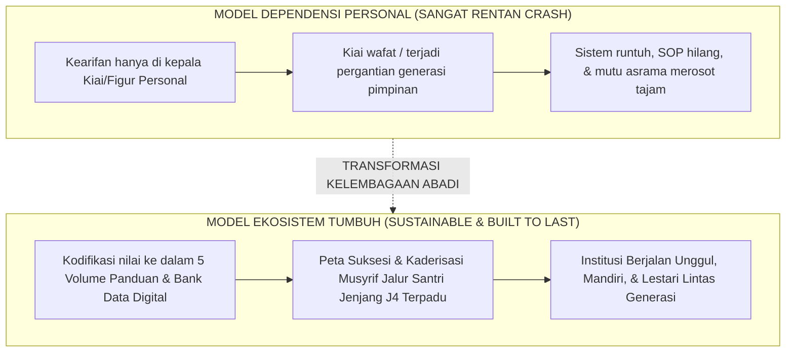

# SUB-BAB 8.3: KEBERLANJUTAN LEMBAGA (*INSTITUTIONAL SUSTAINABILITY*): MENGATASI REGENERASI

---

## 1. Dari Ketergantungan Figur Personal Menuju Keabadian Sistem

Sejarah mencatat bahwa kelemahan paling rentan dari ribuan pondok pesantren di dunia Islam adalah **sangat bergantungnya keberlangsungan mutu lembaga pada figur personal seorang Kiai Karismatik (*Charismatic Founder Trap*)**. [^1]

Tatkala sang pendiri wafat atau berganti generasi penerus:
* Nilai-nilai luhur kepengasuhan yang tadinya tersimpan di dalam dada sang Kiai tidak terkodifikasi secara tertulis, sehingga generasi penerus kehilangan pegangan baku.
* Terjadi degradasi mutu pengasuhan yang drastis; asrama menjadi tidak tertib, sanksi fisik kembali marak, dan terjadi perpecahan internal perebutan otoritas.
* Pesantren yang tadinya menjadi mercusuar umat perlahan-lahan meredup dan hanya tinggal menyisakan nama sejarah kejayaan masa lalu.

Ekosistem TUMBUH merancang **Keberlanjutan Kelembagaan Abadi (*Institutional Sustainability & Longevity*)**: mentransformasikan kearifan, adab, dan visi luhur para ulama ke dalam **Arsitektur Sistem, Manual SOP 24 Jam, dan Bank Pengetahuan Kelembagaan (*Institutional Knowledge Repository*)** yang dapat dijalankan secara konsisten oleh siapa pun generasi yang memimpin.

---

## 2. Peta Suksesi & Jalur Kaderisasi Mandiri Musyrif

Untuk menjamin ketersediaan tenaga pendidik asrama yang beradab dan memahami ruh pesantren secara mendalam, lembaga menerapkan **Jalur Kaderisasi Musyrif Mandiri (*Internal Succession Pipeline*)**: [^2]

1. **Rekrutmen Lulusan Terbaik Jenjang J4 (Kelas 12 MA)**:
   * Santri jenjang J4 yang telah menunjukkan rekam jejak kematangan adab Tahap 7 (*Second Nature*), berprestasi dalam program *Peer-Mentorship*, dan memiliki jiwa khidmah tinggi direkrut menjadi Calon Musyrif Magang (*Musyrif Trainee*).
2. **Program Pra-Tugas Pengasuhan Intensif (3 Bulan)**:
   * Mengikuti pendidikan kilat mengenai psikologi remaja, neurosains terapan, protokol de-eskalasi krisis Bilik Sakinah, manajemen kamar 5S, dan Keadilan Restoratif Ishlah 3R.
3. **Penyelarasan Sanad Nilai & Budaya Qudwah**:
   * Melalui proses kaderisasi internal ini, ruh keikhlasan, etika *Karamatul Insan*, dan adab mulia pondok diwariskan secara murni dari satu generasi santri ke generasi berikutnya tanpa pernah terputus.

---

### 📚 Catatan Kaki & Referensi Akademik:

[^1]: Collins, J., & Porras, J. I. (1994). *Built to Last: Successful Habits of Visionary Companies*. New York: HarperBusiness, hlm. 48–85.
[^2]: Rothwell, W. J. (2010). *Effective Succession Planning: Ensuring Leadership Continuity and Building Talent from Within* (4th ed.). New York: Amacom.
[^3]: Ibnu Khaldun, 'Abdurrahman bin Muhammad. (2001). *Al-Muqaddimah*. Beirut: Dar al-Fikr, hlm. 145–168.
