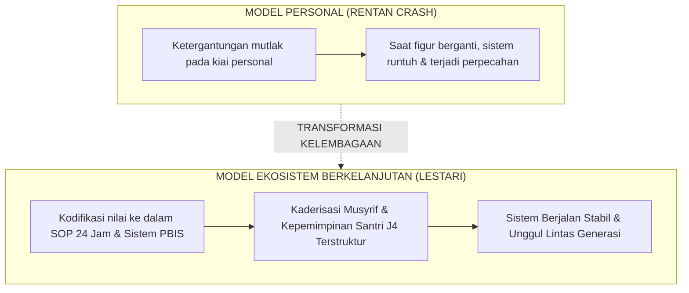

# SUB-BAB 8.3: KEBERLANJUTAN LEMBAGA (*INSTITUTIONAL SUSTAINABILITY*): MENGATASI REGENERASI

---

## 1. Dari Ketergantungan Figur Menuju Keunggulan Sistem

Salah satu kerentanan terbesar institusi pesantren tradisional adalah **ketergantungan mutlak pada figur personal seorang kiai karismatik (*Charismatic Figure Dependency*)**. Tatkala sang kiai wafat atau berganti generasi kepengurusan, kualitas pengasuhan dan ketertiban pondok sering kali merosot tajam.

Ekosistem TUMBUH merancang **Keberlanjutan Kelembagaan (*Institutional Sustainability*)**: mentransformasi nilai-nilai luhur sang kiai ke dalam **sistem tata kelola, SOP terstandarisasi, dan budaya organisasi pembelajar yang abadi**. [^1]

---

## 2. Peta Suksesi & Kaderisasi Musyrif Berkelanjutan

1. **Jalur Kaderisasi Musyrif Mandiri**: Merekrut calon musyrif dari lulusan santri jenjang J4 terbaik yang telah memiliki rekam jejak kepemimpinan *Peer-Mentor* dan karakter *Khadimul Ummah*.
2. **Bank Pengetahuan Institusi (*Institutional Knowledge Base*)**: Seluruh dokumen SOP, kurikulum pelatihan, modul intervensi, dan studi kasus lapangan terdokumentasi rapi dalam portal digital pondok, sehingga staf baru dapat langsung menguasai standar kerja dalam hitungan pekan.

---

### 📚 Catatan Kaki & Referensi Akademik:

[^1]: Collins, J., & Porras, J. I. (1994). *Built to Last: Successful Habits of Visionary Companies*. New York: HarperBusiness, hlm. 48–75.
[^2]: Ibnu Khaldun, 'Abdurrahman bin Muhammad. (2001). *Muqaddimah Ibni Khaldun*. Beirut: Dar al-Fikr, hlm. 145–160.
