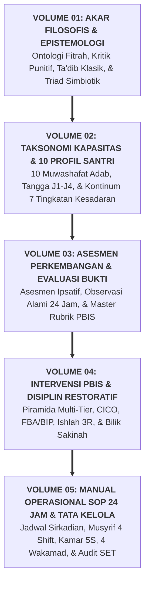

# SUB-BAB 8.4: PENUTUP SERI BUKU PANDUAN: MENJAGA AMANAH PERADABAN MELALUI EKOSISTEM TUMBUH

---

## 1. Sintesis Paripurna 5 Volume Master Guidebook TUMBUH

Dengan rampungnya **Buku Panduan Volume 05**, seluruh arsitektur peradaban **Ekosistem TUMBUH Pesantren** telah tuntas terkodifikasi dari hulu filosofis hingga hilir operasional harian:

---

## 2. Pesan Akhir: Menjaga Amanah Generasi Peradaban

Pesantren adalah benteng terakhir penjaga moral dan keimanan umat Islam. Mengelola pesantren di era modern menuntut perpaduan sempurna antara **kemurnian spiritualitas Turats Islam** dengan **kecanggihan metodologi sains terapan**.

Ekosistem TUMBUH hadir bukan sekadar sebagai sekumpulan aturan teknis, melainkan sebagai sebuah **ikhtiar suci peradaban (*Ijtihad Hadharah*)**:
* Menjamin setiap **santri bertumbuh** dalam naungan fitrah yang suci, merdeka jiwanya, dan luhur adabnya.
* Menjamin setiap **guru dan musyrif bertumbuh** dalam kemuliaan keteladanan, kesejahteraan jiwa yang sehat, dan pahala jariyah yang abadi.
* Menjamin setiap **lembaga pesantren bertumbuh** menjadi pusat peradaban Islam yang unggul, profesional, dan menebarkan rahmat bagi semesta alam (*Rahmatan lil 'Alamin*).

*Walhamdulillāhi Rabbil 'Ālamīn.*

---

### 📚 Catatan Kaki & Referensi Akademik:

[^1]: Al-Attas, Syed Muhammad Naquib. (1980). *The Concept of Education in Islam*. Kuala Lumpur: ABIM, hlm. 45–50.
[^2]: Al-Ghazali, Abu Hamid Muhammad bin Muhammad. (2004). *Ihya' 'Ulumiddin*. Beirut: Dar al-Kutub al-'Ilmiyyah, Jilid I, Kitab *al-'Ilm*, hlm. 15–30.
