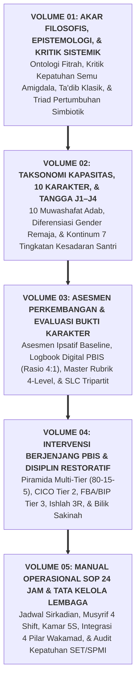

# SUB-BAB 8.4: PENUTUP SERI BUKU PANDUAN: MENJAGA AMANAH PERADABAN MELALUI EKOSISTEM TUMBUH

---

## 1. Sintesis Paripurna Arsitektur 5 Volume Ekosistem TUMBUH

Dengan tuntasnya perumusan **Buku Panduan Volume 05**, seluruh bangunan arsitektur peradaban **Ekosistem TUMBUH Pesantren** telah berdiri kokoh, menyatu secara harmonis dari hulu filosofis hingga praksis lapangan detik-demi-detik: [^1]

---

## 2. Pesan Akhir: Menjaga Amanah Suci Generasi Peradaban

Pondok pesantren adalah rahim peradaban Islam dan benteng moral umat yang tidak ternilai harganya. Di dalam lorong-lorong asrama dan ruang-ruang halaqahnya, jutaan anak kaum muslimin menitipkan masa depan akal, jiwa, dan raganya untuk ditempa menjadi khalifah di muka bumi (*Khulafa' fi al-Ardh*).

Mengelola pesantren di abad ke-21 menuntut keberanian untuk **memadukan kemurnian spiritualitas Turats Islam dengan kecanggihan metodologi sains terapan**. Kita tidak boleh lagi mempertahankan tradisi kekerasan, penelantaran musyrif, atau kepatuhan semu atas nama "ketegasan", padahal syariat Islam dibangun di atas fondasi kasih sayang (*Rahmah*), keadilan (*'Adl*), dan pemuliaan martabat manusia (*Karamatul Insan*). [^2]

Ekosistem TUMBUH dipersembahkan sebagai sebuah **Ijtihad Peradaban (*Ijtihad Hadhari*)**:
* Menjamin setiap **santri bertumbuh** dalam lingkungan yang aman, suci, bermartabat, merdeka nalarnya, dan mulia akhlaknya.
* Menjamin setiap **guru dan musyrif bertumbuh** dalam kemuliaan keteladanan *Qudwah Hasanah*, kesehatan mental yang terjaga, dan kesejahteraan yang penuh berkah.
* Menjamin setiap **lembaga pesantren bertumbuh** menjadi institusi pendidikan Islam kelas dunia yang unggul, profesional, mandiri, dan menebarkan rahmat bagi semesta alam (*Rahmatan lil 'Alamin*).

*Semoga Allah Subhanahu wa Ta'ala meridhai setiap tetes keringat, langkah kaki, dan ketulusan niat kita dalam menjaga amanah suci peradaban ini.*

---

### 📚 Catatan Kaki & Referensi Akademik:

[^1]: Al-Attas, Syed Muhammad Naquib. (1980). *The Concept of Education in Islam: A Framework for an Islamic Philosophy of Education*. Kuala Lumpur: ABIM, hlm. 45–60.
[^2]: Al-Ghazali, Abu Hamid Muhammad bin Muhammad. (2004). *Ihya' 'Ulumiddin*. Beirut: Dar al-Kutub al-'Ilmiyyah, Jilid I, Kitab *al-'Ilm*, hlm. 15–35.
[^3]: Sugai, G., & Horner, R. H. (2006). A promising approach for expanding and sustaining school-wide positive behavior support. *School Psychology Review*, 35(2), 245–259.
