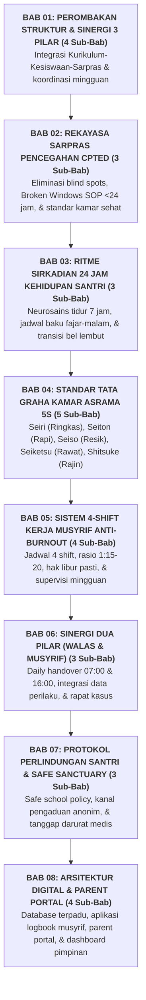

# BUKU PANDUAN VOLUME 05: MANUAL OPERASIONAL, STANDAR SOP MUSYRIF, & TATA KELOLA ASRAMA
## *Jadwal Sirkadian 24 Jam, Manajemen Kamar 5S, Rekayasa Sarpras CPTED, Sistem Shift Anti-Burnout, dan Integrasi Kurikulum-Kesiswaan-Sarpras*

---

**Nomor Panduan**: `BOOK-SERIES-2/VOL-05/2026`  
**Sasaran Pembaca**: Kepala Pesantren, Kepala Madrasah (MA/MTs), Wakamad Sarpras, Wakamad Kesiswaan, Wakamad Kurikulum, Kepala Asrama, Musyrif/Musyrifah, Staf Medis, dan Tim Tata Kelola  
**Dewan Pakar Pengkaji**: Pakar Pengasuhan Asrama, Pakar Intervensi Preventif, Pakar Tata Kelola Qudwah, Pakar Arsitektur Digital Pesantren, dan Pakar Perlindungan Anak  

---

## 🧭 PETA STRUKTUR & DISTRIBUSI BAB VOLUME 05 (8 BAB ORGANIK)

---

## 📚 DAFTAR LENGKAP BAB DAN SUB-BAB VOLUME 05

### 🏛️ [Bab 01: Perombakan Struktur Kelembagaan & Sinergi 3 Pilar (4 Sub-Bab)](file:///c:/xampp/htdocs/tumbuh/BOOK%20Series%202/Volume-05-Manual-Operasional-SOP-24Jam-dan-Tata-Kelola/Bab-01-Perombakan-Struktur-3-Pilar)
* **Sub-Bab 1.1**: Kegagalan Struktur Komando Lama yang Memisahkan Madrasah dan Asrama
* **Sub-Bab 1.2**: Bagan Organisasi Baru: Kepala Pesantren $\rightarrow$ Kepala MA/MTs $\rightarrow$ 4 Wakamad
* **Sub-Bab 1.3**: Trinitas Ekologis Pengasuhan: Kurikulum, Kesiswaan, & Sarpras
* **Sub-Bab 1.4**: Prosedur Tetap Rapat Koordinasi Lintas Bidang Mingguan

### 🏗️ [Bab 02: Rekayasa Sarpras & Lingkungan Pencegahan CPTED (3 Sub-Bab)](file:///c:/xampp/htdocs/tumbuh/BOOK%20Series%202/Volume-05-Manual-Operasional-SOP-24Jam-dan-Tata-Kelola/Bab-02-Rekayasa-Sarpras-CPTED)
* **Sub-Bab 2.1**: Penerapan Prinsip CPTED untuk Eliminasi Titik Rawan (*Hotspots & Blind Spots*)
* **Sub-Bab 2.2**: Pencegahan Efek Jendela Pecah (*Broken Windows*): SOP Perbaikan Kerusakan <24 Jam
* **Sub-Bab 2.3**: Standar Ergonomi Kamar Santri: Ventilasi Silang, Kapasitas Maksimal, & Bilik Sakinah

### ⏰ [Bab 03: Ritme Sirkadian 24 Jam Kehidupan Asrama (3 Sub-Bab)](file:///c:/xampp/htdocs/tumbuh/BOOK%20Series%202/Volume-05-Manual-Operasional-SOP-24Jam-dan-Tata-Kelola/Bab-03-Ritme-Sirkadian-24-Jam)
* **Sub-Bab 3.1**: Kronobiologi Remaja: Jaminan Hak Tidur Sehat 6.5–7 Jam & Qailulah Siang
* **Sub-Bab 3.2**: Matriks Jadwal Harian Sirkadian Baku dari Bangun Fajar hingga Jam Hening Malam
* **Sub-Bab 3.3**: Manajemen Transisi Tenang Antar-Sesi (*Zero-Chaos Transitions*) Menggunakan Audio Bel Sirkatian

### 🧹 [Bab 04: Standar Tata Graha Kamar Asrama 5S (5 Sub-Bab Khusus)](file:///c:/xampp/htdocs/tumbuh/BOOK%20Series%202/Volume-05-Manual-Operasional-SOP-24Jam-dan-Tata-Kelola/Bab-04-Standar-Tata-Graha-5S)
* **Sub-Bab 4.1**: *Seiri (Ringkas / At-Tajrid)* — Standar Pembatasan Maksimal 7 Stel Pakaian di Lemari
* **Sub-Bab 4.2**: *Seiton (Rapi / At-Tartib)* — Standar Sprei Kencang Hospital Corner & Rak Kitab Berurut
* **Sub-Bab 4.3**: *Seiso (Resik / An-Nazhafah)* — Pembagian Jadwal & Parameter Piket Harian Pagi-Sore
* **Sub-Bab 4.4**: *Seiketsu (Rawat / Al-Muhafazhah)* — Papan Checklist Visual 5S di Setiap Pintu Kamar
* **Sub-Bab 4.5**: *Shitsuke (Rajin / Al-Istiqamah)* — Pembudayaan Kerapian Mandiri Tanpa Pengawasan Paksa

### 🛡️ [Bab 05: Sistem 4-Shift Kerja Musyrif & Protokol Anti-Burnout (4 Sub-Bab)](file:///c:/xampp/htdocs/tumbuh/BOOK%20Series%202/Volume-05-Manual-Operasional-SOP-24Jam-dan-Tata-Kelola/Bab-05-Sistem-4-Shift-Musyrif)
* **Sub-Bab 5.1**: Mengakhiri Penugasan 24 Jam Nonstop: Analisis Ergonomi & Perlindungan Mental Musyrif
* **Sub-Bab 5.2**: Rincian Pembagian Waktu & Tugas 4-Shift Terpadu (Subuh-Pagi, Siang, Malam, Ronda Malam)
* **Sub-Bab 5.3**: Standarisasi Rasio Pengasuhan Ideal 1 Musyrif : 15–20 Santri
* **Sub-Bab 5.4**: Dekrit Kesejahteraan Pengasuh: Hak Libur Mingguan, Cuti, Gizi, & Supervisi Klinis

### 🤝 [Bab 06: Sinergi Dua Pilar (Walas & Musyrif) (3 Sub-Bab)](file:///c:/xampp/htdocs/tumbuh/BOOK%20Series%202/Volume-05-Manual-Operasional-SOP-24Jam-dan-Tata-Kelola/Bab-06-Sinergi-Dua-Pilar)
* **Sub-Bab 6.1**: Konsep *Dual-Pillar Caretaking*: Wali Kelas (Siang) & Musyrif (Malam)
* **Sub-Bab 6.2**: Protokol Baku *Daily Handover* Pukul 07:00 Pagi & Pukul 16:00 Sore
* **Sub-Bab 6.3**: Rapat Penyelarasan Kasus Kolaboratif Walas-Musyrif Menghadapi Santri Bermasalah

### 🚨 [Bab 07: Protokol Perlindungan Santri & Safe Sanctuary (3 Sub-Bab)](file:///c:/xampp/htdocs/tumbuh/BOOK%20Series%202/Volume-05-Manual-Operasional-SOP-24Jam-dan-Tata-Kelola/Bab-07-Perlindungan-Santri)
* **Sub-Bab 7.1**: *Safe School Policy* & Kebijakan Zero-Tolerance Terhadap Segala Bentuk Kekerasan
* **Sub-Bab 7.2**: Kanal Pengaduan Aman, Anonim, & Ramah Anak (*Safe Whistleblowing Protocol*)
* **Sub-Bab 7.3**: Standar Operasional Prosedur Tanggap Darurat Medis Poskestren & Rujukan RS

### 💻 [Bab 08: Arsitektur Digital & Parent Portal (4 Sub-Bab)](file:///c:/xampp/htdocs/tumbuh/BOOK%20Series%202/Volume-05-Manual-Operasional-SOP-24Jam-dan-Tata-Kelola/Bab-08-Arsitektur-Digital)
* **Sub-Bab 8.1**: Arsitektur Database Relasional Santri Terpadu 24 Jam
* **Sub-Bab 8.2**: Desain Aplikasi Mobile Musyrif: Fitur Presensi, CICO, Audit 5S, & Apresiasi 4:1
* **Sub-Bab 8.3**: Portal Transparan Wali Santri (*Parent Portal App*) untuk Pemantauan Perkembangan Adab
* **Sub-Bab 8.4**: Dashboard Analitik Eksekutif Pimpinan: Metrik Kesehatan Iklim & Tren Perilaku PBIS
