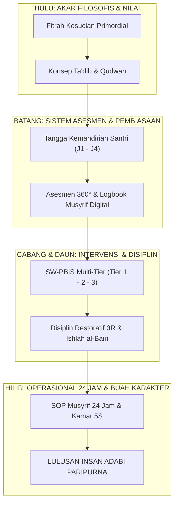

# BUKU PANDUAN INDUK: MENGENAL EKOSISTEM TUMBUH DARI HULU KE HILIR
## *Buku Saku Pimpinan, Asatidz, & Musyrif: Memahami Apa Itu Sistem TUMBUH, Mengapa Ia Lahir, dan Bagaimana Penerapannya dari Awal hingga Ujung*

---

**Nomor Panduan**: `BOOK-SERIES/PANDUAN-INDUK-2026`  
**Sasaran Pembaca**: Kiai, Pengasuh Pondok, Kepala Madrasah, Wali Kelas, Guru BK, Musyrif Asrama, & Wali Santri  
**Penyusun**: Dewan Keilmuan & Pengasuhan Ekosistem TUMBUH  

---

## 🌟 BAGIAN I: APA ITU SISTEM TUMBUH & MENGAPA IA LAHIR?

### 1. Titik Berangkat: Mengapa Sistem TUMBUH Ada?
Pernahkah kita menyaksikan santri yang tampak sangat patuh dan rajin di hadapan pengasuh, namun seketika berubah saat berada di luar jangkauan asrama? Atau santri yang merasa tertekan, memendam dendam, dan trauma karena hukuman fisik yang dianggap lumrah atas nama "disiplin"? Di sisi lain, para musyrif (pembina asrama) sering kali mengalami kelelahan mental luar biasa (*burnout*) karena harus berjaga 24 jam nonstop tanpa shift yang manusiawi.

Kondisi inilah yang melahirkan **Sistem TUMBUH**. 

Sistem TUMBUH hadir bukan untuk menghapus ruh luhur pesantren, melainkan untuk **memulihkan kemurnian tarbiyah nabawiyyah** dengan cara membersihkannya dari praktik kekerasan, intimidasi feodal, dan kepalsuan adab. Sistem ini membuktikan bahwa kedisiplinan dan ketertiban tinggi di pesantren dapat dicapai melalui **keteladanan nyata (*Qudwah Hasanah*), kasih sayang (*Rahmah*), dan penataan sistem yang terukur berbasis sains perkembangan anak**.

---

### 2. Apa Sebenarnya Sistem TUMBUH Itu?
**Sistem TUMBUH** adalah sebuah **kerangka kerja pengasuhan dan pembinaan karakter santri 24 jam** yang memadukan dua pilar agung:
1. **Khazanah Turats Islam**: Konsep *Ta'dib* (penanaman adab ke dalam jiwa), *Tazkiyatun Nafs* (penyucian hati), *Ukhuwah Islamiyyah*, dan *Ishlah al-Bain* (pemulihan hubungan).
2. **Konsensus Sains Modern Teruji**: *School-Wide Positive Behavioral Interventions and Supports (SW-PBIS)*, Neurosains Kognitif Remaja, *Social-Emotional Learning (CASEL)*, dan Keadilan Restoratif (*Restorative Justice*).

#### Makna Filosofis Akronim TUMBUH:
* **T - Tarbiyah Ruhiyyah**: Penanaman akidah yang kokoh dan ibadah yang benar sejak dini.
* **U - Ukhuwah & Adab**: Pembiasaan saling menghormati, tolong-menolong, dan bebas senioritas toksik.
* **M - Mutawaazin (Seimbang)**: Keseimbangan antara zikir, pikir, istirahat cukup (7 jam), dan kesehatan fisik.
* **B - Barakah & Khidmah**: Jiwa pengabdian sukarela bagi kemaslahatan umat dan pesantren.
* **U - Unggul & Mandiri**: Mampu mengatur diri (*Self-Regulation*) tanpa perlu diawasi secara menakutkan.
* **H - Hasanah (Qudwah)**: Menjadi teladan hidup kebaikan bagi sesama di mana pun berada.



---

## 🗺️ BAGIAN II: PETA PERJALANAN SISTEM TUMBUH (DARI HULU KE HILIR)

Bagaimana cara mempelajari dan menerapkan Sistem TUMBUH secara utuh? Sistem ini dirangkum dalam **5 Buku Panduan Praktis** yang saling menyambung dari hulu (konsep) hingga ke hilir (praktik operasional lapangan):

```mermaid
journey
    title Perjalanan Membaca & Menerapkan Seri Buku Panduan TUMBUH
    section Buku 1: Fondasi Filosofis
      Memahami Fitrah Santri: 5: Pimpinan & Guru
      Meninggalkan Hukuman Fisik: 5: Pimpinan & Musyrif
      Membangun Visi Insan Adabi: 5: Seluruh Civitas
    section Buku 2: Taksonomi & Profil
      Mengenal 10 Muwashafat Adab: 5: Guru & Musyrif
      Menjalankan Tangga J1 s/d J4: 4: Guru & Musyrif
      Membimbing Tahap 7 Penggerak: 4: Musyrif Senior
    section Buku 3: Asesmen Pertumbuhan
      Observasi Alami 24 Jam: 4: Musyrif
      Menghapus Ranking Karakter: 5: Guru & Musyrif
      Mengisi Logbook & Rapor Naratif: 4: Wali Kelas & Musyrif
    section Buku 4: Intervensi & Restoratif
      Pencegahan Primer Tier 1: 5: Guru & Musyrif
      Bimbingan CICO Tier 2: 4: Musyrif & BK
      Sidang Ishlah & Restoratif Tier 3: 4: Tim Disiplin & Pimpinan
    section Buku 5: Manual SOP 24 Jam
      Penerapan Jadwal Sirkadian 24 Jam: 5: Seluruh Asrama
      Penataan Kamar Standar 5S: 4: Santri & Musyrif
      Penerapan Shift Kerja Anti-Burnout: 5: Pimpinan & Musyrif
```

---

### Rincian 5 Jilid Buku Panduan Seri Master TUMBUH:

### 📗 [BUKU PANDUAN VOLUME 01](file:///c:/xampp/htdocs/tumbuh/BOOK-SERIES/Volume-01/Buku-Volume-01-Akar-Filosofis-dan-Epistemologi-Pendidikan-Karakter-Pesantren.md)
**Judul**: *Akar Filosofis & Fondasi Nilai Pembinaan Karakter Pesantren*  
**Pertanyaan yang Dijawab**: *"Mengapa kita harus mengubah cara pandang dalam mendidik santri?"*  
* **Isi Pokok**:
  1. Menjelaskan hakikat fitrah santri yang lahir dalam keadaan suci (*Fitrah al-Munazzalah*).
  2. Mengapa hukuman fisik, bentakan, dan teror malam terbukti secara neurosains merusak otak remaja dan memicu kemunafikan perilaku.
  3. Membangun paradigma baru bahwa pendidik adalah *Living Curriculum* yang mengasuh dengan keteladanan (*Qudwah*).

---

### 📘 [BUKU PANDUAN VOLUME 02](file:///c:/xampp/htdocs/tumbuh/BOOK-SERIES/Volume-02/Buku-Volume-02-Taksonomi-Kapasitas-dan-10-Profil-Karakter-Santri-TUMBUH.md)
**Judul**: *Taksonomi Karakter & Pembiasaan 10 Muwashafat Santri*  
**Pertanyaan yang Dijawab**: *"Karakter apa saja yang ingin kita bentuk dan bagaimana tahap perkembangannya?"*  
* **Isi Pokok**:
  1. Panduan menumbuhkan **10 Muwashafat Adab Nabawi** (Salimul Aqidah, Shahihul Ibadah, Matinul Khuluq, Qadirun 'alal Kasbi, Mutsaqqaful Fikr, Qawiyyul Jism, Mujahidun Linafsihi, Munazhzhamun fi Syu'unihi, Haritsun 'ala Waqtihi, dan Nafi'un Lighairihi).
  2. **Tangga Progresi Kemandirian (J1–J4)**:
     - **J1 (Adaptasi & Fondasi)**: Pendampingan intensif bagi santri baru agar nyaman di pondok.
     - **J2 (Pembiasaan & Rutinitas)**: Penguatan disiplin kamar dan ibadah secara berkelompok.
     - **J3 (Kematangan Diri & Tanggung Jawab)**: Santri mulai mampu mengatur diri secara sadar.
     - **J4 (Penggerak & Khidmah)**: Santri senior menjadi mentor adik kelas dan teladan lingkungan.

---

### 📙 [BUKU PANDUAN VOLUME 03](file:///c:/xampp/htdocs/tumbuh/BOOK-SERIES/Volume-03/Buku-Volume-03-Sistem-Asesmen-Perkembangan-dan-Evaluasi-Berbasis-Bukti.md)
**Judul**: *Asesmen Perkembangan Karakter & Evaluasi Berbasis Bukti*  
**Pertanyaan yang Dijawab**: *"Bagaimana cara menilai adab santri secara adil tanpa memberi cap buruk (*labelling*) atau ranking?"*  
* **Isi Pokok**:
  1. Prinsip **Asesmen Ipsatif**: Membandingkan kemajuan santri hari ini dengan dirinya di masa lalu, bukan membandingkannya dengan santri lain.
  2. **Triangulasi Data 360°**: Menggabungkan penilaian diri (*Muhasabah*), penilaian teman sekamar (*Ukhuwah*), dan observasi alami musyrif/guru.
  3. Format Rapor Naratif Karakter yang membahagiakan orang tua dan memotivasi santri untuk terus berbenah.

---

### 📕 [BUKU PANDUAN VOLUME 04](file:///c:/xampp/htdocs/tumbuh/BOOK-SERIES/Volume-04/Buku-Volume-04-Pedoman-Intervensi-Berjenjang-PBIS-dan-Praktik-Restoratif-di-Asrama.md)
**Judul**: *Intervensi Berjenjang PBIS & Disiplin Restoratif di Asrama*  
**Pertanyaan yang Dijawab**: *"Apa yang harus dilakukan musyrif dan guru saat santri melakukan pelanggaran atau mengalami masalah perilaku?"*  
* **Isi Pokok**:
  1. **Tiga Tingkat Bantuan (SW-PBIS Multi-Tier)**:
     - **Tier 1 (Universal - 80-85% Santri)**: Pencegahan umum melalui aturan visual, kamar yang nyaman, dan rasio apresiasi emas 4:1 (4 pujian untuk 1 teguran).
     - **Tier 2 (Targeted - 10-15% Santri)**: Bantuan terarah melalui kartu harian *Check-In/Check-Out (CICO)* dan pembinaan kelompok kecil.
     - **Tier 3 (Intensive - 1-5% Santri)**: Penanganan mendalam untuk kasus berat bersama Guru BK dan Orang Tua.
  2. **Disiplin Restoratif 3R (*Restitution, Resolution, Reconciliation*)**: Mengganti hukuman fisik dengan tindakan ganti rugi nyata, dialog 5 pertanyaan reflektif, dan forum *Ishlah al-Bain* (perdamaian tuntas).

---

### 📓 [BUKU PANDUAN VOLUME 05](file:///c:/xampp/htdocs/tumbuh/BOOK-SERIES/Volume-05/Buku-Volume-05-Manual-Operasional-SOP-Musyrif-dan-Tata-Kelola-Pesantren-Modern.md)
**Judul**: *Manual Operasional, Standar SOP Musyrif, & Tata Kelola Asrama 24 Jam*  
**Pertanyaan yang Dijawab**: *"Bagaimana jadwal harian dan SOP teknis menjalankan asrama dari bangun tidur sampai tidur kembali?"*  
* **Isi Pokok**:
  1. Jadwal Sirkadian 24 Jam yang melindungi hak tidur santri 6.5–7 jam dan waktu istirahat siang (*Qailulah*).
  2. SOP Standar Kamar 5S (Ringkas, Rapi, Resik, Rawat, Rajin) dan sanitasi sehat.
  3. SOP Shift Kerja Musyrif yang Manusiawi (Anti-Burnout) dengan rasio asuh ideal 1 : 15–20 santri.
  4. Protokol Perlindungan Santri (*Safe Sanctuary Child Protection*) dan penggunaan aplikasi digital Logbook Musyrif.

---

## 🚀 BAGIAN III: PANDUAN PRAKTIS IMPLEMENTASI 4 LANGKAH BAGI PESANTREN

Bagi pondok pesantren yang ingin mengadopsi Sistem TUMBUH, lakukan 4 langkah praktis berikut:

| Tahap | Durasi | Langkah Aksi Lapangan | Panduan Rujukan |
| :---: | :---: | :--- | :--- |
| **Tahap 1: Penyelarasan Visi** | Bulan 1 | Pelatihan dewan asatidz dan musyrif untuk memahami filosofi fitrah dan menyepakati deklarasi *Zero-Violence* (Nol Kekerasan). | Baca **Buku Panduan Vol 01** |
| **Tahap 2: Penataan Ruang & SOP** | Bulan 2 | Menata kamar asrama standar 5S, menetapkan jadwal sirkadian sehat, dan membagi shift kerja musyrif yang adil. | Baca **Buku Panduan Vol 05** |
| **Tahap 3: Pembiasaan & Asesmen** | Bulan 3–6 | Mengajarkan 10 Muwashafat Adab, menjalankan kartu CICO bagi santri yang butuh bimbingan, dan mengisi logbook harian. | Baca **Buku Panduan Vol 02 & 03** |
| **Tahap 4: Disiplin Restoratif** | Bulan 6+ | Menerapkan forum ishlah al-bain untuk penyelesaian konflik dan membagikan rapor naratif karakter kepada wali santri. | Baca **Buku Panduan Vol 04** |

---

> [!TIP]
> ### 💡 Kunci Sukses Pengasuhan Sistem TUMBUH:
> *"Ketegasan seorang pendidik tidak diukur dari kerasnya suara atau beratnya pukulan, melainkan dari konsistensi keteladanan, kejernihan aturan, dan kehangatan rangkulan saat santri berbuat salah untuk dibimbing kembali ke jalan yang lurus."*
